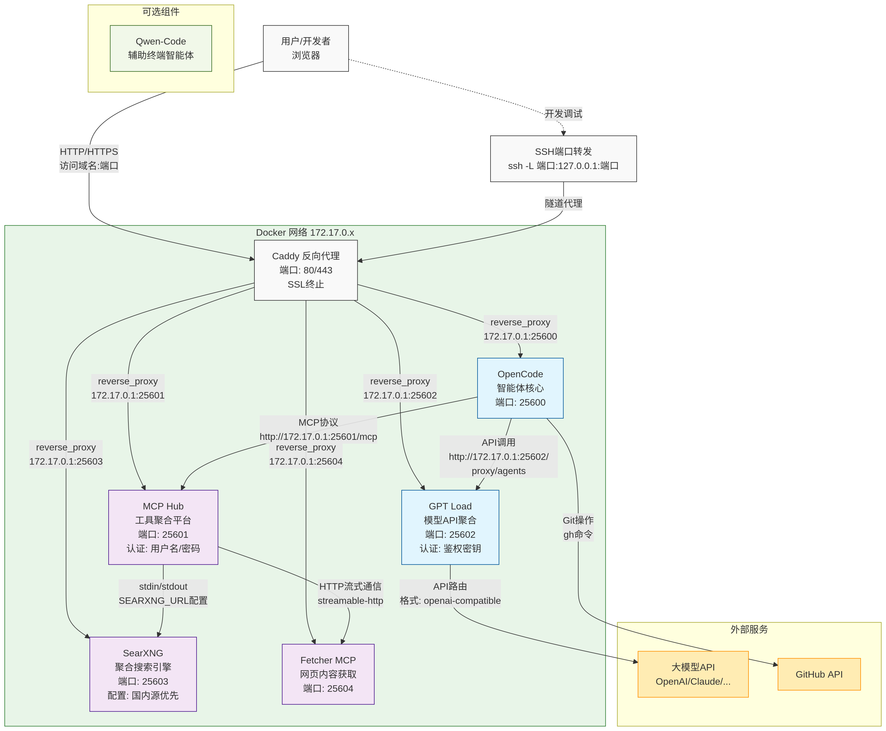

# 智能体的设计

## 概述

OpenCode 是一个开源的 AI 编程助手，可以部署为网页客户端，构建私有、安全的 AI 辅助通用工作和编程环境。海塞姆 AI 助手以 OpenCode 为核心构建了智能体系统，通过 Docker 容器化部署，实现代码生成、自动化测试、文档编写等智能辅助功能。



## opencode-docker-web 设计与实现

为实现 OpenCode 的容器化部署，`@PJ568` 设计并实现了 [opencode-docker-web](https://github.com/haytham-ai-assistant/opencode-docker-web)。

### 设计哲学

opencode-docker-web 的设计遵循以下核心原则：

1. **最小化依赖冲突**：通过 Docker 容器化隔离运行环境，确保 OpenCode 及其依赖在不同系统中行为一致。
2. **配置即代码**：所有配置通过环境变量和配置文件管理，支持版本控制和自动化部署。
3. **开箱即用**：镜像预装完整的开发工具链，用户无需手动安装任何依赖。
4. **安全优先**：默认启用认证、支持 CORS 配置、避免敏感信息硬编码。
5. **可观测性**：提供详细的启动日志和健康检查支持。

### 技术架构

#### 基础镜像选型

选择 `node:22-slim` 作为基础镜像，基于以下考虑：

- **技术匹配**：OpenCode CLI 基于 Node.js 开发，需要 Node.js 运行时环境。
- **体积优化**：`slim` 版本相比完整版减少约 200MB 体积，同时保留核心功能。
- **安全性**：官方镜像定期更新安全补丁，维护周期明确。
- **兼容性**：Node.js 22 是 LTS 版本，提供长期支持。

#### 系统依赖设计

Dockerfile 中安装的系统依赖分为以下几类：

```dockerfile
# 基础工具
bash nano wget gnupg jq unzip file

# 浏览器环境（OpenCode 可能需要）
chromium fonts-liberation fonts-noto-cjk fonts-noto-color-emoji

# 开发工具链
git python3 python3-pip build-essential

# 文档处理
pandoc texlive-base texlive-binaries texlive-latex-base \
texlive-fonts-recommended texlive-latex-recommended \
texlive-lang-chinese texlive-latex-extra

# 网络工具
socat websockify

# 容器工具
gosu tini

# 版本控制工具
gh

# 包管理器
nix-setup-systemd
```

**设计决策**：

- `chromium` 和字体包：为 OpenCode 的浏览器相关功能提供完整渲染环境。
- `pandoc` 和 `texlive`：支持文档格式转换，满足技术文档编写需求。
- `socat` 和 `websockify`：提供网络代理和 WebSocket 支持。
- `gosu` 和 `tini`：改善容器内进程管理和信号处理。
- `gh`：集成 GitHub 工作流，便于代码仓库操作。

#### 关键组件实现

##### Dockerfile 设计

```dockerfile
FROM node:22-slim

# 环境变量配置
ENV DEBIAN_FRONTEND=noninteractive \
    OPENCODE_CONFIG_DIR=/opt/opencode/config \
    PATH="/root/.cargo/bin:/root/.local/bin:/root/.opencode/bin:${PATH}"

# 安装系统依赖（见上文）
RUN apt-get update && apt-get install -y ...

# 安装 chsrc（中国开发者优化）
RUN curl -LO https://gitee.com/RubyMetric/chsrc/releases/download/pre/chsrc_latest-1_amd64.deb
RUN apt install ./chsrc_latest-1_amd64.deb
RUN rm ./chsrc_latest-1_amd64.deb

# 安装 GitHub CLI
RUN curl -fsSL https://cli.github.com/packages/githubcli-archive-keyring.gpg | dd of=/usr/share/keyrings/githubcli-archive-keyring.gpg \
    && chmod go+r /usr/share/keyrings/githubcli-archive-keyring.gpg \
    && echo "deb [arch=$(dpkg --print-architecture) signed-by=/usr/share/keyrings/githubcli-archive-keyring.gpg] https://cli.github.com/packages stable main" | tee /etc/apt/sources.list.d/github-cli.list > /dev/null \
    && apt-get update \
    && apt-get install -y gh \
    && rm -rf /var/lib/apt/lists/*

# 安装 OpenCode
RUN mkdir -p /root/.local/share/opencode
RUN curl -fsSL https://opencode.ai/install | bash
RUN test -x /root/.opencode/bin/opencode && echo "OpenCode installed successfully" || (echo "OpenCode installation failed" && exit 1)

# 安装 x-cmd（增强命令行体验）
RUN eval "$(curl https://get.x-cmd.com)"

# 安装 Rust 工具链
RUN curl -sSf https://sh.rustup.rs --output rustup-init && \
    sh rustup-init -y && \
    rm rustup-init && \
    rustup component add rustfmt clippy

# 创建配置目录
RUN mkdir -p ${OPENCODE_CONFIG_DIR}

# 安装其他工具
RUN curl -sSL https://git.io/JcGER | sh

# 工作目录
WORKDIR /workspace

# 配置卷
VOLUME ${OPENCODE_CONFIG_DIR}
VOLUME /workspace
VOLUME /root

# 复制配置文件
COPY .nanorc /root/.nanorc
COPY entrypoint.sh /usr/local/bin/entrypoint.sh
RUN chmod +x /usr/local/bin/entrypoint.sh
COPY retry-exec /usr/local/bin/retry-exec
RUN chmod +x /usr/local/bin/retry-exec

# 入口点
ENTRYPOINT ["/usr/local/bin/entrypoint.sh"]
```

**关键设计点**：

1. **环境变量配置**：`DEBIAN_FRONTEND=noninteractive` 避免交互式提示，`OPENCODE_CONFIG_DIR` 统一配置目录。
2. **PATH 扩展**：包含多个工具链路径，确保 OpenCode、Rust、Python 工具可访问。
3. **安装验证**：使用 `test -x` 验证 OpenCode 安装成功，失败时立即退出。
4. **卷设计**：三个卷分别用于配置、工作空间和用户目录，实现数据持久化和配置分离。

##### entrypoint.sh 启动脚本设计

```bash
#!/bin/bash
set -e

# 更新源（后台运行，不阻塞 OpenCode）
{
  chsrc set cargo
  chsrc set node
  chsrc set debian
} &

# 构建参数数组
args=()

# 端口配置
PORT=${OPENCODE_SERVER_PORT:-4096}
args+=("--port" "$PORT")

# 主机名配置
HOSTNAME=${OPENCODE_SERVER_HOSTNAME:-0.0.0.0}
args+=("--hostname" "$HOSTNAME")

# mDNS 配置
if [ "$OPENCODE_SERVER_MDNS" = "true" ] || [ "$OPENCODE_SERVER_MDNS" = "1" ]; then
    args+=("--mdns")
    if [ -n "$OPENCODE_SERVER_MDNS_DOMAIN" ]; then
        args+=("--mdns-domain" "$OPENCODE_SERVER_MDNS_DOMAIN")
    fi
fi

# CORS 配置
if [ -n "$OPENCODE_SERVER_CORS" ]; then
    # 按逗号分割多个域名
    IFS=',' read -ra cors_domains <<< "$OPENCODE_SERVER_CORS"
    for domain in "${cors_domains[@]}"; do
        args+=("--cors" "$domain")
    done
fi

echo "Starting OpenCode web server with arguments: ${args[@]}"
exec opencode web "${args[@]}"
```

**设计特点**：

1. **模块化参数构建**：使用数组 `args` 动态构建命令行参数，提高可读性和可维护性。
2. **默认值处理**：所有配置都有合理的默认值，降低用户配置负担。
3. **mDNS 支持**：通过环境变量控制 mDNS 服务发现，便于局域网内访问。
4. **CORS 灵活配置**：支持多个域名，自动分割处理。
5. **exec 优化**：使用 `exec` 替换当前进程，减少进程树深度。

##### docker-compose.yml 编排设计

```yaml
services:
  opencode:
    image: ${DOCKER_IMAGE:-ghcr.io/haytham-ai-assistant/opencode-docker-web:latest}
    container_name: opencode_web_app
    extra_hosts:
      - "host.docker.internal:host-gateway"

    volumes:
      # 项目目录（开发时热重载）
      - .:/app:z
      # 专用工作空间
      - ./workspace:/workspace:z
      # OpenCode 配置目录
      - ./config:/opt/opencode/config:z
      # OpenCode 设置目录
      - ./opencode:/root/.local/share/opencode:z
      # 只读 Git 配置（复用主机配置）
      - ~/.gitconfig:/root/.gitconfig:ro
      # 只读 GitHub CLI 配置
      - ~/.config/gh:/root/.config/gh:ro

    environment:
      # API 密钥
      OPENCODE_API_KEY: ${OPENCODE_API_KEY:-}
      ANTHROPIC_API_KEY: ${ANTHROPIC_API_KEY:-}
      OPENAI_API_KEY: ${OPENAI_API_KEY:-}
      GITHUB_TOKEN: ${GITHUB_TOKEN:-}

      # 网页服务器配置
      OPENCODE_SERVER_USERNAME: ${OPENCODE_SERVER_USERNAME:-}
      OPENCODE_SERVER_PASSWORD: ${OPENCODE_SERVER_PASSWORD:-}
      OPENCODE_SERVER_PORT: ${OPENCODE_SERVER_PORT:-}
      OPENCODE_SERVER_HOSTNAME: ${OPENCODE_SERVER_HOSTNAME:-}
      OPENCODE_SERVER_MDNS: ${OPENCODE_SERVER_MDNS:-false}
      OPENCODE_SERVER_MDNS_DOMAIN: ${OPENCODE_SERVER_MDNS_DOMAIN:-}
      OPENCODE_SERVER_CORS: ${OPENCODE_SERVER_CORS:-}

    working_dir: /workspace
    stdin_open: true
    tty: true
    restart: unless-stopped
    ports:
      - "${OPENCODE_SERVER_HOST_PORT:-4096}:${OPENCODE_SERVER_PORT:-4096}"
```

**编排策略**：

1. **卷复用设计**：
   - `./workspace:/workspace:z`：持久化用户代码
   - `./config:/opt/opencode/config:z`：外部化配置
   - `~/.gitconfig:/root/.gitconfig:ro`：复用主机 Git 配置
   - `~/.config/gh:/root/.config/gh:ro`：复用 GitHub CLI 认证

2. **环境变量管理**：所有配置通过环境变量传递，支持 `.env` 文件管理。
3. **端口动态映射**：主机端口和容器端口都可配置，支持多实例部署。
4. **重启策略**：`unless-stopped` 确保服务异常退出后自动重启。

##### retry-exec 重试机制设计

```bash
#!/bin/bash

set -u

show_usage() {
  echo "用法: $0 <command> [args...]"
  echo "重试执行命令，最多 64 次，直到成功（退出码为 0）。"
  echo "示例:"
  echo "  $0 curl -I https://example.com"
  echo "  $0 ping -c 1 8.8.8.8"
  echo "  $0 'some command with spaces'"
}

if [ $# -eq 0 ]; then
  show_usage
  exit 1
fi

attempt=1

echo "开始重试执行命令: $*"
echo "按 Ctrl+C 中断。"

while [ $attempt -le 64 ]; do
  printf "尝试 #%d: " "$attempt"
  if "$@"; then
    echo "命令执行成功。"
    exit 0
  else
    ret=$?
    echo "命令失败，退出码: $ret"
    attempt=$((attempt + 1))
    sleep 1
  fi
done

echo "已达到最大重试次数 (64)，命令最终失败。"
exit $ret
```

**设计思想**：

1. **通用重试逻辑**：适用于任何命令，提高网络不稳定环境下的可靠性。
2. **进度反馈**：每次尝试都显示进度和退出码，增强可观测性。
3. **延迟机制**：失败后等待 1 秒，避免高频重试导致的资源浪费。
4. **使用安全**：`set -u` 防止未定义变量，提供清晰的用法说明。

##### Makefile 简化设计

```makefile
# Docker 命令
# 设置默认 shell 为 bash，兼容 Windows（msys2 和 WSLD）

# 主要目标
.PHONY: up down exec

up:
	docker compose up -d

down:
	docker compose down

exec:
	docker compose exec opencode bash
```

**设计理念**：

- **极简抽象**：仅封装最常用的三个操作，避免过度抽象。
- **一致性**：所有命令都代理到 `docker compose`，保持行为一致。
- **可扩展**：用户可轻松添加自己的目标。

### 配置系统设计

#### 环境变量层次结构

```text
|-- API 密钥 (敏感信息)
|   |-- OPENCODE_API_KEY
|   |-- ANTHROPIC_API_KEY
|   |-- OPENAI_API_KEY
|
|-- 服务器配置
|   |-- OPENCODE_SERVER_USERNAME
|   |-- OPENCODE_SERVER_PASSWORD
|   |-- OPENCODE_SERVER_PORT
|   |-- OPENCODE_SERVER_HOST_PORT
|   |-- OPENCODE_SERVER_HOSTNAME
|   |-- OPENCODE_SERVER_MDNS
|   |-- OPENCODE_SERVER_MDNS_DOMAIN
|   |-- OPENCODE_SERVER_CORS
|
|-- Docker 镜像配置
    |-- DOCKER_IMAGE
```

**设计原则**：

1. **分离关注点**：API 密钥、服务器配置、Docker 配置分离。
2. **默认值机制**：所有变量都有合理默认值或空值处理。
3. **安全处理**：密码等敏感信息通过环境变量传递，避免硬编码。

#### 配置文件管理

配置文件通过卷挂载实现外部化管理：

- **主机路径**：`./config/`
- **容器路径**：`/opt/opencode/config`
- **文件示例**：`opencode.yaml`、`.opencoderc`、`settings.json`

**优势**：

1. **版本控制**：配置文件可纳入 Git 管理。
2. **热更新**：修改配置文件后重启容器即可生效。
3. **环境差异**：不同环境可使用不同配置文件。

### 构建和打包流程

#### 本地构建

```bash
# 克隆项目
git clone <repository-url>
cd opencode-docker-web

# 构建镜像
docker build -t opencode-env .

# 测试运行
docker run -it --rm opencode-env opencode --version
```

#### 自动化构建（GitHub Actions）

```yaml
name: Build and Push Docker Image to GHCR

on:
  workflow_dispatch:
    inputs:
      tag:
        description: "Docker image tag (default: latest)"
        required: false
        default: "latest"
      push_latest:
        description: "Push as latest tag"
        required: false
        default: true
        type: boolean
  push:
    branches: ["master"]

env:
  REGISTRY: ghcr.io
  IMAGE_NAME: ${{ github.repository }}

jobs:
  build-and-push:
    runs-on: ubuntu-latest
    permissions:
      contents: read
      packages: write

    steps:
      - name: Checkout repository
        uses: actions/checkout@v4

      - name: Set up Docker Buildx
        uses: docker/setup-buildx-action@v3

      - name: Log in to GitHub Container Registry
        uses: docker/login-action@v3
        with:
          registry: ${{ env.REGISTRY }}
          username: ${{ github.actor }}
          password: ${{ secrets.GITHUB_TOKEN }}

      - name: Determine tags
        id: tags
        run: |
          # 如果是 workflow_dispatch 事件，使用 inputs.tag，否则使用 'latest'
          if [[ -n "${{ github.event.inputs.tag }}" ]]; then
            TAG="${{ github.event.inputs.tag }}"
          else
            TAG="latest"
          fi
          TAGS="${{ env.REGISTRY }}/${{ env.IMAGE_NAME }}:${TAG}"
          # 如果是 workflow_dispatch 事件，检查 push_latest 输入
          if [[ -n "${{ github.event.inputs.push_latest }}" ]]; then
            PUSH_LATEST="${{ github.event.inputs.push_latest }}"
          else
            # 对于 push 事件，默认推送 latest 标签
            PUSH_LATEST="true"
          fi
          if [[ "${PUSH_LATEST}" == "true" ]] && [[ "${TAG}" != "latest" ]]; then
            TAGS="${TAGS},${{ env.REGISTRY }}/${{ env.IMAGE_NAME }}:latest"
          fi
          echo "tags=${TAGS}" >> $GITHUB_OUTPUT

      - name: Build and push Docker image
        uses: docker/build-push-action@v5
        with:
          context: .
          file: ./Dockerfile
          push: true
          tags: ${{ steps.tags.outputs.tags }}
          cache-from: type=gha
          cache-to: type=gha,mode=max
```

**自动化策略**：

1. **多触发器**：支持代码推送和手动触发。
2. **标签管理**：灵活处理镜像标签，支持同时推送多个标签。
3. **缓存优化**：使用 GitHub Actions 缓存加速构建。

### 扩展与定制设计

#### 添加新工具

在 Dockerfile 的 `RUN apt-get install` 部分添加软件包：

```dockerfile
# 示例：添加 PostgreSQL 客户端
RUN apt-get update && apt-get install -y postgresql-client
```

#### 修改配置默认值

修改 `entrypoint.sh` 中的默认值：

```bash
# 修改默认端口
PORT=${OPENCODE_SERVER_PORT:-8080}

# 修改默认主机名
HOSTNAME=${OPENCODE_SERVER_HOSTNAME:-127.0.0.1}
```

#### 调整资源限制

在 `docker-compose.yml` 中添加资源限制：

```yaml
deploy:
  resources:
    limits:
      cpus: "2"
      memory: 4G
    reservations:
      cpus: "1"
      memory: 2G
```

### 项目结构复现指南

根据本文档设计，从零开始复现 opencode-docker-web 项目的完整步骤：

1. **创建项目结构**

```bash
mkdir opencode-docker-web
cd opencode-docker-web

# 创建核心文件
touch Dockerfile docker-compose.yml entrypoint.sh retry-exec Makefile README.md .env.example

# 创建目录
mkdir -p config .github/workflows
touch config/.gitkeep

# 创建配置文件
touch .dockerignore .gitignore .nanorc
```

2. **实现 Dockerfile**（内容见上文）
3. **实现 docker-compose.yml**（内容见上文）
4. **实现 entrypoint.sh**（内容见上文）
5. **实现 retry-exec**（内容见上文）
6. **实现其他配置文件**

7. **构建和测试**

```bash
# 构建镜像
docker build -t opencode-env .

# 验证镜像
docker run -it --rm opencode-env opencode --version

# 测试完整功能
docker compose up -d
docker compose logs opencode
```

### 设计总结

opencode-docker-web 项目的设计体现了以下工程实践：

1. **容器化最佳实践**：最小镜像、分层构建、数据卷分离。
2. **配置外部化**：环境变量 + 配置文件，支持多环境部署。
3. **自动化优先**：GitHub Actions 自动化构建和部署。
4. **用户友好**：提供 Makefile 简化操作，详细的错误处理。
5. **安全合规**：敏感信息隔离，认证机制完善。

## MCP 工具聚合平台

调研后采用 [MCPHub](https://github.com/samanhappy/mcphub)。

各项配置详见[文档](https://docs.mcphubx.com/zh)。

## 模型 API 聚合平台

调研后采用 [GPT-Load](https://github.com/tbphp/gpt-load)。

各项配置详见[文档](https://www.gpt-load.com/docs)。

## 聚合元搜索引擎

采用 [SearXNG](https://github.com/searxng/searxng-docker)。

## 网页内容获取格式化工具

采用 [Fetcher MCP](https://github.com/jae-jae/fetcher-mcp)。
