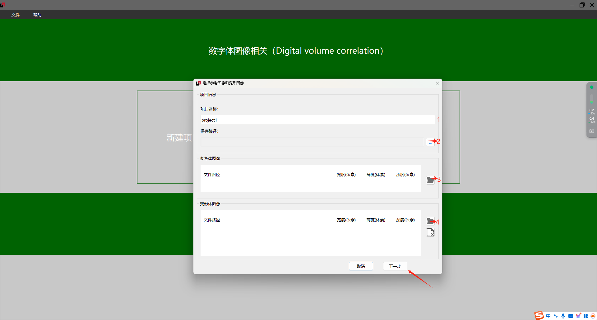
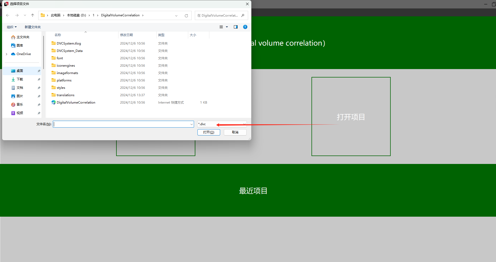
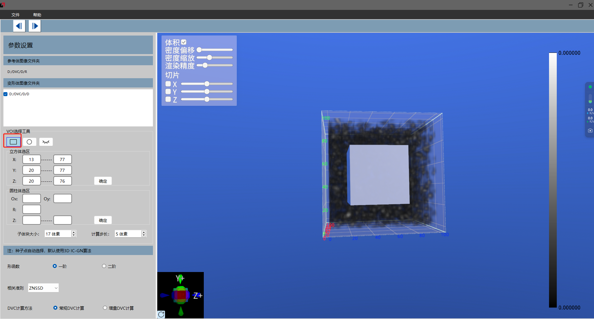
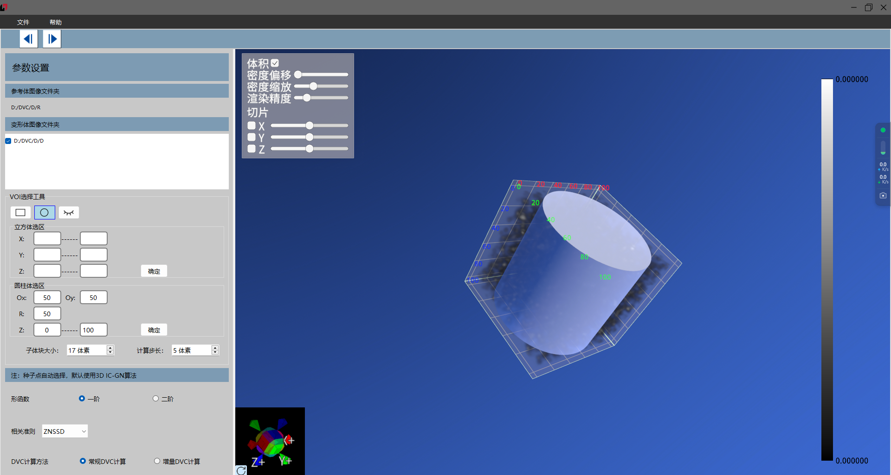
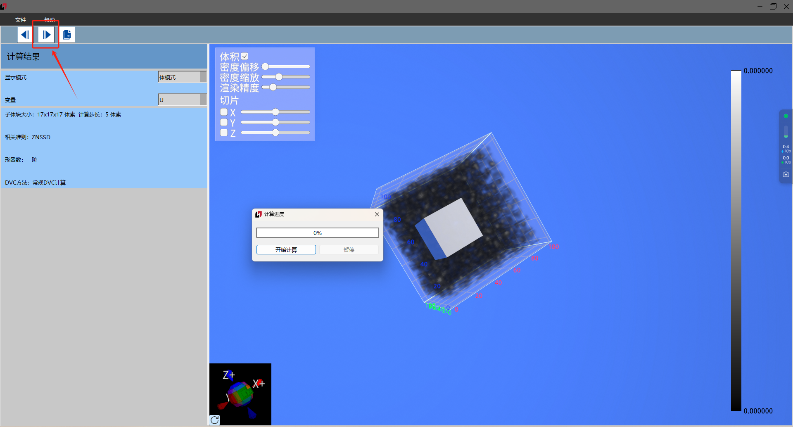
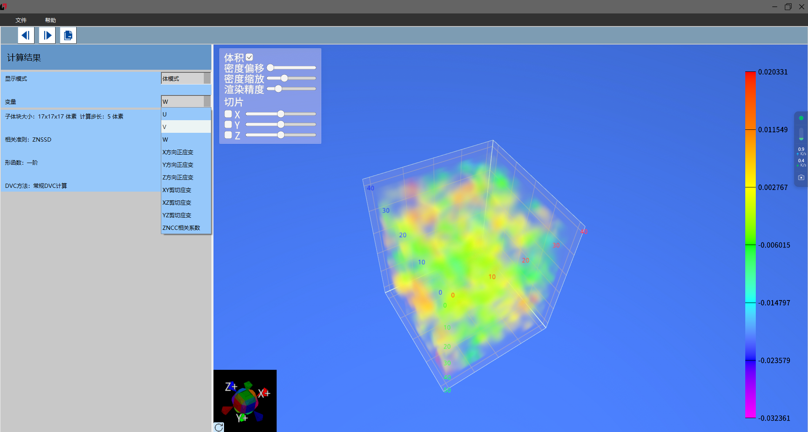
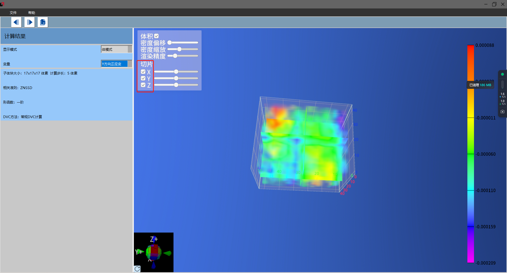
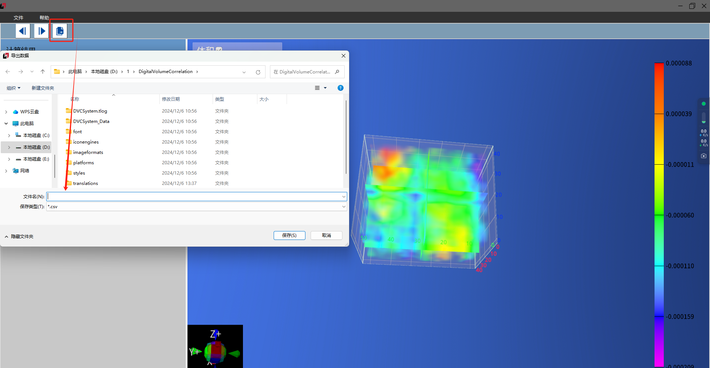

# DVC 功能介绍文档

1.  ## 新建项目

    默认给出了项目名称，可自行修改名称；选择合适的存储路径后进行图片导入，其中参考体图像和变形体图像的宽度、高度、深度都应该保持一致，以确保数据的准确性，点击下一步即完成项目创建

后续可通过【打开项目】打开已经创建的项目进行数据查看

2.  ## 框选立方体

    点击【VOI】选择工具选中立方体，可通过鼠标左键将区域（右图中的灰色立方体）拖动至感兴趣的区域内，（往里拖为缩小范围，往外拖则是扩大范围），可按住右键对立方体进行 360°旋转动，从而对不同的面进行设置；也可通过修改左侧坐标来设置区域，修改坐标后需点击确定才可生效

3.  ## 框选圆柱体

    点击【VOI】选择工具选中圆柱体，操作步骤和立方体一致。需要注意设置的区域大小需要预留半个子区大小的范围，否则点击计算会提示区域选择不符合

4.  ## 计算

    点击“”按钮，跳转至计算页面，再次点击该按钮，弹出计算弹窗，点击【开始计算】等待计算完成

    

5.  ## 查看结果

    通过控制【变量】可查看位移和应变

    

6.  ## 查看切片

    勾选不同方向的切片可查看其切片

    

7.  ## 数据导出

    选择导出数据按钮，设置名称及保存地址，保存为 csv 文件

    
