1.  附件

    1.  ## 附件一：可通讯试验机厂家表

<table>
<colgroup>
<col style="width: 22%" />
<col style="width: 21%" />
<col style="width: 21%" />
<col style="width: 23%" />
<col style="width: 11%" />
</colgroup>
<tbody>
<tr class="odd">
<td colspan="5"><strong>试验机通讯方式</strong></td>
</tr>
<tr class="even">
<td rowspan="2"><strong>试验机厂家</strong></td>
<td rowspan="2"><strong>型号</strong></td>
<td colspan="3"><strong>传输类型</strong></td>
</tr>
<tr class="odd">
<td><strong>UDP 数字信号</strong></td>
<td><strong>模拟信号（±10V）</strong></td>
<td><strong>串口</strong></td>
</tr>
<tr class="even">
<td rowspan="3">MTS</td>
<td>Flex</td>
<td>UDP_9 位</td>
<td></td>
<td></td>
</tr>
<tr class="odd">
<td>DCS</td>
<td>UDP_9 位</td>
<td></td>
<td></td>
</tr>
<tr class="even">
<td>C.E 系列</td>
<td>UDP_9 位</td>
<td>海塞姆控制器</td>
<td>串口</td>
</tr>
<tr class="odd">
<td>三思纵横</td>
<td>静态</td>
<td>UDP_Json_三思</td>
<td></td>
<td></td>
</tr>
<tr class="even">
<td>力试</td>
<td></td>
<td>UDP_9 位</td>
<td></td>
<td></td>
</tr>
<tr class="odd">
<td rowspan="2">万测</td>
<td>TestPilot_X10A</td>
<td>串口</td>
<td></td>
<td></td>
</tr>
<tr class="even">
<td></td>
<td>UDP_Json</td>
<td></td>
<td></td>
</tr>
<tr class="odd">
<td>中机</td>
<td></td>
<td>UDP_Json</td>
<td></td>
<td></td>
</tr>
<tr class="even">
<td>Zwick</td>
<td></td>
<td></td>
<td>海塞姆控制器</td>
<td></td>
</tr>
<tr class="odd">
<td>英斯特朗</td>
<td></td>
<td></td>
<td>海塞姆控制器</td>
<td></td>
</tr>
<tr class="even">
<td>岛津</td>
<td></td>
<td></td>
<td>海塞姆控制器</td>
<td></td>
</tr>
<tr class="odd">
<td>特斯麦特</td>
<td></td>
<td>UDP_9 位</td>
<td></td>
<td></td>
</tr>
<tr class="even">
<td>美三思</td>
<td></td>
<td>UDP_9 位</td>
<td></td>
<td></td>
</tr>
<tr class="odd">
<td>三思检测技术</td>
<td></td>
<td>UDP_9 位</td>
<td></td>
<td></td>
</tr>
<tr class="even">
<td>吉林冠腾</td>
<td></td>
<td>UDP_Json</td>
<td></td>
<td></td>
</tr>
<tr class="odd">
<td>宝大</td>
<td></td>
<td>UDP_Json</td>
<td></td>
<td></td>
</tr>
<tr class="even">
<td>长春方锐</td>
<td></td>
<td>UDP_Json</td>
<td></td>
<td></td>
</tr>
</tbody>
</table>

<table>
<colgroup>
<col style="width: 22%" />
<col style="width: 21%" />
<col style="width: 21%" />
<col style="width: 23%" />
<col style="width: 11%" />
</colgroup>
<tbody>
<tr class="odd">
<td colspan="5"><strong>试验机通讯方式</strong></td>
</tr>
<tr class="even">
<td rowspan="2"><strong>试验机厂家</strong></td>
<td rowspan="2"><strong>型号</strong></td>
<td colspan="3"><strong>传输类型</strong></td>
</tr>
<tr class="odd">
<td><strong>UDP 数字信号</strong></td>
<td><strong>模拟信号（±10V）</strong></td>
<td><strong>串口</strong></td>
</tr>
<tr class="even">
<td>上海华龙</td>
<td></td>
<td>UDP_13 位</td>
<td></td>
<td></td>
</tr>
<tr class="odd">
<td>金健</td>
<td></td>
<td>UDP_Json</td>
<td></td>
<td></td>
</tr>
<tr class="even">
<td>广州广材</td>
<td></td>
<td>UDP_Json</td>
<td></td>
<td></td>
</tr>
<tr class="odd">
<td>恒维通（纳百川）</td>
<td></td>
<td>UDP_Json</td>
<td></td>
<td></td>
</tr>
<tr class="even">
<td>陕西力创</td>
<td></td>
<td>UDP_Json</td>
<td></td>
<td></td>
</tr>
<tr class="odd">
<td>恩普达</td>
<td></td>
<td></td>
<td>海塞姆控制器</td>
<td></td>
</tr>
<tr class="even">
<td>宇宏试验机</td>
<td></td>
<td></td>
<td></td>
<td>串口</td>
</tr>
<tr class="odd">
<td>杭州微力</td>
<td></td>
<td>UDP_Json</td>
<td></td>
<td></td>
</tr>
</tbody>
</table>

## 附件二：MTS DCS3.0 控制器/CMT 系列试验机通讯设置

## 电脑未安装 MTS 试验机 PowerTest_DCS 软件

**前提条件（全新电脑）**

-   **DCS 3.0 控制器/CMT 系列试验机/配视频引伸计。**

-   **新电脑有 64 位 win10 系统，有 USB3.0 接口。**

**更新步骤：**

1.  **安装试验机操作软件：**

<!-- -->

1.  打开“DCS 软件安装包 ＞ PowerTest V3.6.1658_D00C”

2.  双击打开，安装软件

<!-- -->

2.  **更新视频引伸计接口文件**

<!-- -->

3.  将“OUT”文件包中“PowerTest_D00C-H.exe”文件，拷贝到试验机软件根目录下（如：X 盘：
    PowerTest_V3.6C），

4.  将“OUT”文件包中“mswinsck.ocx”文件，拷贝到 C 盘 windows 的 syswow64 目录下。

5.  开始＞windows 系统＞命令提示符（右击鼠标）＞更多＞以系统管理员身份运行，

6.  在“管理员：命令提示符”弹窗，输入命令 (红色字)，
    出现注册成功窗口就可。

-   C:\\windows\\system32\> cd.. （回车）

-   C:\\Windows\> cd syswow64（回车）

-   C:\\Windows\\SysWOW64\>regsvr32 MSWINSCK.OCX（回车）

-   C:\\Windows\\SysWOW64\>

-   弹出“注册成功”窗口，即可

-   回到 PowerTest_V3.6C 目录下，找到
    PowerTest_D00C-H，右键“创建快捷方式”

3.  **获取试验机软件授权激活文件**

<!-- -->

7.  双击打开 PowerTest_DOOC-H 软件后，会出现“获取授权信息失败”弹窗，

8.  点“Ok”按键，出现“获取电脑授权信息或激活”，再点击“获取授权信息”。

9.  电脑桌面上出现文件 ComputerInfo.DAT 文件，

10. 将文件发给美特斯客服部，获取授权激活文件，

11. 重复 1）-2）步，激活即可。

<!-- -->

4.  **拷贝试验机硬件参数到新电脑中：**

<!-- -->

12. 在原配电脑中，以管理员身份登录操作软件，选择脱机。

13. 软件界面左上角“参数设备” - “硬件参数” - “导出” - “数据库形式” - “导出”

14. 导出的文件，默认保存路径：HardwareParameter ＞ 自定义文件名

15. 找到 HardwareParameter 文件包，复制到 U 盘。

16. 在新电脑中，将复制的文件包拷贝到试验机操作软件路径下。

17. 在新电脑中，以管理员身份登录操作软件，选择脱机。

18. 软件界面左上角“参数设备” - “硬件参数” - “导入”

19. 选择已经拷贝好的文件，双击即可。

20. 退出软件，重新启动软件，选择与当前试验机匹配的主机参数，进行联机。

## 电脑已安装 MTS 试验机 PowerTest_DCS 软件

1.  将“OUT”文件包中“PowerTest_D00C-H.exe”文件，拷贝到试验机软件根目录下（如：X 盘：
    PowerTest_V3.6C），

2.  将“OUT”文件包中“mswinsck.ocx”文件，拷贝到 C 盘 windows 的 syswow64 目录下，或 WIN7 系统
    \[System32\]目录

3.  开始＞windows 文件＞命令提示符（右击鼠标）＞更多＞以系统管理员身份运行

4.  在“管理员：命令提示符”窗口，按照步骤输入命令 (红色字)，
    出现注册成功窗口就可。

-   C:\\windows\\system32\> <u>cd..</u>

-   C:\\Windows\> cd syswow64 或 WIN7 系统 (system32)

-   C:\\Windows\\SysWOW64\><u>regsvr32 MSWINSCK.OCX</u>

-   C:\\Windows\\SysWOW64\>（WIN7 系统<u>中</u>SysWOW64 需要替换<u>system32)</u>）

> 旧电脑美特斯软件已经激活，无需再次激活。

## 附件三：MTS FLEX 控制器 CMT 系列试验机通讯设置

## 电脑未安装 MTS 试验机 PowerTest_FLEX 软件

1.  **修改软件安装电脑的 IP 地址**

网口与试验机默认 IP 不同。

桌面开始--＞ 设置--＞ 网络和 Internet--＞ 以太网--＞
更改适配器选型--＞右击以太网图标--＞ 属性--＞
双击 Internet 协议版本 4（TCP/IPV4）--＞

使用下面的 IP 地址--＞ 输入与试验机控制器同一网段但 IP 不同的不同的 IP 地址。

**例如**：控制器默认 IP 地址是：192.168.10.10，

所以此时电脑上输入的 IP 地址应为 192.168.11（前 3 位相同，最后一位不同）。

2.  **安装试验机操作软件**

<!-- -->

1.  打开“MTS(配视觉引伸计) 最新软件＞MTS”文件包

2.  运行“PowerTest V5.0_F00C.exe”程序，安装“PowerTest V5.0_F00C”软件。

3.  试验机软件成功安装后，将“MTS--＞ OUT--＞
    FLEX--＞“PowerTest_F00C-H.exe
    ”文件，拷贝到试验机软件根目录下（如：X 盘 PowerTest_F00C），

4.  “OUT”文件包中“wsock32.dll”文件，是一个备用文件，如果 windows 中没有才需要拷贝注册

-   （32 位电脑）C:Windows＞System32

-   （64 位电脑）C:Windows＞syswow64

3.  **获取试验机软件授权激活文件**

<!-- -->

5.  双击打开 PowerTest_F00C-H 软件后，会出现“获取授权信息失败”弹窗，

6.  点“Ok”按键，出现“获取电脑授权信息或激活”，再点击“获取授权信息”。

7.  电脑桌面上出现文件 ComputerInfo.DAT 文件，

8.  将文件发给美特斯客服部，获取授权激活文件，

9.  重复 1）-2）步，激活即可。

<!-- -->

4.  **拷贝试验机硬件参数到新电脑中：**

<!-- -->

10. 在原配电脑中，以管理员身份登录操作软件，选择脱机。

-   软件界面左上角“参数设备” - “硬件参数” - “导出” - “数据库形式” - “导出”

-   导出的文件，默认保存路径：HardwareParameter ＞ 自定义文件名

-   找到 HardwareParameter 文件包，复制到 U 盘。

11. 在新电脑中，将复制的文件包拷贝到试验机操作软件路径下。

-   在新电脑中，以管理员身份登录操作软件，选择脱机。

-   软件界面左上角“参数设备” - “硬件参数” - “导入”

-   选择已经拷贝好的文件，双击即可。

-   退出软件，重新启动软件，选择与当前试验机匹配的主机参数，进行联机。

## 电脑已安装 MTS 试验机 PowerTest_FLEX 软件

将“ ＞ MTS ＞ OUT ＞ FLEX ＞ PowerTest_F00C-H.exe”文件，

拷贝到试验机软件根目录下（如：X 盘：PowerTest_F00C），即可。

**注：如果视频引伸计软件和试验机软件不安装在同一台电脑上，还可通过网线将两台电脑桥接的方式进行通讯**

**网线连接方式：**

**试验机操作软件安装目录下找到 SANS.INI 配置文件，**

**在配置文件中找到\[Haytham\]字符，如图**

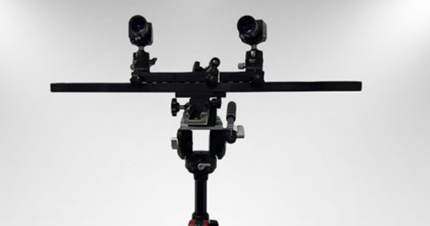

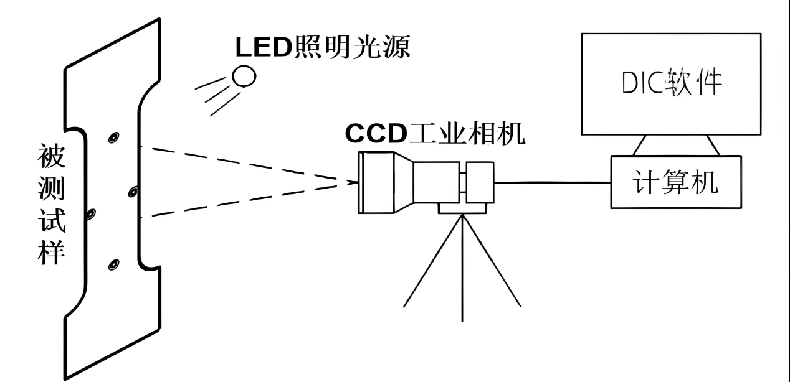

1.  将“LocalIP = 127.0.0.1”修改为 与 引伸计电脑同网段 IP.

**例如：**安装视频引伸计电脑 的 IPV4 地址：192.168.0.11

修改试验机软件电脑 LocalIP 为 192.168.0.12（保持全三位一致，尾数不同）

2.  将“LocalIPort =
    8011”，或者修改为本项数字，此时试验机软件将会接收该网段 8011 端口的数据。

> 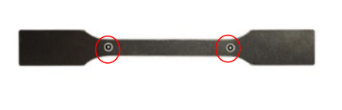 style="width:5.01528in;height:1.28125in" />

3.  将视频引伸计软件的 UDP 发送端口号改为 8011。

## 附件四：MTS SHT 液压试验机通讯设置

## 使用 PowerTestV3.5-SHT 海塞姆视频引伸计接口程序，替换原试验机操作软件启动程序

1.  打开试验机操作软件的安装根目录，找到“PowerTestV3.5-SHT.exe”程序，将其复制一份副本备份。

2.  打开“PowerTestV3.5-SHT-接口程序”压缩包，将“PowerTestV3.5-SHT”程序拷贝到试验机操作软件的根目录下，替换原来的“PowerTestV3.5-SHT.exe”程序，启动此软件以操作试验机。

## 先以 SANS 调试员 的身份登录软件，密码 sans

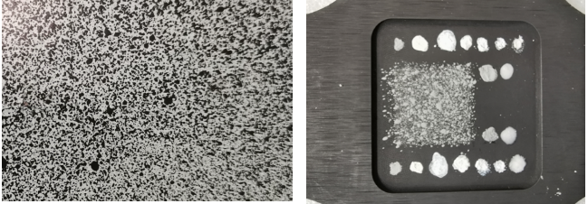

## 到 硬件参数 的 设备参数，勾选“视频引伸计（Haytham）”，然后点 保存。根据 提示 重启软件。

## 到 硬件参数 的 设备参数，选中“视频引伸计（Haytham）”页面，填写 IP 地址和端口号，如果需要正式版请输入注册码，然后点 保存。重启软件。

## 到 硬件参数 的 更换传感器，选择引伸计 那里 点下拉菜单，选择 Haytham，然后点击 确定。

>  style="width:3.6746in;height:4.58019in" />

6)  ## 以引伸计的试验方案做试验。软件上的引伸计就是 Haytham 的示值了。 

    1.  ## 附件五：MTS C/E 系列试验机操作软件 TestSuite 通讯设置

## **试验机电脑确认：**

1.  目前只能在试验机原电脑上安装。

2.  确认原电脑的 USB
    3.0 口，64 位操作软件，确认电脑防火墙允许后续软件运行。

3.  安装海塞姆相机驱动，引伸计操作软件，确认有影像。

## **引伸计接口程序安装**

压缩包文件如下：

1.  将 HaythamDevice.dll 文件拷贝

2.  到 C:\\Program Files (x86)\\MTS
    Systems\\MTSTestSuite\\ExternalDevices\\

3.  将 HaythamDevice.tsDeviceTemplate 文件拷贝

4.  到 C:\\Program Files (x86)\\MTS Systems\\MTS
    TestSuite\\ExternalDevices\\

5.  External Device Templates\\

## **打开软件左上角菜单**

1.  点击软件左上角菜单栏“控制器”，选择“外部设备”。

**  
**

2.  点击弹窗右上角的“+”，添加外部设备

3.  在弹窗中选择“Haytham Video”，随后连续点击确认关闭弹窗

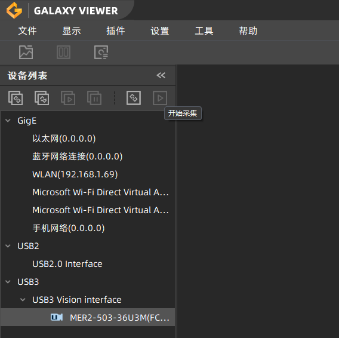

## **选择测试模板（使用引伸计）**

1.  按序：MTS 模板 -“TW-EM” - MTS EM 拉伸试验（引伸计）

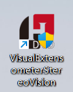

2.  在测试模板界面，按序：定义 -资源 -导入资源

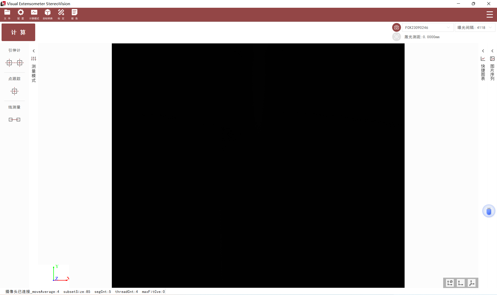

3.  导入选定的站台资源 -外部设备 - Haytham Video

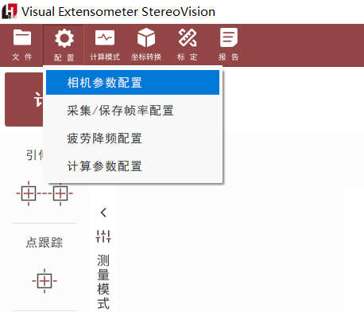

## **浮点信号 - 引伸计 - Haytham Video Y1** 

浮点信号—横向引伸计信号 - Haytham Video X1（如需横向变形）

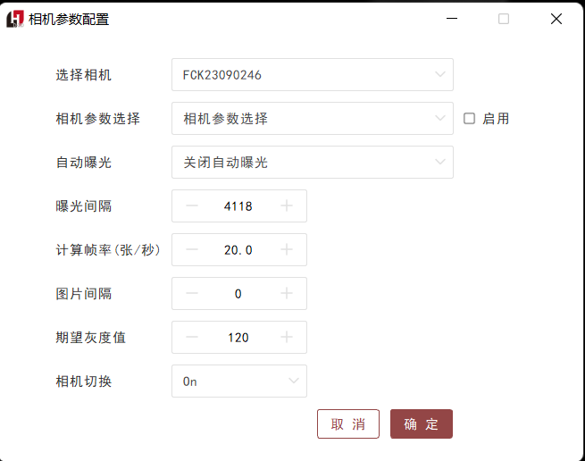

## **软件激活**

1.  试用版：重启软件即可试用。默认是 1 个小时试用时间，可以关闭后重开软件来反复试用。

2.  正式版：软件“运行时显示”右侧有 Mac Address
    ，将“数字”告诉美特斯公司，获取正式版注册码，

<!-- -->

1.  填写“注册码”后，重启软件即可正式使用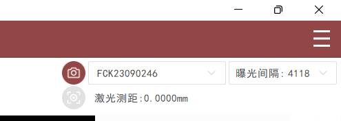

2.  点击引伸计软件 - 计算，回到试验机软件，数字有跳到即为通讯成功。

    1.  ## 附件六：特斯麦特试验机通讯设置

## 软件备份

进入到试验机操作软件的根目录，找到“Tester_D20C.exe”程序，将其复制备份。

## 可执行文件替换

拷贝“海塞姆 - 特斯麦特”文件夹中的“Tester_D20C”程序，复制到试验机操作软件的根目录，进行替换原来的“Tester_D20C”程序。

## 电脑环境配置

“海塞姆 - 特斯麦特”文件夹中的 MSWINSCK.ocx
这个文件可以先不用拷贝到根目录中，如果软件不能正常使用，再拷贝这个文件。

## 通讯设置

IP 设置为本机 IPV4 地址 或 127.0.0.1，端口默认设置为 8011。

注意：此时本地端口为 8011，那么在视频引伸计软件中应将“配置”—“通讯参数设置”—“端口”—“UDP 发送端”改为 8011。

> 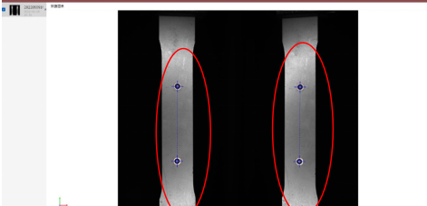 style="width:3.125in;height:2.375in" />
>
>  style="width:5.76806in;height:2.29398in" />

5)  ## 试验机操作软件在联机时应勾选“视频引伸计”使用。

6)  ## 方案中设置 HsmExt1 为轴向变形值，HsmTExt1 为径向变形值。

>  style="width:5.76806in;height:3.58953in" />

## 附件七：Doli 控制器通讯设置 

1)  ## 功能描述

    2D视频引伸计支持通过RS232或者RS485串口信号与doli控制器进行数值传输，支持以下三类传值：

-   支持独立传输一组纵向结果 (Y 向)。

-   支持独立传输一组横向结果 (X 向)。

-   支持同时传输一组纵向结果和一组横向结果。

## 硬件设置

1.  确保 Doli 控制器 Y1 有配置串口接口，如果没有需要找 Doli 厂家，增加串口端口配置。

    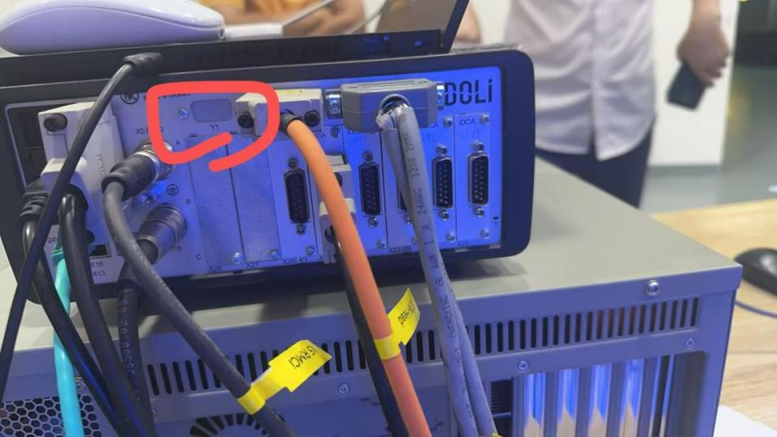

    

2.  USB 转串口线，9pin 串口接 Doli，USB 接电脑。

    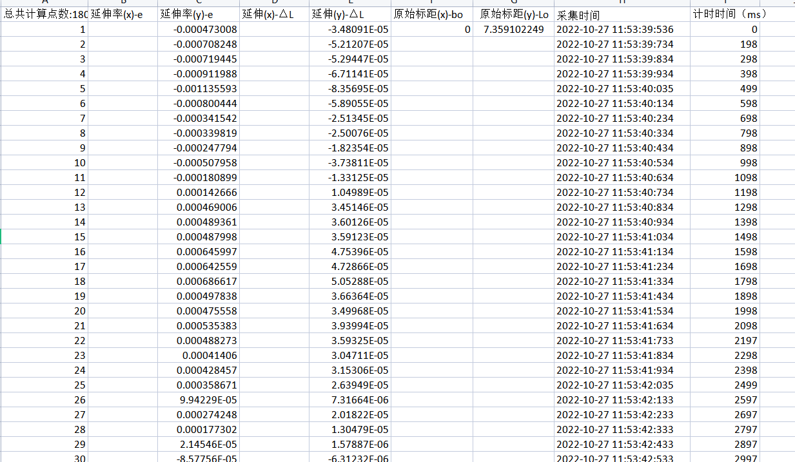

## 软件设置

1.  Doli 软件端口号设置，设置完成要写入 Doli 控制器才生效，（此步骤建议让客户自己协调专业人员操作）

    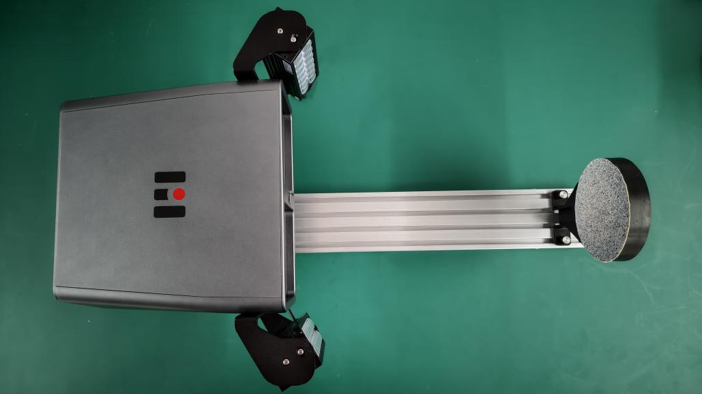

2.  确保电脑装有串口驱动，设置软件勾选串口通讯，串口设置实际识别的串口号，波特率设置为：115200，数据位：8 位，校验位：奇校验，停止位：1 位。

    

    **需要做应变控的话 Doli 需要调节 PID**

    1.  ## 附件八：模拟信号通讯设置

## 功能描述

本软件计算生成的变形数据初始类型为数字信号，该数字信号无法直接被试验机采集使用，需通过指定的数据采集卡设备将数字信号转换为模拟信号后，方可实现试验机的数据采集及后续运算 (总流程如下图所示)。

信号转换环节需使用指定品牌的数据采集卡，目前支持的数据采集卡品牌为 NI、阿尔泰、上海简仪三家。经上述数据采集卡转换后的模拟信号，可通过多种常见数据端口进行输出，具体包括 BNC 接口、鳄鱼夹接口、RJ45 接口等类型。

输出的变形模拟信号由试验机采集后，试验机将基于该信号完成各类预设计算结果及流程，为后续试验相关的分析及控制提供数据支撑。

## 硬件设置（以 NI 为例，三家设置大同小异）

1.  硬件构成

主要由 NI-9171 单槽 USB，NI-9269 电压输入模块和相关线缆构成

左为 NI-9171，右为 NI-9269

NI-9171 单槽 USB：用于输入输出模块供电与数据传输。

NI-9269 电压输出模块：以模拟信号实时输出视频引伸计变形量给试验机。

2.  硬件连接

I/O 部分连接试验机，USB 口连接电脑

## 软件设置

1.  软件安装，电脑需安装 NI 驱动程序“ni-daqmx_23.8.0_offline”，安装完成后安装并打开控制程序“NIDAC_V2.1.2”设置端口号，端口号需与引伸计软件通讯设置配置一致。

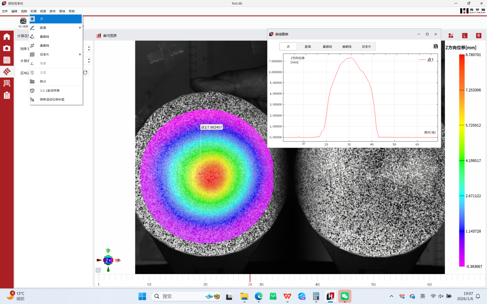

左为 DAC 设置界面，右为视频引伸计通讯设置界面

2.  2.NI 控制程序选择和硬件连接对应的端口号。

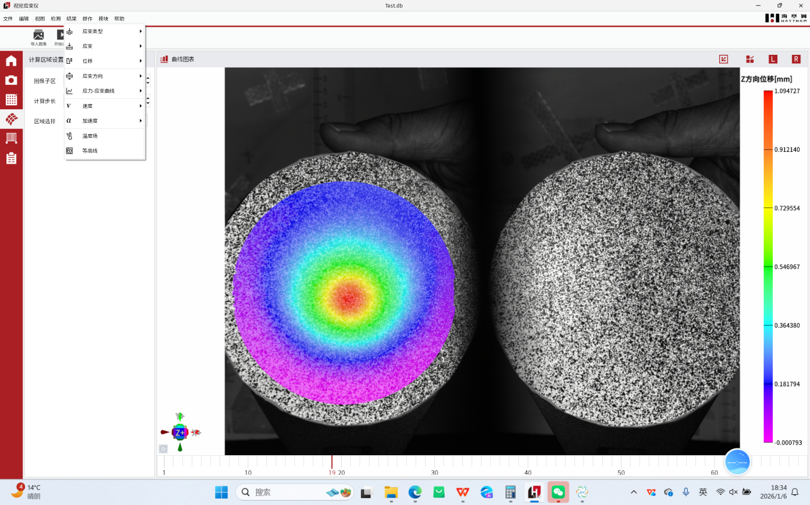
