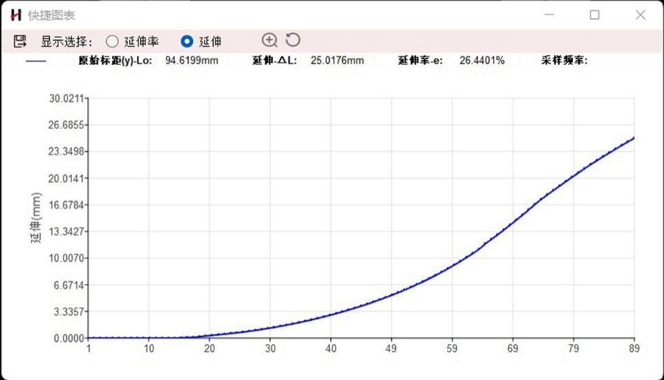

**RED BOX 视频引伸计使用手册**

深圳市海塞姆科技有限公司

# 

# 目 录

[一、设备介绍 1](\l)

[二、硬件安装 3](\l)

[三、软件安装 4](\l)

[四、软件使用 6](\l)

[五、安全操作及注意事项 1](\l)1

# 

# 

# 一、设备介绍

**视频引伸计主要部件：设备主机、操作软件、加密狗、光源及光源控制器、固定支架及云台、标定板、USB3.0 数据线、标记点或高温材料。**

# 1、设备主机

主要包括红色外观方形盒子和防尘盖两部分，通过底部不同的固定孔位可实现水平放置或者呈 90°竖直放置。

>  style="width:1.45972in;height:1.33333in" /> style="width:1.45972in;height:1.33333in" /> style="width:1.45972in;height:1.33333in" />

# 2、光源

常温标准视野配置环光，高温炉环境配置射灯，高低温箱环境配置条光。

>  style="width:1.45972in;height:1.33333in" />
>  style="width:1.45972in;height:1.33333in" /> style="width:1.45972in;height:1.33333in" />

# 3、固定支架（根据实际测试环境搭配）

1）利用试验机安装孔固定的有旋转支架或 45 度支架。

2）可移动式固定支架有三角架或电动支架。

# 4、标记点

1）常温试验时，采用标准化标记点，可以实现软件自动识别。

2）高温试验时，采用酒精加高温材料或高温笔，制作高温标记点。

# 

# 二、硬件安装

1.固定好旋转支架或三角架。

2.将快装板固定在引伸计底座上。

3.将引伸计安装在云台或支架上，调整好水平及高度。

4.按照引伸计预设的距离参数，调整合适的摆放距离。

> 例：预设距离参数 210mm。
>
> 使用卷尺或长度尺等测量“设备前端边缘到试样”的间距，调整到约为 210mm。完成引伸计窗口和待测试样中心的基本对齐。

5.将光源固定在引伸计主机或者试验夹具周围（环形光源磁吸至引伸计前端，其余光源采用专用支架固定）。

6.光源连接：将电源线连接至光源控制器上，再通过黑色数据线将光源控制器（CH 接口）与光源连接。

7.引伸计连接：用 USB3.0 数据线将引伸计和电脑主机连接（电脑必须支持 USB3.0 接口）。

8.取下引伸计防尘盖，按下光源控制器开关，蓝色光源点亮，调整亮度使视野亮度适中。

9.在待检测试样上粘贴标记点或者做好耐高温标记点，按照试验要求，选择合适的标距及位置，并将贴好标记点的试样固定在试验机夹具上。

10.打开电脑，进行软件操作，对引伸计、灯光等进行微调（调整至试样在软件界面清晰可见，标记点不反光）。

# 三、软件安装

**初次使用时，必须在试验机电脑上先进行软件安装。**

**电脑基本配置要求：i7 处理器 16GB 内存 1TB 固态硬盘 USB3.0 接口/
64 位 WIN10 操作系统以上。**

# 相机驱动安装

找到随机 U 盘资料以下相机驱动文件，解压点击安装。

>  style="width:3.51806in;height:0.35764in" alt="1718705453768" />
>
>  style="width:3.04444in;height:0.35764in" alt="1718705636399" />

# 引伸计软件安装

1）找到随机 U 盘资料以下文件（版本号以实际为准），解压点击安装。

>  style="width:2.825in;height:0.59167in" />

2）安装完成后，电脑屏幕上显示相机驱动软件和引伸计软件。

3.  # 软件安装验证

    1）点击电脑屏幕上摄像头图标。

2）在软件界面左侧，双击”MER-503-36U3M”打开摄像头，以相机型号为准。

3）在新窗口点击软件左上角“开始采集”图标，显示有图像即安装成功。

# 四、软件使用

# 1、软件打开

将加密狗 U 盘插入到电脑主机 USB 插口中，双击软件图标

打开软件界面如下：点亮相机按钮，设备连接成功。

>  style="width:5.41736in;height:3.13264in" />

# 2、图片保存操作

1）点击文件，选择保存：依次点击软件界面左上角“文件”→
勾选“保存图片”，再次打开时，“保存图片”前端处于勾选状态。

2）设置保存路径：点击“设置保存图片路径”。选择主机中剩余内存空间高于 300G 的硬盘创建文件夹存储图片。

3）不需要保存图片：取消“保存图片”勾选状态。

>  style="width:2.24097in;height:2.62222in" />

# 3、相机参数设置

点击工具栏第二个按钮“配置”，弹出参数配置界面，根据需求对相机参数、计算参数等参数进行修改。

>  style="width:2.72153in;height:2.89097in" />

# 4、设备微调

1）点击“相机”按钮，试样图片出现在电脑屏幕上。

>  style="width:3.875in;height:1.36667in" />

2）观察视窗，通过继续调整引伸计位置和角度，直至在视窗中看到清晰的待测试样全貌为止。

**5.识别标记点（计算标距）**

1）自动识别标距：再次点击“相机”按钮，软件可以自动识别相关的标记点。

2）手动调整标距：如果无法自动识别时，请选用手动调整；通过鼠标拖动“十字星”与试样上的标记点重合；根据需要可设置多组标记点，在视窗单击鼠标右键，即可添加。

# 6、数据计算

1）点击“计算”按钮。

>  style="width:2.04444in;height:1.13819in" />

2）软件出现浮窗显示实时数据及位移 - 时间曲线，数据会通过 UDP 协议实时传输给试验机操作软件，显示在引伸计窗口（以试验机软件显示为准）；试验结束时，再次点击计算按钮，停止计算。

>  style="width:4.59167in;height:2.67708in" />

# 7、数据输出

1）点击“快捷图表”中工具栏最左侧“保存”图标，

>  style="width:4.36806in;height:2.50556in" />

2）即可输出实验数据的 EXCEL 格式文件。

# 8、图片二次计算

1）可以将已保存的图片，或者在其他单目三维引伸计上保存的图片，导入到本软件进行二次计算。

2）依次点击软件界面左上角“文件”→ “输入”→
“图形序列”，选择图片保存的路径，待图片导入完成进行计算即可。

# **五、**安全操作及注意事项 

1.  未经专业培训，不得单独操作此仪器。

2.  使用时尽量不要让光源直射人眼，避免可能造成操作人员眼部伤害。

3.  高温环境下，尽量配戴高温手套，防止人员烫伤，制作高温散斑或者标记点时，注意不要沾到眼睛。

4\. 仪器不使用时，应将其装入箱内，置于干燥处，注意防震、防尘和防潮。

5\.
仪器运输应将仪器装于箱内进行，运输时应小心避免挤压、碰撞和剧烈震动，长途运输填充软件泡沫作为缓冲物。

6\. 仪器安装至三脚架或者拆卸时，要先托住仪器，以防仪器跌落。

7\. 不可用化学试剂擦试塑料部件及有机玻璃表面，可用浸水的软布擦试。

8\.
测量前应仔细全面检查仪器，确信仪器各项指标、功能、电源符合要求时再进行作业。

9.  即使发现仪器功能异常，非专业维修人员不可擅自拆开仪器，以免发生不必要的损坏。

**感谢您选用我公司产品！**

**海塞姆科技，点亮机器的眼睛！**

**深圳市海塞姆科技有限公司**

地址：深圳市南山区桃源街道长源社区

学苑大道 1001 号南山智园 C3 栋 15 层

电话：0755-86347753

网址：www.haytham.com.cn

微信公众号 B 站 今日头条
