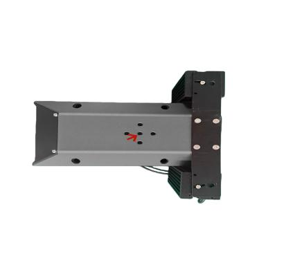
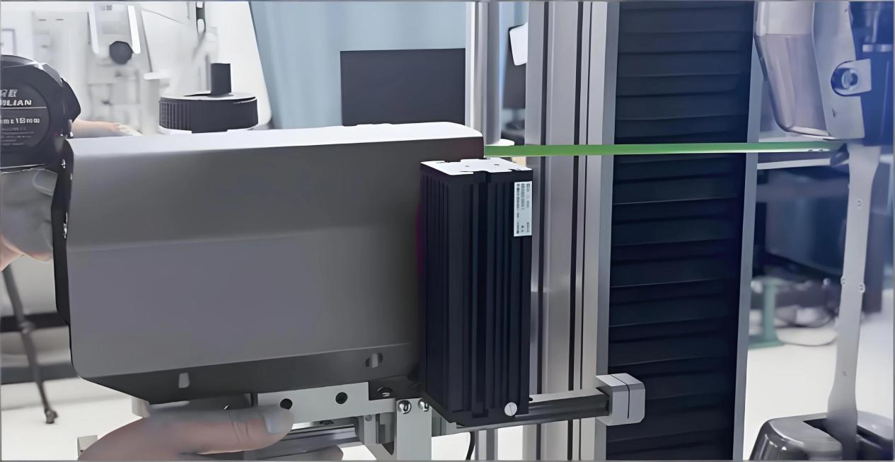
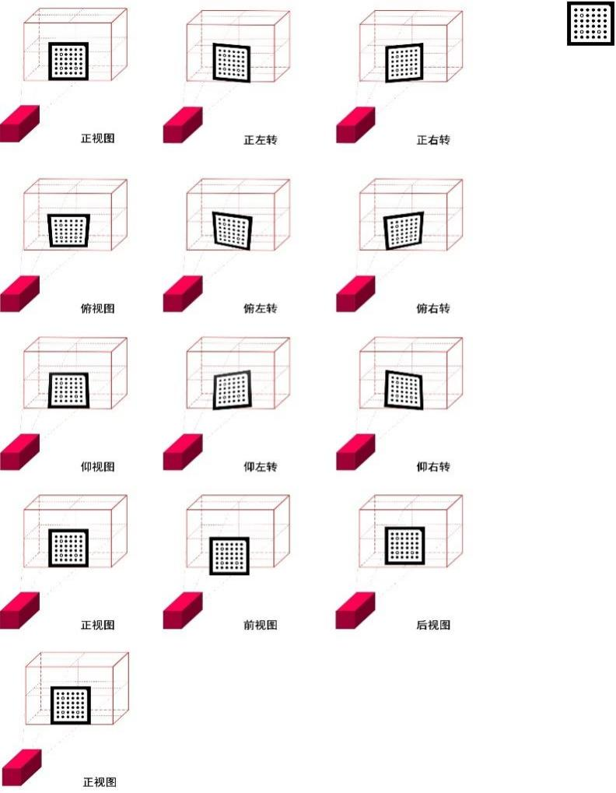

# 

# **目录**

[**1. 注意事项 [2](#_Toc23120)**](\l)

[1.1. 使用安全 [2](#使用安全)](\l)

[1.2. 使用警告 [2](#使用警告)](\l)

[1.3. 法律声明 [3](#法律声明)](\l)

[**2. 系统介绍 [4](#_Toc11626)**](\l)

[2.1. 测量原理 [4](#_Toc15714)](\l)

[2.2. 应用场景 [5](#应用场景)](\l)

[2.3. 硬件配置 [5](#硬件配置)](\l)

[2.4. 测量流程 [8](#测量流程)](\l)

[**3. 软件安装 [8](#_Toc17190)**](\l)

[3.1. 相机驱动安装 [9](#相机驱动安装)](\l)

[3.2. 视频引伸计软件安装 [9](#视频引伸计软件安装)](\l)

[**4. 硬件安装 [10](#_Toc16079)**](\l)

[**5. 软件使用 [12](#_Toc7314)**](\l)

[5.1. 视频引伸计软件基本功能 [12](#视频引伸计软件基本功能)](\l)

[5.2. 视频引伸计软件详细功能 [14](#视频引伸计软件详细功能)](\l)

[**6. 设备保养维护以及注意事项 [28](#_Toc15052)**](\l)

[6.1. 日常维护 [28](#日常维护)](\l)

[6.2. 周期性维护 [28](#周期性维护)](\l)

[6.3. 定期校准 [29](#定期校准)](\l)

[6.4. 长期存放与特殊情况处理 [29](#长期存放与特殊情况处理)](\l)

1.  注意事项

    1.  ## 使用安全

<!-- -->

1)  本系统在部分需使用电源配件时，应使用符合标准三相 220V 电压，且应有接地装置。使用不正确的工作电压可能导致故障或火灾的危险，请严格遵守使用规范。

2)  使用设备前需检查设备是否完整，电缆是否破损或损坏，以防造成设备损坏或人员伤亡。

3)  请勿在高温、高压、高湿等环境下使用该设备。如确需使用，需做好整机防护。

4)  请勿在多尘、结霜、腐蚀等环境下使用该设备。

5)  在使用过程中必须遵守相关的使用流程及事故防治条例。

    1.  ## 使用警告

<!-- -->

1)  在使用过程中注意保持镜面清洁，请勿用手或尖锐物体触碰镜面，避免污染镜面影响成像质量。

2)  在使用设备过程中注意设备需远离振动源，减少环境对测量结果的影响。

3)  在使用设备时，请勿触碰或撞击设备及设备支架。

4)  在安装完设备后，需保证设备固定，防止摔落造成设备损坏或内部结构变化。

5)  请勿直视本设备补光灯，以免眼睛不适或视力受损。

6)  请勿在易滑动、倾斜、振动等地面使用该设备，避免晃动、摔落等风险。

7)  请勿自行拆装本系统主机及配件。如需更换零配件，请与本公司联系。

8)  如发现设备问题，请及时与本公司联系，请勿随意处理。

    1.  ## 法律声明

<!-- -->

1)  本说明书的文字、图片、操作指引、参数说明等所有内容，均为海塞姆的合法知识产权，受法律保护。您仅可将说明书用于指导本公司产品的使用，不得擅自抄袭、复制、传播、篡改说明书内容，或用于商业推广及其他产品配套非授权用途。

2)  本说明书的内容是基于产品当前版本、技术参数及行业规范编写，力求准确完整，但不保证内容完全无遗漏或绝对精准。若您发现内容与实际设备存在差异，或有疑问，可联系本公司电话核实。

3)  本公司保留根据产品技术升级、合规要求及功能优化等情况，对说明书内容（包括参数、操作步骤等）进行修改、补充或更新的权利。更新后的说明书以实际随箱设备附带的版本或官方发布的最新版本为准，无需另行通知。

4)  本说明书仅作为设备使用指引，其中的参数功能说明仅为参考，不构成对产品使用效果的绝对承诺。您在使用设备时，仍需结合自身测试场景、行业规范及实际需求操作，海塞姆不对因未按规范使用或场景不匹配导致的问题承担额外责任。

5)  任何单位或个人未经本公司许可，擅自使用、修改、传播本说明书内容，或侵犯相关知识产权的，本公司将依法追究其法律责任。

6)  本声明的最终解释权归深圳市海塞姆科技有限公司所有，若您对声明内容有疑问，可通过本公司电话咨询。

<!-- -->

2.  系统介绍

2D 视频引伸计主要由以下部件组成：‌

-   设备主机

-   操作软件

-   电子密钥

-   光源及光源控制器

-   固定支架与云台

-   标定板

-   USB 3.0 数据线

-   标记点（或高温材料）

    1.  ## 测量原理

2D 视频引伸计是一种光学非接触式变形测量设备，它通过一台相机捕捉试样表面的时序图像，利用数字图像相关技术 (Digital
Image
Correlation，DIC) 分析变形前后图像中特征点的位移变化，从而得到试样的位移变化值。视频引伸计测量系统主要构成见图 1，其中工业相机在光源和计算机的配合下完成对试样图像的采集，试样上布置的四个标准特征点作为视频引伸计需要匹配跟踪的特征。

图 1 测量原理示意图

## 应用场景

1)  金属材料测试：拉伸、压缩、弯曲试验，测量弹性模量、泊松比、屈服强度

2)  高分子材料：橡胶塑料大变形测试（变形可达 350% 以上）

3)  复合材料：碳纤维、玻璃纤维等各向异性材料性能评估

4)  微电子与薄膜：芯片、薄膜材料的微小变形测量

5)  生物医学材料：组织工程支架、生物医用弹性体的力学性能测试

    1.  ## 硬件配置

<!-- -->

1)  **设备主机：**设备主机外观如图 2 图 3 所示，前端（图 2）为高透亚克力面板，两侧为设备的照明光源，（图 3）后端分别为电源指示灯和数据传输接口。

图 2 设备主机前端图片

图 3.设备主机后端图片

2)  **光源：**通常情况下，设备主机自带集成光源，在常规场景和高低温箱中可选配条形灯（图 3.右），在微小试样、高温炉等场景可选配射灯（图 3.左）。

 

图 3 选配光源

3)  **固定支架：**

<!-- -->

1.  依据实际的夹具转向（90°/45°），在试验机平台上安装（90°/45°）旋转支架（图 4）。

图 4.旋转支架

2.  便携式三脚架（图 5），可自由调节系统水平和设备空间距离。

 

图 5.便携式三脚架

4)  **标记点**

<!-- -->

1.  在常温试验时，粘贴标准圆形标记点，可以实现软件自动识别。

2.  在高温试验时，使用酒精与高温材料混合制作高温标记点，或使用高温油漆笔制作标记点，在常温试验时如不方便粘贴标准圆形标记点，也可使用普通油漆笔制作标记点。

## 测量流程

1)  **布置测量系统环境**

<!-- -->

1.  安装视频引伸计、相机驱动、数据采集卡软件。

2.  安装固定装置（便携式三脚架/旋转支架/移动支架）、视频引伸计及光源。

<!-- -->

2)  **测量前准备**

调节视频引伸计设备的物距角度，使其系统位于合理位置上并进行标定作业。对待测试件表面进行特征点布置（标准标记点/手绘标记点）。

3)  **开始测量**

实时采集图像并计算特征的点变形和应变，并同时将数据输入到试验机系统中。

4)  **结果输出**

试验结束后，变形和应变数据会在试验机界面中进行显示，测量结果会同试验机的载荷、横梁位移、应力等绘制成折线图，同时也可对结果参数进行设置得到杨氏模量、泊松比、Rp0.2、抗拉强度、N 值、R 值、断后伸长率等。

3.  软件安装

安装软件的电脑基本配置要求：

-   i7 或以上处理器。

-   16GB 以上内存。

-   1TB 以上固态硬盘。

-   USB3.0 接口。

-   64 位 WIN10 以上操作系统。

    1.  ## 相机驱动安装

将随箱 U 盘插入待安装电脑主机上，打开 U 盘 - “相机驱动软件”文件夹，安装相机驱动软件。

安装完成后桌面上将生成 2 个快捷方式图标，一般只会用到 Galaxy
Viewer 软件。

## 视频引伸计软件安装

将随箱 U 盘插入到待安装的电脑主机端口上，拷贝 U 盘根目录下的“视频引伸计软件”文件夹至电脑主机的 D 盘中 - 双击“Visual
Extensometer”文件夹 - 点击“setup”应用程序进行安装。

安装完成后，桌面上会自动生成快捷方式图标。

4.  硬件安装

-   固定三脚架或安装旋转支架。

-   通过设备底部的 1/4 螺纹孔，将设备安装至三脚架或旋转支架上。

     

-   开启光源系统：将电源线连接至光源控制器上，再通过黑色数据线将光源控制器与光源连接。

    

-   设备连接：通过数据线将 2D 引伸计与电脑主机连接。

-   打开光源控制器开关，蓝色光源点亮，调整亮度。

-   将做好标记的试样放置于合适的夹持处，打开“Visual
    Extensometer”软件，调整至合适的曝光参数（5000-20000μs）。

-   根据“Visual
    Extensometer”软件上的实时界面，依次调整设备的高度、水平、物距，使待测试样位于画面中心处（如下图所示），即可完成调整。

-   设置好试验参数，准备开始测量。

例：预设距离参数 210mm。

通过卷尺或直尺测量并调整“设备前端边缘到试样表面”的距离为 210mm。打开“Visual
Extensometer”软件，调整设备使其试样位于画面中心处。

5.  软件使用

    1.  ## 视频引伸计软件基本功能

<!-- -->

1)  将试样做好标记置于试验位置，标记通过粘贴标准圆形标记点或者手绘明显标记点方式完成，先在待测试样表面布置标记点/特征点，布置完成后将试样。

2)  将设备按照标准物距架设，确保设备平行于试样表面，通过 USB 数据线将设备连接到电脑 USB3.0 接口上。

3)  将加密狗插入到电脑主机 USB 接口中。

4)  双击 VisualExtensometer2D 软件桌面快捷方式图标打开软件。打开软件界面如下：

>  src="./media/image23.png"
> style="width:5.75972in;height:3.33542in" alt="中心界面截图" />

5)  确认标距

<!-- -->

1.  使用粘贴标准圆形标记点时，软件在启动或打开相机时可自动识别标记点，并以 p1 与 p2 间的绝对距离作为待测试样的原始标距，如图所示：

>  src="./media/image24.png"
> style="width:2.35833in;height:1.77153in" alt="标记点" />

2.  使用手绘标记点时，需将 p1，p2 的十字准星手动拖动到标记点处，并确保十字准星方框包裹住标记点，以 p1 与 p2 间的绝对距离作为待测试样的原始标距，如图：

>  src="./media/image25.png"
> style="width:2.34653in;height:1.77153in" alt="手绘标记点" />

6)  点击计算，即可计算原始标距距离、延伸量、延伸率数据。

7)  计算结束后点击取消，以取消计算。

    1.  ## 视频引伸计软件详细功能

### **文件：点击菜单栏“文件”按钮，可进行文件操作**

1.  **保存图片：**点击保存图片选项，可在计算时进行保存图片操作。

未开启保存图片状态：

已开启保存图片状态：

图片默认保存在软件安装目录下。

2.  **设置保存图片路径：**点击后可进行保存图片路径的修改。

3.  **设置数据保存路径：**此软件会保留一份计算数据，默认在软件安装目录下的 DataBase 文件夹内，点击此选项可进行数据保存路径的修改。

4.  **输入：**可选择输入“力值”、“图片序列”、“表格数据”

-   力值：在实时计算或者离线计算完毕后可将试验机的力值数据导入到软件内以生成应力应变曲线和材料参数，此处需注意力值数据需按照软件规定格式导入，格式见 5。

-   图片序列：可将保存的实验过程图片导入到软件里进行离线计算。

-   表格数据：如有已生成的应力应变数据表格，可导入到软件内生成应力应变曲线。

5.  **力值导入格式：**由于输入力值数据时需按照软件规定格式，此选项可生成板材或者棒材的格式模板，将力值数据和试样参数按照模板格式填写后即可。

6.  **测试标定：**在软件内进行标定操作后，可通过测试标定功能来验证标定精度。在标定位置采集一张标定板正视图图片，点击“标定板图片目录”后按钮，选择这种标定板正视图图片，点击“计算”，可得出“X 向空心圆点间距”和“Y 向空心圆点间距”，将此数据与标定上原点间距数值×3 进行比较，可得出标定计算误差，如误差在可接受范围内，则此标定无问题。

###  **参数配置：点击菜单栏“配置”按钮，可进行软硬件参数的配置**

1.  **相机参数设置：**此配置可设置相机硬件参数。

-   选择相机：如连接单台设备则不用进行选择，如连接多台设备，可单独对每台设备进行硬件参数设置。

-   相机参数选择：暂不使用

-   自动曝光设置：一般情况下，需选择关闭自动曝光，使用手动调节曝光间隔来控制画面亮度。

-   曝光间隔：即调整相机的曝光时间，单位为微秒，一般建议不超过 20000 微秒。

-   图片间隔：计算每张图片之间的间隔时间，单位为毫秒，在输入图片序列进行离线计算时可用，如试样变形量较大，此处可设置为 1000 毫秒以上，以防止数据丢失，如试样变形量小可设置为 20-30 毫秒。

-   期望灰度值：在使用自动曝光时，需设置画面的期望灰度值，自动曝光会将画面的平均灰度值调整到设置值。

-   触发模式：一般情况下使用 OFF，在相机需要外触发时可设置为 ON。

-   相机画面旋转：2D 视频引伸计设置初次使用时，显示画面是垂直于真实方向的，进行画面旋转可将显示画面方向和真实方向调整为一致。

2.  **计算参数：**此配置可设置计算过程中的计算参数

滑窗长度：每次滤波计算时使用的数据量。

滑窗次数：滤波次数

子区大小：即画面中十字准星外围方框大小，单位为像素个数，需设置为奇数，在使用标准圆形标记点时，软件会自动识别标记点并自动设置到合适的子区大小，在使用手绘标记点时，一般以方框正好包裹住标记点为佳。

3.  **通讯参数配置：**此配置主要用于与试验机软件或硬件进行数据通讯，支持将试验机力值信号通过采集卡传输至本软件，同时可将软件计算的原始标距、延伸量等数据回传至试验机软件。

    主要通讯方式包括 UDP 数字信号通讯、模拟信号通讯和串口通讯。

根据查“附件一”表后得出适用于哪种通讯方式，再根据不同的通讯方式进行不同的设置：

如使用“UDP 数字信号”通讯，需将“通讯”—“通讯格式”设置中的 UDP 格式改成与表中试验机厂家对应的通讯格式。

4.  **采集/保存帧率配置：**此配置可设置不同的采集模式

-   模式选择：默认为实时调整，可根据不同的需要选择不同的模式。

-   实时调整：即整个采集计算过程按照设置的频率运行。

-   阶段调整：可分 3 个阶段进行分段设置采集频率。

-   间隔调整：可设置为间隔 N 秒采集一张照片。

5.  **应力 - 应变参数配置：**此配置适用于实时输入试验机力值时的参数设置。

-   材料选择：可选择板材或棒材，以选择输入试样宽度、厚度或者试样半径来计算试样横截面积。

-   比例系数。由于试验机力值通过采集器输出到软件是电压数值，电压数值转换为力值需设置比例系数。

-   试样宽度：在材料选择为板材时，可输入试样宽度。

-   试样厚度：在材料选择为板材时，可输入试样厚度。

-   试样半径：在材料选择为棒材时，可输入试样半径。

-   指定相机：在连接多台设备时，可指定由某一台设备来处理应力应变数据。

-   应力生成：可选择力值转换。电压转换。

力值转换：试验机传输数据直接为力值数据。电压转换：试验机传输数据为电压信号。

6.  **算法参数配置：**此配置适用于修改自动识别的标记点类型，以及大变形场景的参数设置

-   自动识别：在打开软件或者启动相机时可进行标记点的自动识别

<!-- -->

-   标记点：标准圆形标记点。

-   黑橡胶：黑色橡胶上点的白色实心圆点。

-   白橡胶：白色橡胶上点的黑色实心圆点。

-   大变形：此参数适用于在橡胶拉伸等大变形量的场景，设置合适参数使手绘标记点的跟踪更精准。

-   增量值：是否开启增量计算的阈值。当计算点的匹配相关系数小于给定阈值时 (0~1)，开启增量计算。

-   Zncc 阈值：
    是否停止粗匹配阈值。当计算点的匹配相关系数大于给定阈值时 (0~1)，停止全图搜索过程，进行小范围内的高精度匹配。

-   CZncc
    阈值：是否进行粗匹配阈值。当计算点的匹配相关系数小于给定阈值时 (0~1)，对该点进行整图位置搜索。

7.  **测量结果：**可选择是否在开始计算时输入实验名称

###  **计算模式**

点击菜单栏“计算模式”可选择不同的计算模式

1.  **真实值：**软件默认采用绝对值进行数据展示，如需“拉正压负”数据需勾选真实值选项。

2.  **平均值：**在有多组同向标距时，勾选平均值，可计算多组数据的平均延伸量及延伸率。

3.  **应力 - 应变：**勾选此功能时，软件开启应力 - 应变计算模式，如接入试验机力值实时传输，则可在软件内实时查看应力应变曲线，也可在试验结束后导入试验机力值表格，来生成应力应变曲线

### **软件标定**

**软件在第一次连接设备时，需创建标定矩阵。**

按照随箱 U 盘 - “标定文件”文件夹 - 标定参数，输入标定板尺寸、圆点间距、空心圆位置点参数，随后点击“尺寸标定目录”后

按钮，选择随箱 U 盘 - “标定文件”文件夹 - 标定文件 - “1”文件夹，再点击“内参标定目录”后

选择随箱 U 盘 - “标定文件”文件夹 - 标定文件 - “13”文件夹，选择完毕后，软件会自动开始进行标定，当显示“标定矩阵创建成功”弹窗时，点击确认以完成软件标定。

\*如使用后期认为数据不准确，可自行重新标定，使用相机驱动软件采集标定图片，使用视频引伸计软件重复此标定操作即可重新标定。

-   **采集标定图片步骤：**

1.  准备工作：将设备至于水平桌面或支架上，在设备物距处摆放标定板，调整合适亮度。

打开相机驱动软件“Galaxy
Viewer”，等待软件读到相机，双击左侧红色方框内相机名称以连接相机，连接相机后，点击画面左上方红色方框内开始采集按键以显示实时画面，由于相机侧置于设备内，故显示为旋转 90°后画面，需鼠标右键单击显示画面内任意位置，选择向左旋转或向右旋转，使显示画面方向与实际方向一致。

2.  设置存图路径，点击左上方工具栏“设置按钮” - 选择“存图设置” - 更改存图位置。

注意：由于标定需要两组图片，所以建议设置两个存图文件夹，一个用来存放“尺寸标定图”，一个用来存放“内参标定图”。

3.  拍摄尺寸标定图，将存图路径设置为“尺寸标定图”文件夹，将标定板按照“正视图”姿势摆放，点击画面左上方“保存当前图片按钮”以拍摄尺寸标定图，拍摄一张即可。

4.  拍摄内参标定图，将存图路径设置为“内参标定图”文件夹，将标定板按照下图姿势摆放，每个姿势都需点击画面左上方“保存当前图片按钮”以拍摄当前姿势标定图，共需拍摄 13 张。

### **输出报告**

如需使用此软件出具报告，可点击菜单栏“报告”按钮，填写相关信息，以出具报告。

### **添加多组标距**

在软件的图像显示区域任意位置单击鼠标右键，将出现“是否添加横向或纵向标记点”弹窗，根据实际需要进行添加。

### **固定标距**

在使用无特征识别模式或试样表面已制作散斑时，可使用固定标距功能，在原始标距上面使用鼠标左键单击十字准星或方框可激活固定标距功能。

### **相机开关**

在一次试验做完更换试样后，如需重新识别标准圆形标记点，可点击下图红色方框处按钮关闭相机后重新打开相机，即可重新识别。

### **快捷图表及相关操作**

1.  在开始计算后，软件会自动弹出快捷图表区域并绘制曲线。

2.  图表上方可切换不同数据曲线，如延伸量、延伸率、应力应变曲线（需输入试验机力值）等。

-   图表右侧为图表操作区从上至下分别为：

-   展开窗口：可将快捷图标区域以浮动窗口的形式展示于软件画面上。

-   保存：可手动保存快捷图表上所有数据，保存格式为.csv。

-   刷新：在曲线被拖动或缩放后可点击此按钮以复原。

-   放大：将鼠标指针悬停在需要放大的区域可进行曲线放大。

-   缩小：将鼠标指针悬停在需要缩小的区域可进行曲线缩小。

3.  另在图表中空白区域按住鼠标左键可拖动曲线，使用鼠标左键或右键单击曲线上的数据点可将此图片设置为初始图片。

6.  设备保养维护以及注意事项

    1.  ## 日常维护

<!-- -->

1)  **使用前检查**

<!-- -->

1.  外观检查：确认设备无碰撞变形，盖板无损伤，连接线无破损。

2.  系统连接：检查摄设备主机与计算机连接是否牢固，电源适配器是否正常工作。

3.  环境条件：确保工作环境温度在 5℃-40℃，相对湿度≤70%，无强光直射和剧烈震动。

4.  设备准备：取出设备，检查前端盖板表面有无灰尘（建议使用气吹清理）。

<!-- -->

2)  **使用后清洁**

<!-- -->

1.  盖板清洁：

-   先用气吹轻轻吹去表面灰尘，避免直接擦拭划伤盖板。

-   如仍有指纹或污渍，用专用镜头纸蘸少量镜头清洁液（勿直接喷在前端盖板上）。

-   以圆周运动方式轻擦，避免来回擦拭，清洁后检查是否有残留。

2.  设备表面：用柔软干布擦拭机身，去除灰尘和污渍，避免使用酒精等有机溶剂。

3.  光源系统：关闭光源，清洁散热孔，确保通风良好。

4.  使用注意事项

5.  避免碰撞：移动设备时轻拿轻放，防止震动影响精度。

6.  标记保护：避免试样标记污染或磨损，影响测量精度。

    1.  ## 周期性维护

<!-- -->

1)  **每月维护**

<!-- -->

1.  全面清洁：

-   彻底清洁，使用软毛刷清理缝隙中的灰尘。

-   检查所有连接线是否有磨损或接触不良。

-   清洁工作台面，确保无金属碎屑等杂物。

2)  **半年维护**

<!-- -->

1.  **校准检查**：使用引伸计标定仪或标定板测试标定验证测量精度（误差应控制在±0.5% 内）。

2.  **光源检查**：检查光源亮度是否均匀，必要时更换老化光源。

    1.  ## 定期校准

3.  **校准周期**：正常使用条件下**12 个月**（最长不超过 18
    个月），使用频繁或环境恶劣时应缩短至**6 个月。**

4.  **校准条件**：必须在温度
    20℃±2℃，湿度≤70%，无振动环境下进行，校准过程中温度波动不超过 1℃/h。

5.  **校准方法**：

-   将设备与校准装置（如引伸计标定仪）正确安装。

-   进行多级位移校准（如 3mm.5mm.10mm 等标准位移）。

-   记录测量值与标准值的误差，确保在设备精度范围内（通常为±0.5% 或
    ±1.5μm）。

-   校准完成后保存记录，以备溯源。

-   **注**：设备经过修理、更换重要部件后，或对测量精度有怀疑时，应立即重新校准。

    1.  ## 长期存放与特殊情况处理

1)  **长期存放（4 周以上）**

<!-- -->

1.  彻底清洁并干燥设备。

2.  将设备放入原厂防震箱或专用仪器柜中，内部放置干燥剂。

3.  存放环境温度保持在 5℃~35℃，相对湿度≤60%，无腐蚀性气体。

4.  每季度检查一次，确保干燥剂有效，设备无霉变或损坏。

<!-- -->

2)  **特殊情况处理**

<!-- -->

1.  **镜头霉变**：如发现镜头有轻微霉斑，立即联系专业维修人员处理，切勿自行擦拭

2.  **设备进水 /
    受潮**：立即断电，切勿开机，放置在干燥环境中自然风干后送修

3.  **精度异常**：测量结果出现偏差时，先检查：

-   镜头是否清洁

-   标记是否清晰

-   环境是否符合要求

-   如均无问题，应进行校准或联系本公司技术

# 
