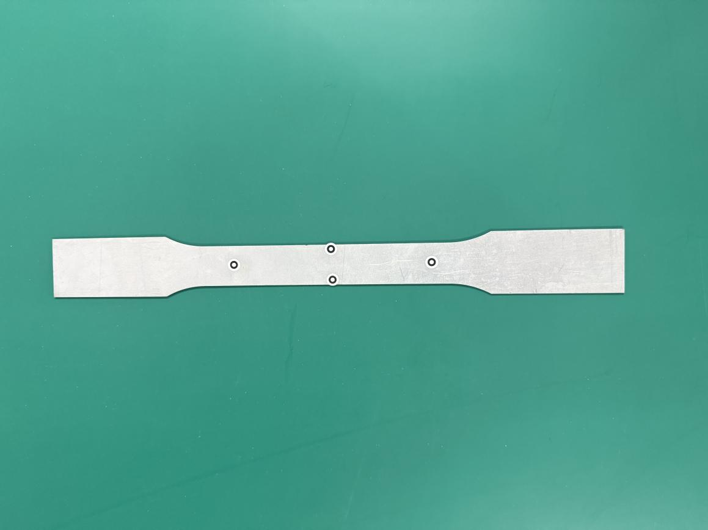
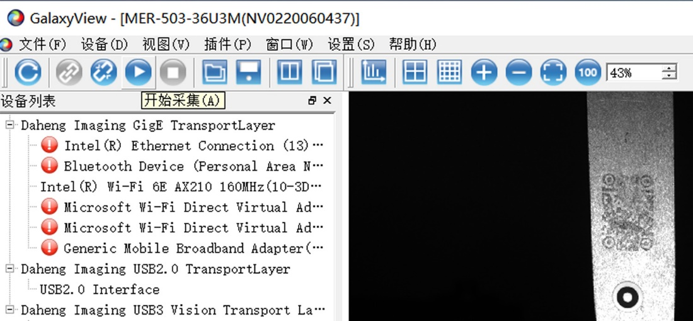

视频引伸计使用手册

# 

# 目 录

[一、设备介绍 [3](#一设备介绍)](\l)

[1、设备主机 [3](#设备主机)](\l)

[2、光源 [3](#光源)](\l)

[3、固定支架 [4](#固定支架-根据实际测试环境搭配)](\l)

[4、标记点 [4](#标记点)](\l)

[二、硬件安装 [6](#_Toc19763)](\l)

[三、软件安装 [7](#三软件安装)](\l)

[1、相机驱动安装 [7](#相机驱动安装)](\l)

[2、引伸计软件安装 [7](#引伸计软件安装)](\l)

[3、软件安装验证 [8](#软件安装验证)](\l)

[四、软件使用 [10](#四软件使用)](\l)

[1、软件打开 [10](#软件打开)](\l)

[2、图片保存操作 [10](#图片保存操作)](\l)

[3、相机参数设置 [11](#相机参数设置)](\l)

[4、设备微调 [11](#设备微调)](\l)

[5、数据计算 [12](#数据计算)](\l)

[6、数据输出 [13](#数据输出)](\l)

[7、图片二次计算 [14](#图片二次计算)](\l)

[五、宽度识别&螺纹钢功能 1](\l)5

[1. 宽度识别功能 1](\l)5

[2. 螺纹钢功能 1](\l)6

[六、安全操作及注意事项 1](\l)8

# 

# 一、设备介绍

视频引伸计主要部件：设备主机、操作软件、加密狗、光源及光源控制器、固定支架及云台、标定板、USB3.0 数据线、标记点或高温材料。

# 1. 、设备主机
主要包括外观方形盒子和防尘盖两部分，通过底部不同的固定孔位可实现水平放置或者呈 90°竖直放置。

# 2. 、光源
常温标准视野配置环光，高温炉环境配置射灯，高低温箱环境配置条光。

>  src="./media/image1.jpeg"
> style="width:1.45972in;height:1.33333in" />  src="./media/image2.jpeg"
> style="width:1.45972in;height:1.33333in" /> src="./media/image3.jpeg"
> style="width:1.45972in;height:1.33333in" />

# 3. 、固定支架（根据实际测试环境搭配）
1）利用试验机安装孔固定的有旋转支架或 45 度支架。

2）可移动式固定支架有三角架或电动支架。

# 4. 、标记点
1）常温试验时，采用标准化标记点，可以实现软件自动识别。

2）高温试验时，采用酒精加高温材料或高温笔，制作高温标记点。

2.  # 硬件安装

     

<!-- -->

1.  固定好旋转支架或三角架。

2.  将快装板固定在引伸计底座上。

3.  将引伸计安装在云台或支架上，调整好水平及高度。

4.  将光源固定在引伸计主机或者试验夹具周围。

5.  光源连接：将电源线连接至光源控制器上，再通过定制光源延长线将光源控制器（CH 接口）与光源连接。

6.  引伸计连接：用双头 USB3.0 数据线将引伸计和电脑主机连接（电脑必须支持 USB3.0 接口），连接完成时设备 LED 灯会常亮。

7.  按照引伸计预设的距离参数，调整合适的摆放距离，有两种方式。

> 例：预设距离参数 210mm。

1.  使用卷尺或长度尺等测量“设备前端边缘到试样”的间距，调整到约 210mm 为好。完成引伸计窗口和待测试样中心的基本对齐。

2.  可采用设备集成的激光测距模块，设备连接完成后打开软件，软件界面右上角点击激光测距。

    如图：红色字体 210mm 为当前设备的激光测距照射到该试样表面的距离，完成引伸计窗口和待测试样中心的基本对齐。\[100mm\]是软件文件配置当激光测距为 100mm 时，达到±2mm 误差时红色字体会变为绿色。

    

    8.取下引伸计防尘盖，按下光源控制器开关，蓝色光源点亮，调整亮度使视野亮度适中。

    9.在待检测试样上粘贴标记点或者做好耐高温标记点，按照试验要求，选择合适的标距及位置，并将贴好标记点的试样固定在试验机夹具上。

    10.打开电脑，进行软件操作，对引伸计、灯光等进行微调（调整至试样在软件界面清晰可见，标记点不反光）。

# 三、软件安装

注意：初次使用时，必须在试验机电脑上先进行软件安装。

> 电脑基本配置要求：i7 处理器 16GB 内存 1TB 固态硬盘 USB3.0 接口/
> 64 位 WIN10 操作系统以上。

# 相机驱动安装

找到随机 U 盘资料以下文件。

>  src="./media/image9.png"
> style="width:4.65625in;height:0.375in" />
>
>  src="./media/image10.png"
> style="width:4.81667in;height:0.52778in"
> alt="C:\Users\ADMINI~1\AppData\Local\Temp\1648197749(1).png" />

# 引伸计软件安装

1）找到随机 U 盘资料以下文件（版本号以实际为准）。

>  src="./media/image11.png"
> style="width:3.12153in;height:0.36736in" alt="1721630428983" />
>
>  src="./media/image12.png"
> style="width:3.16875in;height:0.82431in" alt="1721630448842" />

2）安装完成后，电脑屏幕上显示下述三个图标。

3.  # 软件安装验证

    1.  点击电脑屏幕上摄像头图标。

2）在软件界面左侧，双击”MER-503-36U3M”打开摄像头。

3）在新窗口点击软件左上角“开始采集”图标，显示有图像即安装成功。

# 四、软件使用

# 1. 、软件打开
> 将加密狗 U 盘插入到电脑主机 USB 插口中，双击软件图标  src="./media/image17.png"
> style="width:0.5125in;height:0.66181in" alt="1721629957411" />
>
> 打开软件界面如下：
>
>  src="./media/image18.png"
> style="width:6.03125in;height:3.56528in" />

# 2. 、图片保存操作
> 1）选择保存：依次点击软件界面左上角“文件”→
> 勾选“保存图片”，再次打开时，“保存图片”前端处于勾选状态。
>
> 2）设置保存路径：点击“设置保存图片路径”。选择主机中剩余内存空间高于 300G 的硬盘创建文件夹存储图片。
>
> 3）不需要保存图片：取消“保存图片”勾选状态。
>
>  src="./media/image19.png"
> style="width:2.37083in;height:2.73542in" />

# 3. 、相机参数设置
点击工具栏第二个按钮“配置按钮”，点击相机参数配置，按照试验需求设置计算帧率和曝光间隔。

>  src="./media/image20.png"
> style="width:3.80833in;height:2.25833in" />
>
>  src="./media/image21.png"
> style="width:3.3625in;height:2.32153in" />

# 4. 、设备微调
> 1）点击“相机”按钮（左图），试样图片出现在屏幕上（右图）。
>
>  src="./media/image22.png"
> style="width:2.50208in;height:1.625in" />  src="./media/image23.png"
> style="width:2.57222in;height:1.69722in" />

2）观察视窗，通过继续调整引伸计位置和角度，直至在视窗中看到清晰的待测试样全貌为止。

识别标记点（计算标距）：

1）自动识别标距：再次点击“相机”按钮，软件可以自动识别相关的标记点。

2）手动调整标距：如果无法自动识别时，请选用手动调整，通过鼠标拖动“十字星”与试样上的标记点重合。

3）根据需要可设置多组标记点，在视窗单击鼠标右键，即可添加。

# 5. 、数据计算
> 1）点击“计算”按钮。

> 2）软件出现浮窗显示实时数据及位移 - 时间曲线。
>
> 3）数据会通过 UDP 协议实时传输给试验机操作软件，显示在引伸计窗口（以试验机软件显示为准）。
>
> 4）试验结束时，再次点击计算按钮，停止计算。

# 6. 、数据输出
点击“左图”“快捷图表”中工具栏右侧“保存”图标，即可输出“右图”实验数据的 EXCEL 格式文件。

 

# 7. 、图片二次计算
> 1）可以将已保存的图片，或者在其他单目三维引伸计上保存的图片，导入到本软件进行二次计算。

2）依次点击软件界面左上角“文件”→ “输入”→
“图形序列”，选择图片保存的路径，待图片导入完成进行计算即可。

# 宽度识别&螺纹钢功能

# 宽度识别功能

# 安装对应的软件版本，点击检测勾选计算宽度功能，选中标记点，点击计算即可计算试样粘贴标记点范围内宽度，软件实时显示拉伸过程中试样宽度变化，并输出最小宽度值。

# 螺纹钢功能

1）打开引伸计软件，点击检测勾选螺纹钢模式，即选定螺纹钢模式，螺纹钢直接识别试样表面纹理，不需要粘贴标记点。

2）点击左边标记点，软件右侧会显示原始标距参数设置窗口，可以选择任意标距或者固定标距，设置完成可以拖动左边标记到试样合适的位置。

# 安全操作及注意事项

1.  未经专业培训，不得单独操作此仪器。

2.  使用时尽量不要让光源直射人眼，避免可能造成操作人员眼部伤害。

3.  高温环境下，尽量配戴高温手套，防止人员烫伤，制作高温散斑或者标记点时，
    注意不要沾到眼睛。

4\. 仪器不使用时，应将其装入箱内，置于干燥处，注意防震、防尘和防潮。

5\.
仪器运输应将仪器装于箱内进行，运输时应小心避免挤压、碰撞和剧烈震动，长途运输填充软件泡沫作为缓冲物。

6\. 仪器安装至三脚架或者拆卸时，要先托住仪器，以防仪器跌落。

7\. 不可用化学试剂擦试塑料部件及有机玻璃表面，可用浸水的软布擦试。

8\.
测量前应仔细全面检查仪器，确信仪器各项指标、功能、电源符合要求时再进行作业。

9.  即使发现仪器功能异常，非专业维修人员不可擅自拆开仪器，以免发生不必要的损坏。
