# 2. D Extensometer User Manual
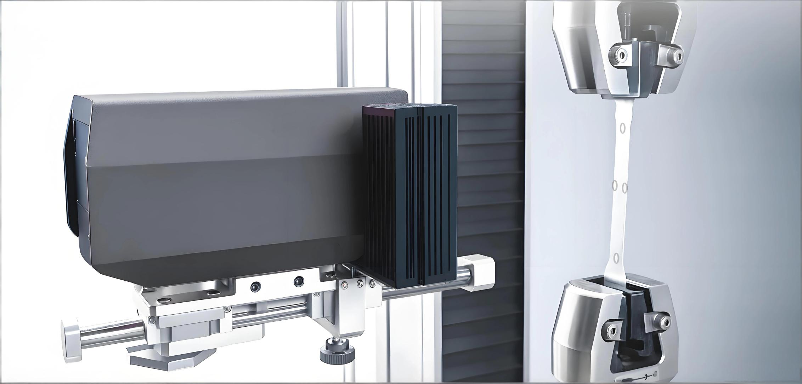

Table of Contents

1.  Equipment Introduction —— 1
2.  Hardware Installation —— 3
3.  Software Installation —— 11
4.  Equipment Operation —— 13
5.  Software Notes —— 30
6.  Safe Operation and Precautions —— 31

<!-- -->

1.  Equipment Introduction
    The main components of the 2D Extensometer are: Main Unit, Operating
    Software, Dongle, Light Source and Light Source Controller (2
    types), Fixing Bracket and Pan-Tilt Head, Calibration Target, USB
    3.0 data cable.
    1.  Main Unit Mainly consists of the fixing bracket and the
        camera lens assembly. It can be placed horizontally through
        different bottom fixing holes.

        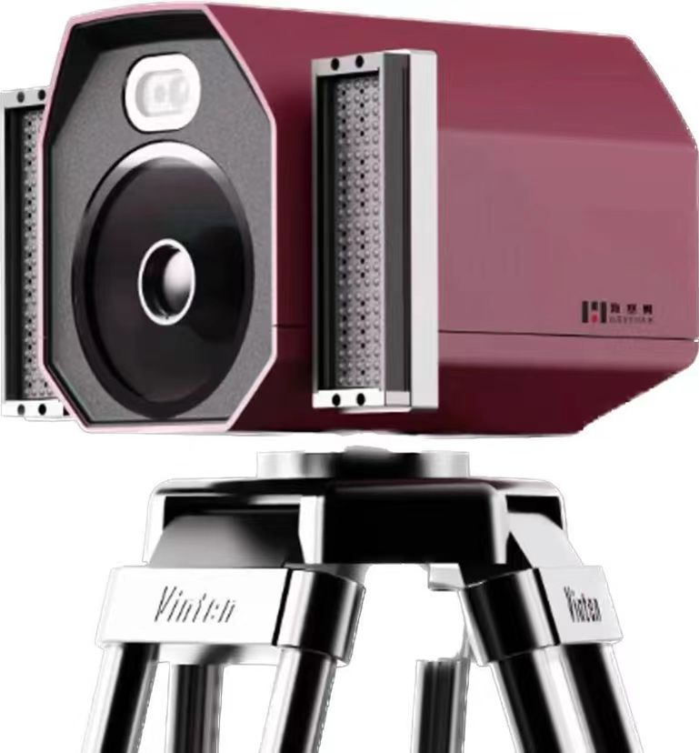

    2.  Light Source Standard configuration for room temperature and
        standard field of view includes a bar light. For measuring the
        percentage reduction of area, add the Backlight Panel.

        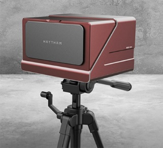

        

    3.  Fixing Bracket Use a Tripod, Pan-Tilt Head, and Stereo Bar
        to fix the camera lenses. Adjust the overall position of the
        stereo device and ensure it is level.

        

    4.  Calibration Target Used for camera calibration to ensure
        accuracy.

        

2.  Hardware Installation

    2.1. Assemble the Tripod.

    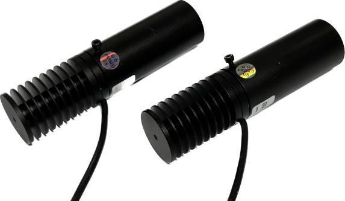

  
2.2. Fix the Quick Release Plate to the base of the Stereo Bar.

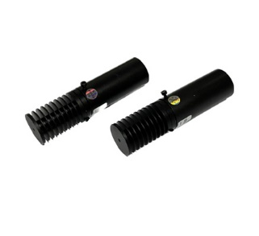

  
2.3. Install the cameras and light sources on the Stereo Bar. Adjust
for level and height.

    2.3.1) Tripod Leg height adjustment
    2.3.2) Center Column height adjustment
    2.3.3) Pan-Tilt Head rotation adjustment
    2.3.4) Pan-Tilt Head Tilt Angle adjustment
    2.3.5) Quick Release Plate detachment adjustment

  
2.4. Camera Connection

Connect the Extensometer to the computer host using a USB 3.0 data cable
(the computer must support USB 3.0 interface).

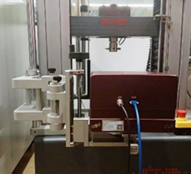

  
2.5. Backlight Panel Installation

Fix the Backlight Panel to the testing machine using the T-bolt fixture.
Secure the Backlight Panel to the fixture using M3\*10mm screws.

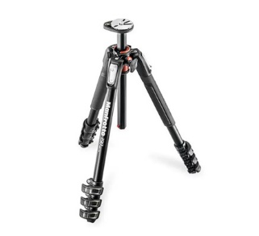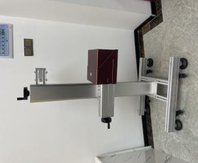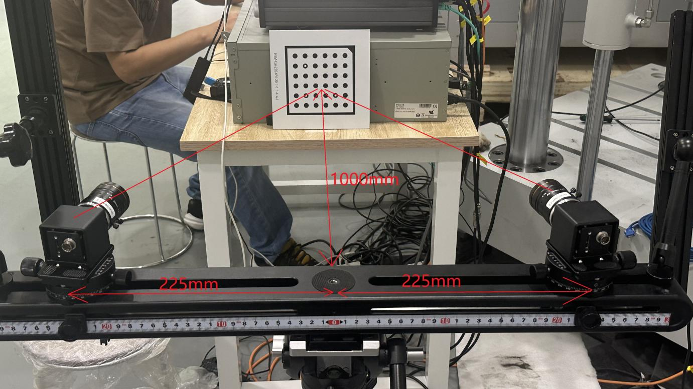

  
2.6. Light Source 1 (Bar Light) Connection: Connect the power cable to
the Light Source Controller, then connect the Light Source Controller
(CH interface) to the light source using the black power cable.

    2.6.1) Channel brightness display, e.g., 1.100 (0 is off, 255 is brightest; 1 refers to channel 1, 100 refers to the brightness value);
    2.6.2) Rotate the control knob to adjust brightness; press to switch channels;

Light Source 2 (Backlight Panel) Connection: Connect the power cable to
the Light Source Controller, then connect the Light Source Controller
(CH interface) to the light source using the power/data cable.

    2.6.3) CH: Adjust channel;
    2.6.4) Adjust brightness value;
    2.6.5) Channel and brightness value display

  
2.7. According to the preset distance parameters of the stereo
extensometer, adjust to a suitable placement distance (camera angle
approx. 30°).

The front edge of the device should be about 1000mm from the surface of
the test specimen. The front of the lens should be about 975mm from the
surface of the test specimen. Use a tape measure or ruler to measure the
distance from the “front edge of the device to the specimen” and adjust
it to approximately 1000mm. Achieve basic alignment between the
extensometer center and the center of the specimen to be tested.

  
2.8. Remove the lens dust covers from the device. Press the Light
Source Controller switch to turn on the blue light source and the
Backlight Panel. Adjust the brightness for a moderate field of view
brightness. Crop the frame of both cameras to an appropriate size (the
specimen image should be within the Backlight Panel area).

3.  Software Installation

    For first-time use, software must be installed on the testing
    machine computer.

3.1 Camera Driver Installation Locate the camera driver file in the
provided USB drive materials, extract it, and click to install.

3.2 Software Installation

1\) Locate the following file in the provided USB drive materials
(version number may vary), extract it, and click to install.

2\) After installation is complete, the camera driver software and
extensometer software icons will be displayed on the computer screen.

3.3 Software Installation Verification

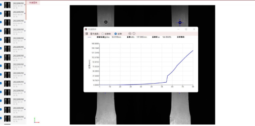1) Click the camera driver
icon on the computer screen;

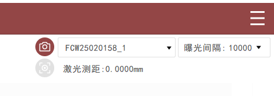

2)  In the software interface’s left panel, double-click
    “ME2S-1610-24U3M” (or the specific camera model) to open the camera;

3)  In the new window, click the “Start Acquisition” icon in the upper
    left corner of the software. If an image is displayed, the
    installation is successful.

    

<!-- -->

4.    
    Equipment Operation

4.1 Camera Settings

Open the camera driver software and enter the acquisition interface.

1)  Confirm the software correctly reads the cameras;

2)  Connect cameras in batch and start batch acquisition;

3)  Adjust the exposure time to suit the image brightness (only affects
    the selected camera);

4)  Adjust the camera acquisition frame rate (only affects the selected
    camera);

    

5)  Rotate the camera image 90° to the right (only affects the selected
    camera);

    

6)  Adjust the working distance (distance between device and measured
    area) based on the proportion of the measured area within the frame;

7)  The camera fixture should be placed horizontally; the cameras should
    be level;

8)  The two cameras should be placed symmetrically. The specimen should
    be on the central axis between the cameras. The distance from each
    camera to the measured area should be consistent;

9)  The angle between the cameras and the central axis should be about
    30°;

    

10) The large tightening knob is the camera lock knob;

11) The small tightening knob is the camera rotation adjustment lock
    knob;

12) The fixing and tightening adjustment knob for the camera position on
    the bar;

    

13) Adjust so that the acquisition frames of both cameras are displayed
    symmetrically and the display range is basically consistent;

    

14) Adjust the lens focus to focus on the measured area, ensuring clear
    imaging;

15) Adjust the lens aperture. Coordinate with external light sources to
    ensure picture brightness, light source brightness (below 80%
    brightness), exposure time (within 20000 μs), and depth of field
    effect (aperture around F4) are all within a suitable range;

    

4.2 Calibration: Using the 2D software, re-calibration is not
required if the working distance has not changed. Re-calibration is only
needed if the working distance changes. The calibration process is as
follows: Open the driver software, connect the cameras,
right-click and rotate the camera image 90° to the right, set the image
save path.

Place the Calibration Target parallel to the front of the lens and
centered in the image. Click the mark position to capture an image.
Select one camera to capture calibration images, then repeat the steps
for the other camera. Capture 14 calibration images (full-frame
calibration).

The calibration pose is as follows (after rotating the camera image, the
hollow circles on the Calibration Target form an ‘L’ shape).

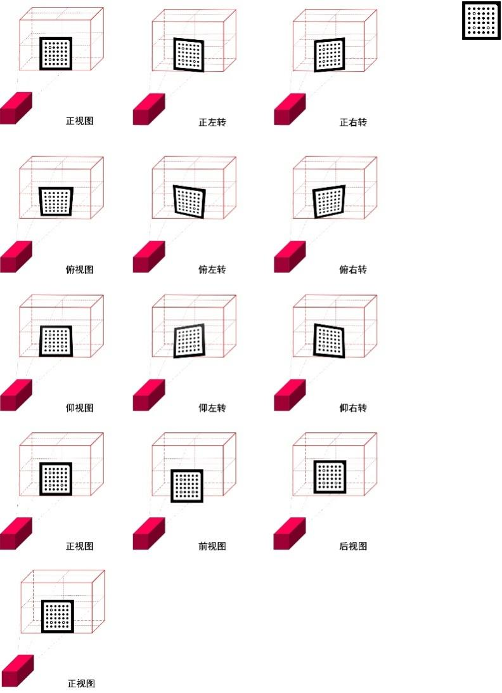

Rotate the captured images 90° to the right, then store them in two
separate directories. Store one centrally placed image in one directory,
and place the remaining images in another folder. Repeat the operation
for Camera 2 (pay attention to distinguish which set of calibration
images was captured by which camera). Open the VisualExtensometer2D
software, open the calibration function, input the corresponding
calibration parameters, select the corresponding camera, select the
corresponding Calibration Target directory size (calibrate using the
single image directory), and the internal parameters (using the multiple
images directory). Repeat the corresponding steps for Camera 2.

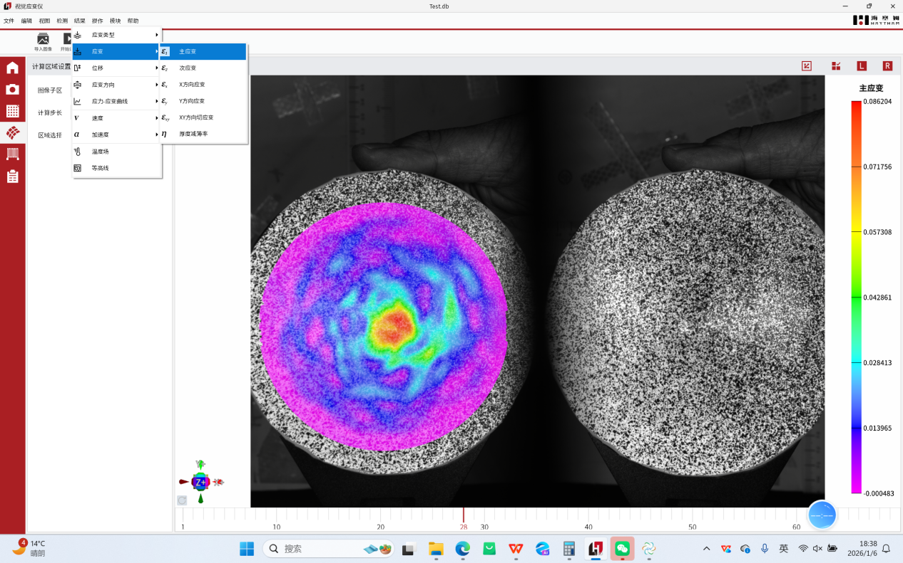

After successful calibration, the re-projection error serves as an
indicator of the calibration quality - the smaller this value, the
better. Generally, a value less than 0.2 is acceptable. If the
re-projection error is large, re-calibration is necessary.

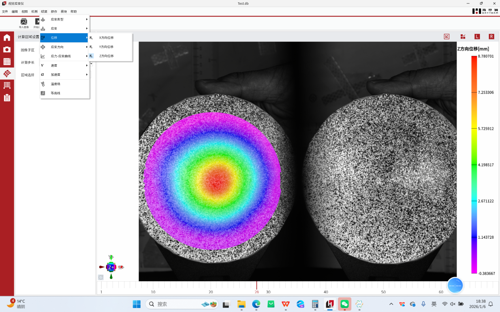

  
4.3 Software Parameter Function Introduction

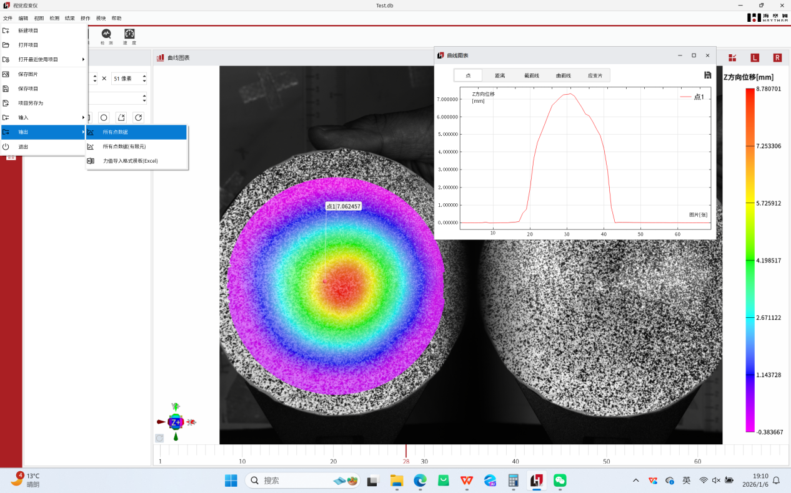

1)  Save Images: When checked, the images used for real-time
    calculation will be saved to the set image storage path.
2)  Set Image Save Path: Set the image storage path.
3)  Set data save path: Set the storage path for calculation results
    (results are saved in .csv format).
4)  Select Camera: Select camera.
5)  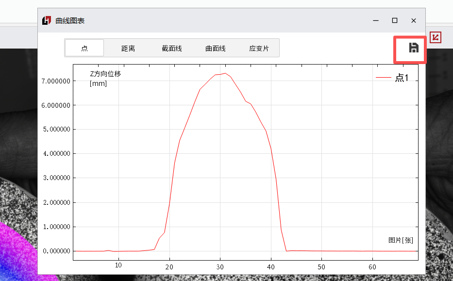Camera Image
    Rotation—-Rotate Right 90°: Rotate both camera images 90° to the
    right.
    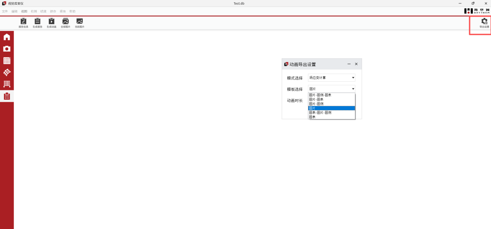
6)  Sliding Window Length: Sliding window length (one data point per
    image, number of data points for one filtering operation).
7)  Sliding Window Count: Sliding window count (how many times to
    filter the data; higher value makes the curve smoother but data more
    distorted).
8)  Subset Size: Search Subset size.
9)  Calculation Segment Count: Number of segments calculated for
    percentage reduction of area.
    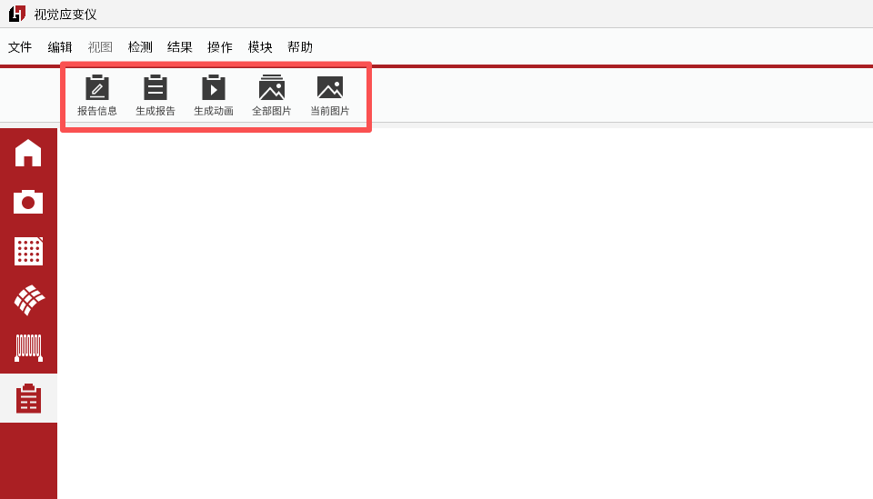
10) Communication Format—UDP_Json: Communication method with the
    testing machine.
11) UDP Sender—8011: Communication port with the testing machine
    (UDP).
    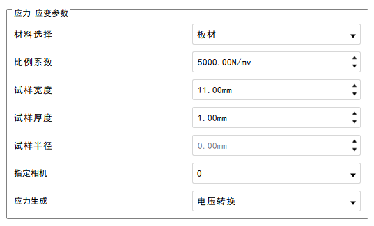
12) Stage Adjustment: Stage adjustment allows setting different
    Sampling Rates for three stages.
13) Real-time Adjustment: Real-time adjustment sets the current
    Sampling Rate (per second).
14) Interval Adjustment: Interval adjustment sets the time interval
    for capturing one image.
    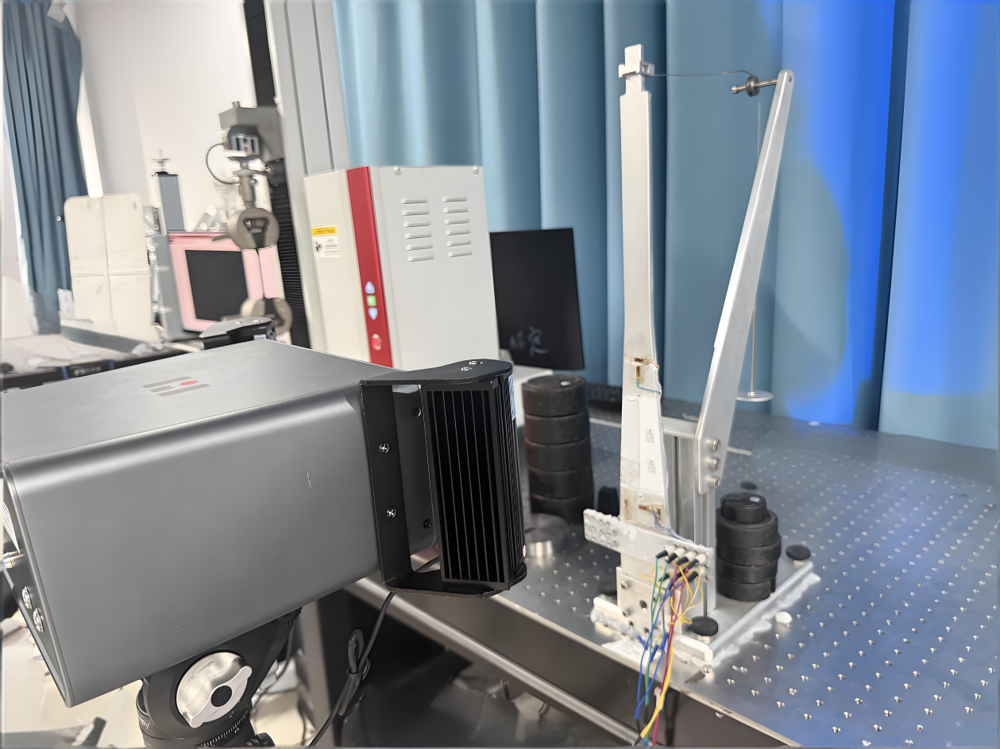
15) Incremental value 0.95: Replace the reference image if the
    Correlation Value is less than the set threshold (prevents the
    extensometer from losing track during rebar stretching due to mill
    scale peeling).
16) Zncc Threshold 0.7: Parameter for specific scenarios, cannot be
    changed.
17) CZncc Threshold 0.5: Parameter for specific scenarios, cannot be
    changed.
    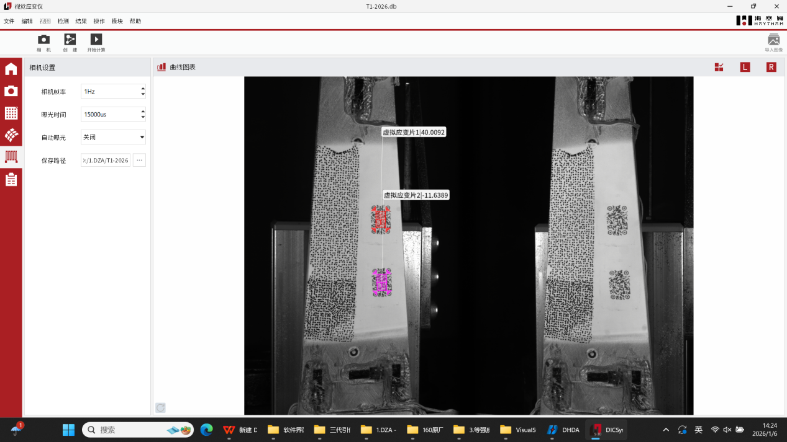
18) Enter experiment name: Whether to require entering an experiment
    name before starting for easier data traceability later.
    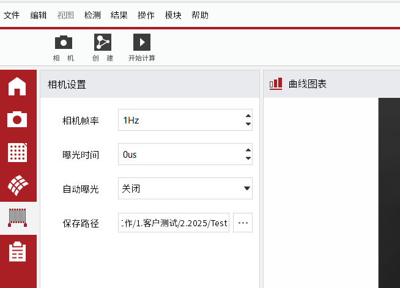
19) True Value: The software calculates absolute values by default.
    Check this to output true values (necessary if the specimen is in
    compression during the experiment).
20) Average Value: When checked, the software will average the
    virtual extensometer values (longitudinal and transverse) from both
    cameras.
21) Calculate Width: Calculate width, used for calculating
    percentage reduction of area. (In rebar experiments, because rebars
    have ribs, when clamping the specimen, ensure the Longitudinal Rib
    is positioned at the center of the rebar in the camera image, as
    shown in the figure below).
    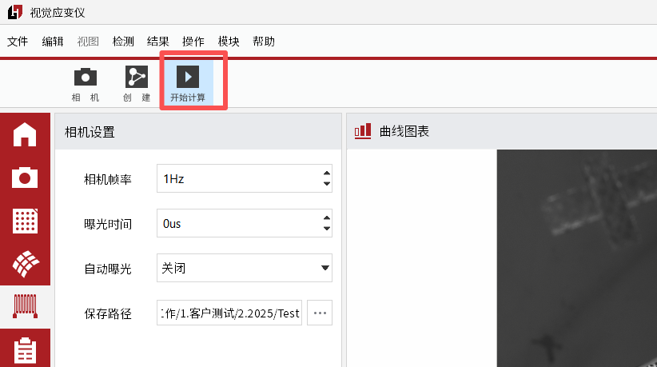
    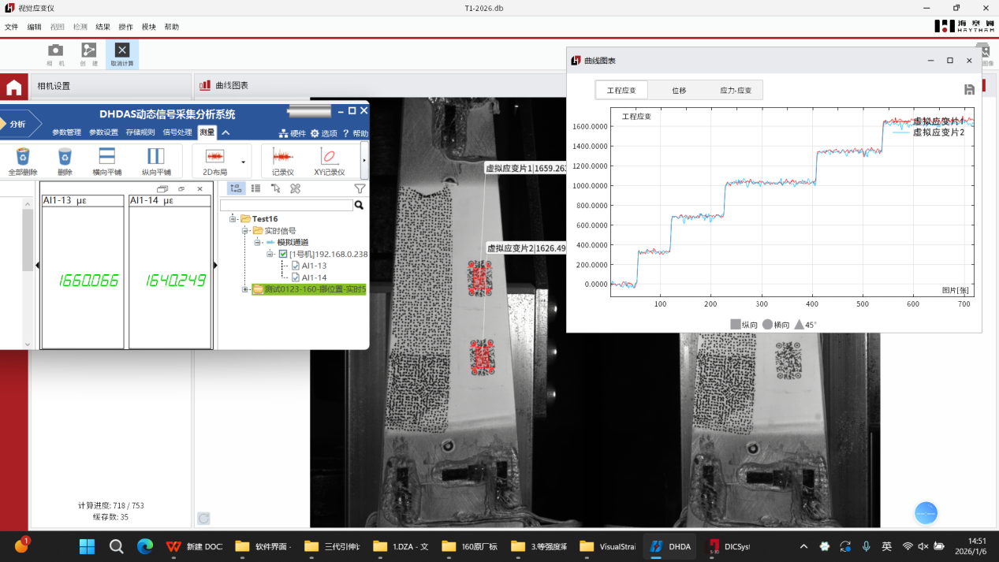
22) Software calculation start and stop.
23) Original Gauge Length (mm) for the current set of virtual
    extensometers.
24) Extension value (mm) for the current set of virtual extensometers.
25) Elongation Percentage (%) for the current set of virtual
    extensometers.
26) Real-time calculated data table display.
27) After calculation ends, results data can be manually exported.

4.4 Software Operation Process

1\) Use a marker pen or spray paint to create Marker Points on the
specimen and install the specimen on the testing machine.

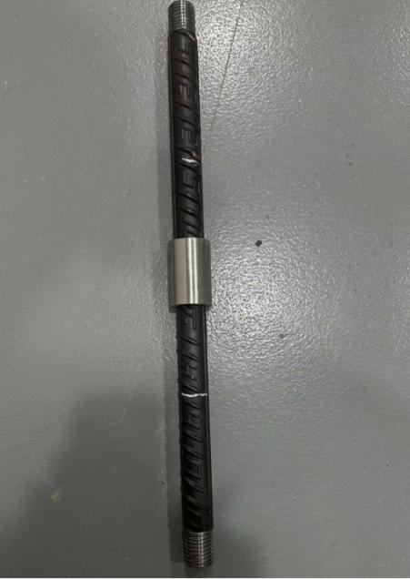

2)  Open the driver software and use it to crop the camera image (keep
    only the area within the Backlight Panel containing the specimen).

    

3)  Close the driver software and open the extensometer software.
    Configure the necessary parameter settings as needed. The software
    will create one set of longitudinal extensometers by default. To
    create multiple sets, right-click the mouse to add transverse or
    longitudinal extensometers. The Virtual Extensometer ROI size can be
    adjusted using the Subset Size mentioned earlier. The ROI can be
    dragged to the target position by pressing the left mouse button,
    dragging, and releasing (the default camera displayed will calculate
    the deformation between the two points and average sets of lines
    between the points to calculate the width value).

    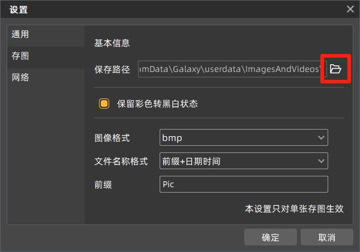

    Note: The Longitudinal Rib of the rebar should be at the center of
    the rebar in the camera image, as shown below.

4)  Switch to Camera 2, then select the calculation area on the image by
    drawing a box (this camera will create 32 sets of lines within the
    boxed area to calculate the width of the rebar).

    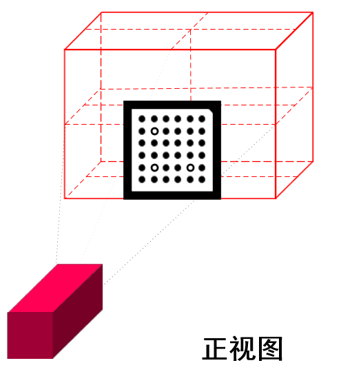

5\) Click Calculate. Check if the testing machine receives the
deformation data (the testing machine should receive one set of
longitudinal deformation values and one set of transverse deformation
values (the minimum width value from the extensometers) for calculating
percentage reduction of area). If data is received, you can proceed with
the experiment on the testing machine. After the experiment, return to
the extensometer software to stop the calculation.

V. Software Notes

1\. If no image appears when opening the software, the camera port might
be occupied by another software (close other software and reopen the
extensometer software).

2\. The acquisition frame rate and exposure time for both cameras must
be consistent. Inconsistency will cause issues with the software output
data.

3\. The Dongle must be plugged in for the software to operate.

4\. If the field of view is obstructed during calculation, matching
errors may occur, leading to abnormal data or no values.

5\. When using a physical extensometer alongside this system, ensure the
Marker Point positions do not coincide with the physical extensometer
attachment points. When removing the physical extensometer, be careful
not to obscure the target points observed by the video extensometer.

6\. When using a physical extensometer alongside this system, it is not
recommended to use the percentage reduction of area function, as
attaching the physical extensometer may interfere with width recognition
and cause abnormalities.

  
VI. Safe Operation and Precautions

5.1. Do not operate this instrument alone without professional
training.

5.2. Try to avoid directing the light source into human eyes during
use to prevent potential eye injury to the operator.

5.3. In high-temperature environments, wear high-temperature gloves
to prevent burns. When creating Speckle Patterns or Marker Points, be
careful not to get materials in the eyes.

5.4. When the instrument is not in use, place it in its case in a
dry location. Protect it from shock, dust, and moisture.

5.5. Transport the instrument in its case. Handle with care during
transport to avoid squeezing, impact, and severe vibration. For
long-distance transport, use padding around the case.

5.6. When installing or removing the instrument from the tripod,
support the instrument first to prevent it from falling.

5.7. Do not use chemical reagents to clean plastic parts or Acrylic
surfaces. Use a soft cloth dampened with water.

5.8. Before measurement, carefully and thoroughly inspect the
instrument. Confirm that all instrument indicators, functions, and power
supply meet requirements before operation.

5.9. If any instrument malfunction is found, non-professional
maintenance personnel must not disassemble the instrument themselves to
avoid unnecessary damage.
