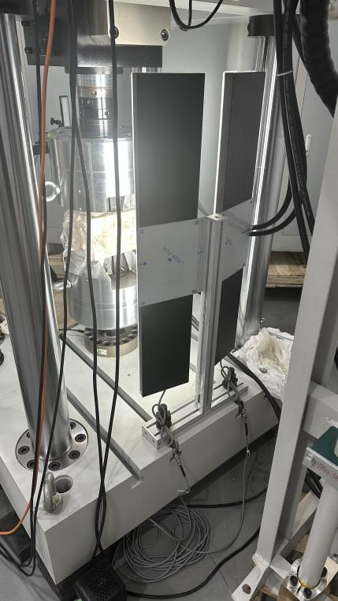

# 2. D Visual Extensometer User Manual

Table Of Contents

[1. Hardware Installation 3](\l)

[2. Software Parameter Details 11](\l)

[3. Experimental Operation Procedure 19](\l)

[4. Software Notes 20](\l)

  
1. Hardware Installation

1.1 Assemble the Rotating Bracket or Tripod.

  
1.2 Fix the Quick Release Plate to the base of the Stereo Bar.

1.3 Install the cameras and light sources onto the Stereo Bar. Adjust
the level and height.  
1.3.1) Tripod Legs height adjustment  
1.3.2) Center Column height adjustment  
1.3.3) Pan-Tilt Head rotation adjustment  
1.3.4) Pan-Tilt Head Tilt Angle adjustment  
1.3.5) Quick Release Plate detachment adjustment

1.4 Camera Connection: Connect the extensometer to the computer host
using a USB 3.0 data cable (the computer must support USB 3.0
interface).

1.5 Backlight Panel Installation

Fix the Backlight Panel Fixture to the testing machine using T-bolts.
Secure the Backlight Panel to the fixture using M3\*10mm screws.

1.6 Light Source 1 (Strip Lights) Connection: Connect the power cable to
the Light Source Controller, then connect the Light Source Controller
(CH interface) to the light source using the black power cable.

  
1.6.1) Channel brightness display, e.g., 1.100 (0 is off, 255 is
brightest; 1 refers to channel 1, 100 refers to the brightness value).  
1.6.2) Rotate the control knob to adjust brightness; press to switch
channels.  
Light Source 2 (Backlight Panel) Connection: Connect the power cable to
the Light Source Controller, then connect the Light Source Controller
(CH interface) to the light source using the power/data cable.  
1.6.3) CH: Adjust channel.  
1.6.4) Adjust brightness value.  
1.6.5) Display of channel and brightness value.

1.7 Adjust the appropriate placement distance according to the preset
distance parameters of the stereo extensometer (camera angle is about
30°).

  
The front edge of the equipment should be about 1000mm from the sample
surface; the front of the lenses should be about 975mm from the sample
surface.  
Use a tape measure or ruler to measure the distance from the front edge
of the equipment to the sample, and adjust it to approximately 1000mm.
Achieve basic alignment between the extensometer and the center of the
sample to be tested.

1.8 Remove the lens dust covers. Press the light source controller
switch to turn on the blue light source and the backlight panel. Adjust
the brightness so the field of view is adequately lit. Crop the Frame of
both cameras to an appropriate size (the sample image should be within
the backlight panel area).

  

2. Software Parameter Details

Save Images: When checked, the images used for real-time calculation
will be saved to the set image save path.

Set Image Save Path: Set the path for saving images.

Set data save path: Set the storage path for calculation results
(results are saved as .csv format table data).

Select Camera: Select the camera.

Camera Image Rotation----Rotate Right 90°: Rotate both camera images
90° to the right.

Sliding Window Length: The number of data points (one per image)
used for a single filtering operation.

Sliding Window Count: The number of times filtering is applied to
the data. A higher value results in a smoother curve but more distorted
data.

Subset Size: The size of the search Subset.

Calculation Segment Count: The number of segments used for
calculating the percentage reduction of area.

Communication Format---UDP_Json: Communication method with the
testing machine.

UDP Sender---8011: Communication method with the testing machine
(UDP port).

Stage Adjustment: Allows setting different Sampling Rates for three
stages.

Real-time Adjustment: Adjusts the current Sampling Rate (images per
second).

Interval Adjustment: Adjusts the time interval between capturing
images.

Incremental value 0.95: The reference image is replaced if the
Correlation Value is below the set threshold (helps prevent tracking
loss due to surface scale peeling during rebar tension).

Zncc Threshold 0.7: Parameter for specific scenarios, cannot be
modified.

CZncc Threshold 0.5: Parameter for specific scenarios, cannot be
modified.

Enter experiment name: Choose whether to require entering an
experiment name before starting for easier data traceability later.

True Value: The software calculates absolute values by default. When
checked, the software outputs true values (must be enabled if the sample
is in compression during the experiment).

Average Value: When checked, the software calculates the average of
the longitudinal and transverse Virtual Extensometer values from both
cameras.

Calculate Width: Calculates width, used for determining the
percentage reduction of area (In rebar experiments, because rebars have
ribs, ensure the Longitudinal Rib is positioned at the center of the
rebar in the camera image when clamping the sample, as shown in the
figure below).

Virtual Extensometer calculation can be selected (the calculation result
is the relative elongation between two points).

22: Software calculation start and stop.

23: Current group Virtual Extensometer original Gauge Length (mm).

24: Current group Virtual Extensometer elongation value (mm).

25: Current group Virtual Extensometer Elongation Percentage (%).

26: Real-time calculation data table display.

27: Calculation results can be manually exported after the calculation
ends.

3.    
    Experimental Operation Procedure

After setting up the equipment and adjusting parameters:

3.1 Use a Marker Pen or Spray Paint to create features (Speckle Pattern
or Marker Points) on the sample and install the sample on the testing
machine.

3.2 Open the Driver Software. Use it to crop the camera Frame (keep only
the area of the sample within the backlight panel).

3.3 Close the Driver Software and open the extensometer software.
Configure the necessary parameters as required (check 'Calculate Width'
and 'True Value'). The software will create one set of longitudinal
extensometers by default. To create multiple sets, right-click to add
transverse or longitudinal extensometers. The Virtual Extensometer ROI
size can be adjusted via the Subset Size mentioned earlier. Left-click,
drag the ROI to the target position, and release (the default camera
displayed will calculate the deformation between two points and average
sets of lines between the points to calculate the width). Note: The
rebar's Longitudinal Rib should be at the center of the rebar in the
camera image, as shown below.

3.4 Switch to Camera 2. Then select the calculation area within the
Frame by drawing a box (this camera creates 32 lines within the selected
rectangular area to calculate the rebar's width).

3.5 Click 'Calculate'. Check if the testing machine receives the
deformation data (the testing machine should receive one set of
longitudinal extensometer deformation values and one set of transverse
deformation values (the minimum width value from the extensometers) for
calculating the percentage reduction of area). If data is received,
proceed with the experiment on the testing machine. After the
experiment, return to the extensometer software to stop the calculation.

4.    
    Software Notes

4.0 If no image appears when opening the software, the camera port might
be occupied by another software (close other software and restart the
extensometer software).

4.2 The acquisition Frame Rate and Exposure Time for both cameras must
be consistent. Inconsistency will cause issues with the software's
output data.

4.3 The Dongle must be plugged in to use the software.

4.4 If the field of view is obstructed during calculation, matching
errors may occur, leading to abnormal data or no values.

4.5 When using a Physical Extensometer concurrently, ensure the Marker
Point positions do not coincide with the Physical Extensometer position.
When removing the Physical Extensometer, avoid obscuring the Target
Points observed by the video extensometer.

4.6 When using a Physical Extensometer concurrently, using the
percentage reduction of area function is not recommended, as attaching
the Physical Extensometer may interfere with width recognition, causing
abnormalities.

  
5. Safe Operation and Equipment Maintenance

5.1 If equipment accuracy issues arise, perform calibration according to
the detailed StereoVision Extensometer operation manual.

5.2 Personnel without professional training must not operate this
instrument alone.

5.3 Avoid directing the light source into human eyes during use to
prevent potential eye injury to the operator.

5.4 In high-temperature environments, wear high-temperature gloves to
prevent burns. Be careful not to get Spray Paint or materials for
creating Speckle Patterns/Marker Points in the eyes.

5.5 When not in use, store the instrument in its case in a dry place.
Protect it from shock, dust, and moisture.

5.6 Transport the instrument in its case. Handle with care during
transport to avoid squeezing, impact, and severe vibration. For
long-distance transport, use padding around the case.

5.7 When installing or removing the instrument from a Tripod, always
support it to prevent dropping.

5.8 Do not use chemical reagents to clean plastic components or Acrylic
surfaces. Use a soft cloth dampened with water.

5.9 Carefully and thoroughly inspect the instrument before measurement.
Confirm all indicators, functions, and power supply meet requirements
before operation.

5.10 If any malfunction is detected, non-professional maintenance
personnel must not disassemble the instrument themselves to avoid
unnecessary damage.
