# 3. D Extensometer Stereo Vision User Manual

#  Table of Contents

I. Device Introduction —— 1

-   1.1 Main Unit —— 1
-   1.2 Light Source —— 1
-   1.3 Mounting Bracket —— 2
-   1.4 Speckle Spray Paint or Marker Pen —— 2
-   1.5 Calibration Target —— 3

II. Hardware Installation —— 4

-   2.1 Tripod Assembly —— 4
-   2.2 Quick-Release Plate Installation —— 4
-   2.3 Mounting Cameras and Light Source —— 5
-   2.4 Camera Connection —— 6
-   2.5 Light Source Connection —— 6
-   2.6 Placement Distance Adjustment —— 7
-   2.7 Light Source Activation —— 8
-   2.8 Specimen Preparation —— 8
-   2.9 Final Setup Check —— 8

III. Software Installation —— 9

-   3.1 Camera Driver Installation —— 9
-   3.2 Software Installation —— 9
-   3.3 Installation Verification —— 9

IV. Device Operation —— 11

-   4.1 Camera Settings —— 11
-   4.2 Calibration —— 14
-   4.3 Software Parameters Description —— 20
-   4.4 Software Operation Workflow —— 26

V. Safety Precautions and Notes —— 28

# 

# I. Device Introduction

Main components of the stereo extensometer: main unit, operating
software, dongle, light source and light source controller, mounting
bracket and pan-tilt head, calibration target, USB 3.0 data cable,
speckle spray paint or marker pens.

## 1.1. Main unit
The main unit mainly consists of the mounting bracket and the camera
lens assemblies. It can be placed horizontally using different mounting
holes on the bottom.

## 1.2. Light source
Standard bar light configured for the standard field of view at room
temperature.

## 1.3. Mounting bracket
Use a tripod, pan-tilt head and stereo bar to secure the camera lenses,
adjust the overall position of the stereo device, and level it.

## 1.4. Speckle spray paint or marker pen
1.  Use the standard black-and-white speckle spray paint (images are
    computed in real time and saved for later full-field analysis).
2.  Use marker pens to make marks — marker marks are for point markers,
    not for full-field analysis.

## 1.5. Calibration target
Used for camera calibration and accuracy verification.

#  II. Hardware Installation

1.  Assemble the tripod.

    

2.  Fix the quick-release plate onto the base of the stereo bar.

    

3.  Mount the cameras and light source on the stereo bar, and adjust
    level and height.

    

### 3.1. Tripod leg height adjustment
### 3.2. Center column height adjustment
### 3.3. Pan-tilt head rotation adjustment
### 3.4. Pan-tilt head tilt (pitch) adjustment
### 3.5. Quick-release plate removal/adjustment
4.  Camera connection: connect the extensometer to the PC using a USB
    3.0 data cable (the computer must support USB 3.0).

    

5.  Light source connection: connect the power cable to the light source
    controller, then connect the light source controller to the light
    source via the black data cable (CH port).

    

5.1 Channel brightness display example: `1.100` (0 = off, 255 = maximum;
`1` denotes channel 1; `100` is the brightness value). 5.2 Rotate the
control knob to adjust brightness; press the knob to switch the channel
being adjusted.

6.  Adjust the placement distance according to the stereo extensometer’s
    preset distance parameter (camera separation angle ≈ 30°).
    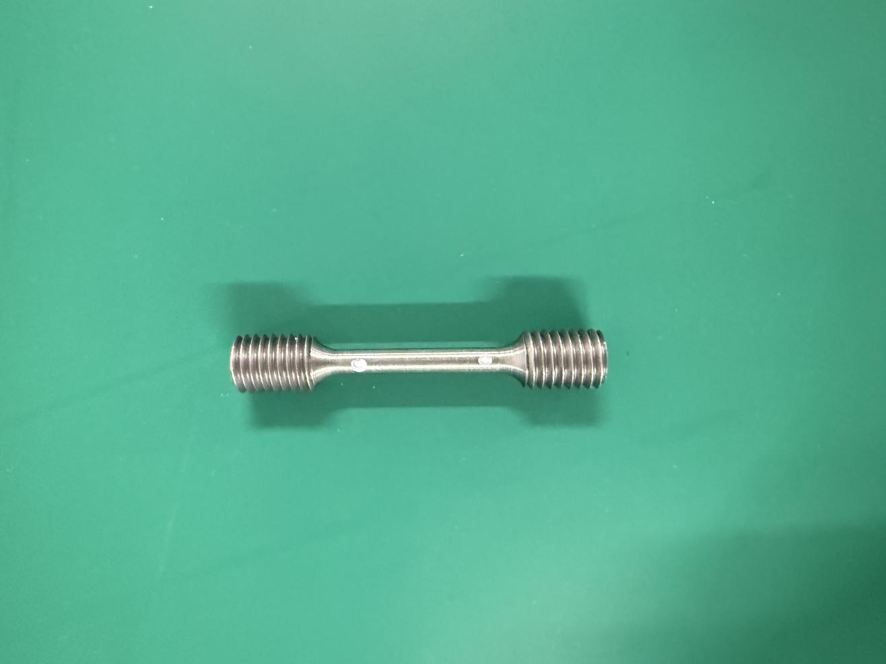

Example: preset distance parameter = 1000 mm. Measure the distance
from the device front edge to the specimen using a tape or ruler and
adjust to about 1000 mm. Align the extensometer and the specimen center
roughly.

7.  Remove the lens dust caps, turn on the light controller; the blue
    light will turn on. Adjust brightness so that the field of view has
    appropriate illumination.

    

8.  According to the test requirements, spray speckles or make marker
    points on the inspection area of the specimen, then fix the specimen
    to the loading device.

    

9.  Turn on the PC, run the software and fine-tune the stereo
    extensometer and lighting.

# III. Software Installation

(Initial installation must be done on the testing machine’s PC.)

## 3.1. Camera driver installation
Locate the camera driver files on the supplied USB drive, unzip and run
the installer.

## 3.2. Software installation
1.  Find the software files on the supplied USB drive (version number
    according to what’s supplied), unzip and run the installer.
2.  After installation, the camera driver software and the extensometer
    software icons will appear on the computer screen.
    

## 3.3. Software installation verification
1.  Click the camera driver icon on the PC.
    
2.  In the software window’s left pane, double-click “ME2S-1610-24U3M”
    (or the camera model present) to start the camera.
3.  In the new window, click the “Start Capture” icon (upper left). If
    images appear, installation is successful.

#  IV. Device Operation

## 4.1. Camera settings
Start the camera driver software and enter the capture interface:

1.  Confirm the software can correctly read the camera.
2.  Batch connect cameras and start capture for multiple cameras.
3.  Adjust a suitable exposure time to match image brightness (applies
    to the selected camera only).
4.  Adjust the camera frame rate (applies to the selected camera only).
    
5.  Rotate the camera image 90° to the right (applies to the selected
    camera only).
    
6.  Adjust the working distance (device to measured area) according to
    the proportion of the region of interest in the image.
7.  The camera fixture should be mounted horizontally and the camera
    kept level.
8.  The two cameras should be placed symmetrically; the specimen should
    be on the common axis, and the distances from each camera to the
    measured area should be equal.
9.  The angle between the camera and the mid-axis should be
    approximately 30°.
    
10. The large tightening knob is the camera locking knob.
11. The small tightening knob is the camera rotation adjustment locking
    knob.
12. The fixing/locking knob secures the camera on the crossbar.
    
13. Adjust so both camera images are symmetric and their fields of view
    match closely.
    
14. Adjust the lens focal length to focus on the measured area and
    ensure clear imaging.
15. Adjust lens aperture together with external lighting so that image
    brightness, light source brightness (below 80%), exposure time (≤
    20000 — unit not specified), and depth of field (aperture around
    f/4) are all in appropriate ranges.
    

## 4.2. Calibration
After hardware debugging is complete, perform calibration. Choose a
calibration target appropriate for the field of view and capture 26–39
calibration images.

Launch the stereo extensometer software, bind the serial number of the
camera that is physically the left camera, and rotate that camera’s
image 90° to the right in software if needed.

Set the save paths for left and right camera images.

The 3D extensometer divides the field of view into an upper and a lower
part (if the calibration board cannot cover the whole field in two
shots, split into upper/ middle/ lower three parts). For example,
collect 26 calibration images in total (choose the calibration board
size so the board point matrix covers as much of the image area as
possible). Typically:

-   Upper part: capture 13 calibration images (13 poses — one image per
    pose).
-   Lower part: capture another 13 calibration images (the lower part
    uses the same 13 poses as the upper part).
    

Place the calibration board in the poses listed below and capture images
one by one. Arrange the calibration board so that the three hollow
circles are placed in an L-shape, i.e., the black corner points toward
the upper-right of the image. After the board is set in a pose, press
the spacebar once to save one image.

The 13 poses (one image per pose) are approximately:

1.  Frontal view — board centered and normal to optical axis (focus
    distance).
    
2.  Tilted down (top edge forward) — ~30° from frontal.
    
3.  Tilted up (top edge backward) — ~30° from frontal.
    
4.  Left frontal (board rotated left ~30° from frontal).
    
5.  Left pitched down (from pose 4, top edge forward ~30°).
    
6.  Left pitched up (from pose 4, top edge backward ~30°).
    
7.  Right frontal (board rotated right ~30° from frontal).
    
8.  Right pitched down (from pose 7, top edge forward ~30°).
    
9.  Right pitched up (from pose 7, top edge backward ~30°).
    
10. Frontal view (return to pose 1).
    
11. Forward view (from frontal, move board ~+3 cm toward cameras,
    frontal).
    
12. Rearward view (from frontal, move board ~−3 cm away from cameras,
    frontal).
    
13. Frontal view (return to pose 1).
    

It is recommended to split the capture into upper / middle / lower
parts, each following the 13-pose sequence above.

You may capture an extra frontal image for test calibration (used to
judge whether the current calibration image set is acceptable). After
capturing calibration images, copy the single image used for test
calibration to another folder and run the software’s calibration
routine: input the required parameters, select the calibration images’
path, and start calibration.

After successful calibration, the reprojection error is used to assess
calibration quality — the smaller the better. Generally, a
reprojection error below 0.2 is acceptable. If one or a few calibration
images exhibit large reprojection errors and negatively affect the
average, delete those images and recalibrate.

Test calibration can be used to critically evaluate whether the current
calibration precision meets requirements, or as a periodic accuracy
check after long periods of disuse (you can recapture one frontal image
for a test). First choose the left/right image paths, then compute the
inter-marker spacing of the hollow circles. The accuracy should be
within 0.05% — if not, re-calibration is recommended.

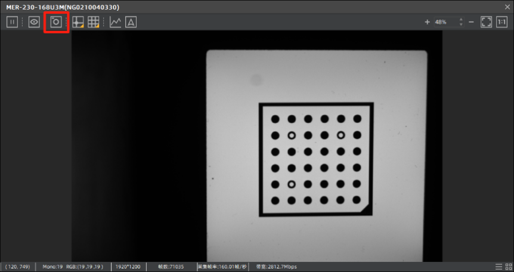

## 4.3. Software parameter descriptions
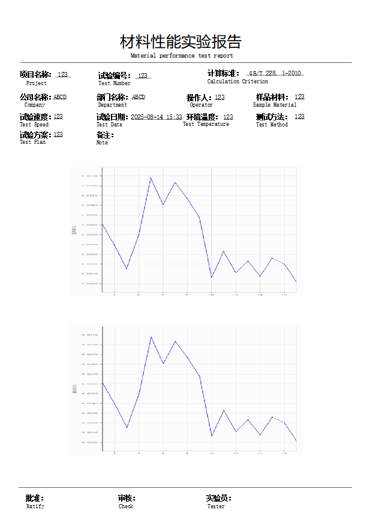

1.  Save Images — when checked, images computed in real time will be
    saved to the configured image storage paths.
2.  Set Image Save Path — set the image storage paths; left and
    right cameras can be configured separately.
3.  Set data save path — set the save path for computation results
    (results are output as `.csv` files).
    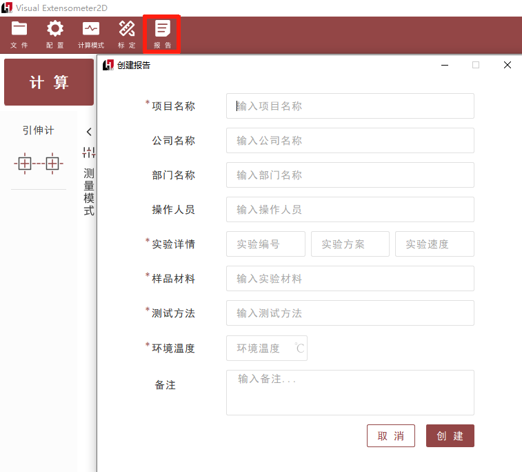
4.  Select Camera — choose the camera to configure.
5.  Camera position — designate the camera as left or right.
6.  Camera Image Rotation — Rotate Right 90° — rotate both camera
    images 90° to the right.
    
7.  Sliding Window Length — sliding window length (number of images
    per filtering window — e.g., one image per datum).
8.  Sliding Window Count — number of sliding windows (more windows =
    smoother curve but more distortion of original data).
9.  Subarea size — size of the search subarea (subset).
    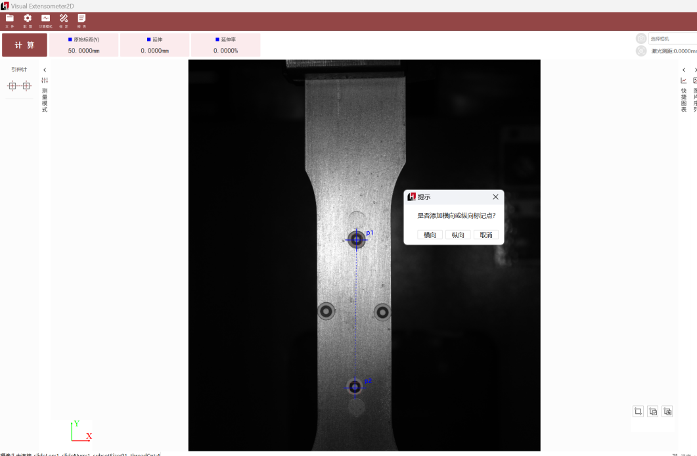
10. Communication Format — UDP_Json (communication protocol with the
    testing machine)
11. UDP Sender---8011(port used for communication with the testing
    machine)
    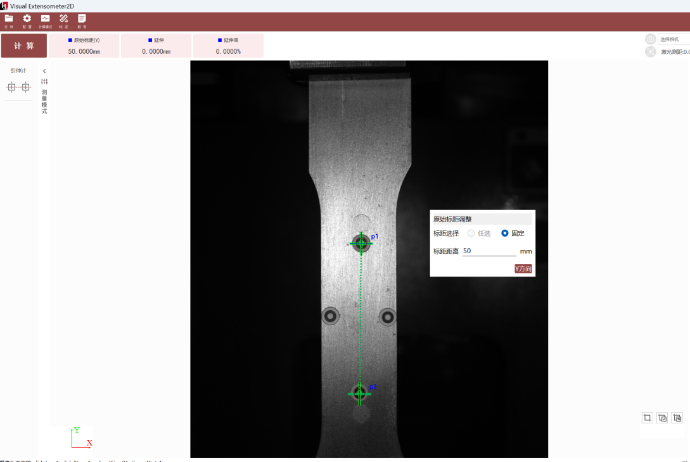
12. Stage Adjustment — set different sampling frequencies for up to
    three stages.
13. Real-time Adjustment — current real-time sampling frequency
    (samples per second).
14. Interval Adjustment — set interval for capturing one image every
    N (time-based or count-based per UI).
    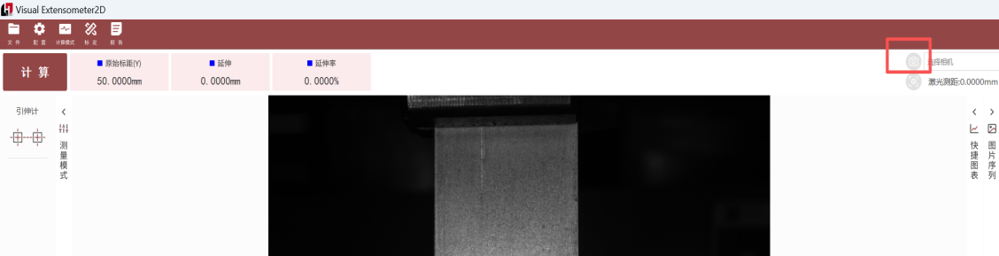
15. Incremental value — e.g., 0.95: if the match value falls below
    the set threshold, the reference image is replaced (prevents loss of
    tracking when surface scale/particles peel during the tensile test
    of ribbed rebar).
16. Zncc Threshold — 0.7 (parameter fixed for specific scenarios;
    not editable in software). ZNCC = Zero-mean Normalized
    Cross-Correlation.
17. CZncc Threshold — 0.5 (parameter fixed for certain scenarios;
    not editable; the software does not define what the leading “C”
    stands for).
    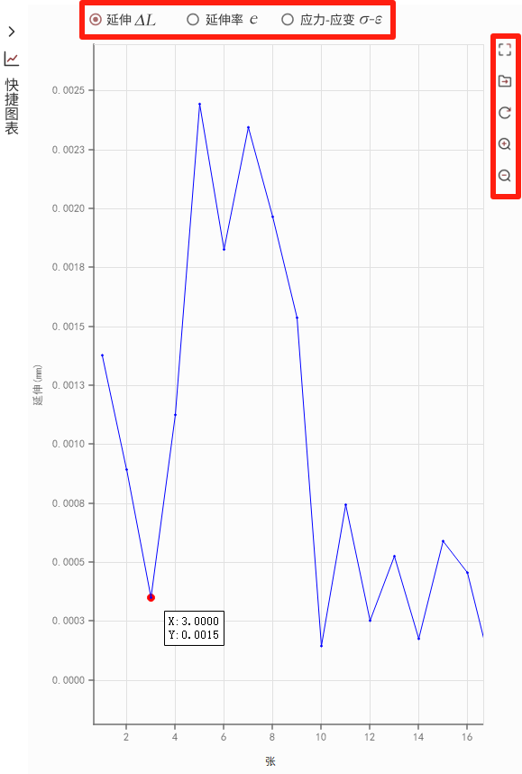
18. Enter experiment name — whether to enter an experiment name
    before a test to facilitate tracing later.
    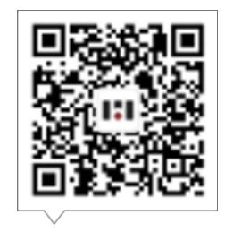
19. True Value — by default the software computes absolute values;
    if checked, the software outputs signed true values (must be enabled
    if specimen undergoes compression).
20. Average Value — when enabled, the software computes average
    values: the virtual extensometers’ longitudinal and transverse
    values are averaged.
    
21. You may choose virtual extensometer computation (computes
    relative elongation between two points) or single-point tracking
    (calculates spatial displacement of a single point).
    
22. Software computation Start / Stop controls.
23. Current group virtual extensometer original gauge length (mm).
24. Current group virtual extensometer elongation amount (mm).
25. Current group virtual extensometer elongation percentage (%).
26. Real-time computed data table display.
27. After calculation ends you can manually export the computed results.

## 4.4. Software operation workflow
1.  Use a marker pen or spray speckle paint to create feature points on
    the specimen.

    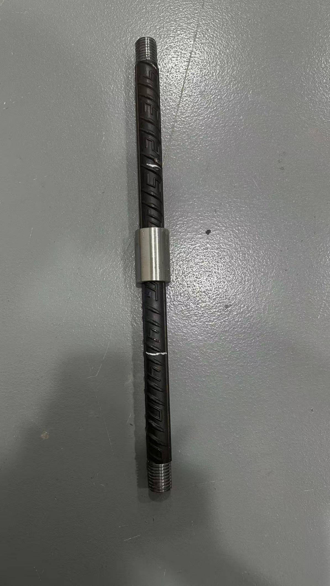

2.  Clamp the specimen in the loading device and launch the extensometer
    software. Configure the required parameters. By default the software
    creates one group of longitudinal (vertical) virtual extensometers.
    To create more groups, right-click to add horizontal or vertical
    virtual extensometers.

The virtual extensometer search box size can be adjusted via the
Subarea size parameter described earlier. The display is divided
into left and right views; for longitudinal virtual extensometers the
search boxes in the left and right views must correspond one-to-one
(top/bottom alignment must not be swapped). Similarly, for transverse
extensometers, left/right alignment must not be swapped. Drag the search
box to the target location by left-clicking and dragging.

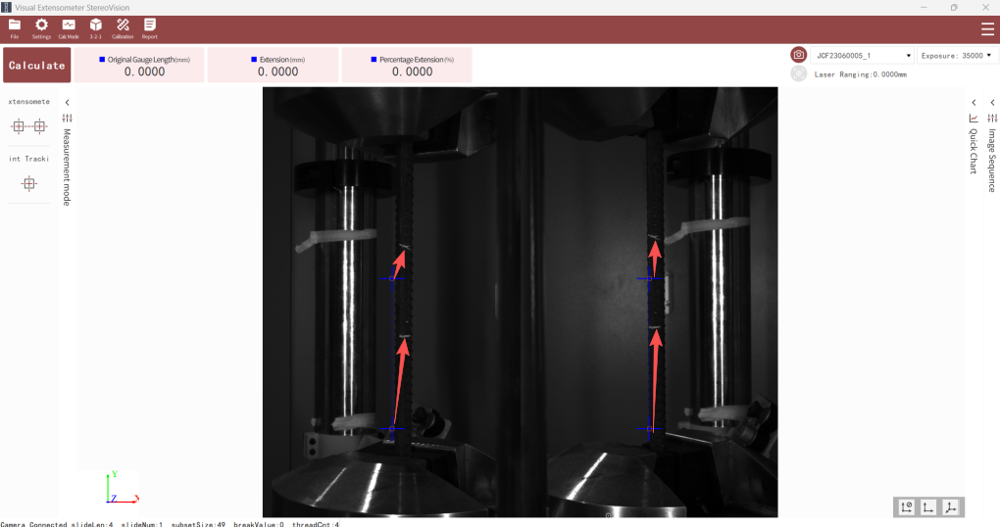

3.  Click Compute to see whether the testing machine has received
    deformation data. If the testing machine is receiving data you may
    proceed with the test. After the test ends, return to the
    extensometer software and stop computation.

#  V. Safety Precautions and Notes

1.  Do not operate this instrument alone without professional training.
2.  Avoid shining light from the light source directly into the eyes to
    prevent possible eye injury.
3.  In high-temperature environments, wear heat-resistant gloves to
    prevent burns. When making speckles or marking points, avoid contact
    with eyes.
4.  When not in use, store the instrument in its case and keep it in a
    dry place. Protect from shock, dust and moisture.
5.  During transportation, place the instrument in its case; handle
    carefully to avoid squeezing, collision and severe vibration. For
    long-distance transport, use padding around the instrument inside
    the case.
6.  When installing onto or removing from the tripod, support the
    instrument with your hand to prevent dropping.
7.  Do not wipe plastic components or acrylic surfaces with chemical
    solvents; use a soft cloth moistened with water.
8.  Before measurement, carefully inspect the instrument and confirm
    that all indicators, functions and power meet requirements before
    operation.
9.  If instrument malfunction is discovered, do not disassemble the
    device unless you are qualified service personnel to avoid
    unnecessary damage.
