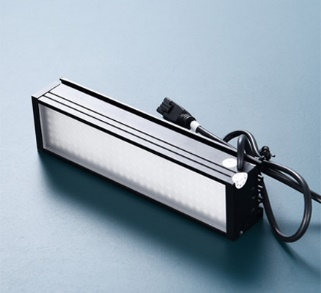

# 

1)  2D 视频引伸计尺寸

<!-- -->

1.  整体尺寸长：206mm，宽：106mm，高：128mm

2.  底部固定孔位：中间孔位 1/4-20 UNC 螺纹孔，4 x M6 -
    6H，详细尺寸请参考（图 2）。

    

图 1 实物图

图 2 底部固定孔位尺寸图

2)  固定支架：

<!-- -->

1.  依据实际的夹具转向（90°/45°），在试验机平台上安装（90°/45°）旋转支架（图 3），视频引伸计前后最好预留 50mm 的行程空间。

图 3.旋转支架

2.  便携式三脚架（图 4），可自由调节系统水平和设备空间距离。

图 4.三脚架

3.  移动支架（图 5），可自由调节系统水平和设备上下空间位置，可整体移动。

图 5.移动支架

3)  电脑配置：

    单组纵向标记点：

    CPU：I5 12400F（雅浚 x400）

    内存：金士顿 16G DDR4 3200

    显卡：GTX3050 6G

    硬盘：500G 固态

    横纵向多组标记点：

    CPU：I7 13700KF

    内存：金士顿 32G DDR4 3200（16G\*2）

    显卡：RTX 4060TI

    硬盘：1T 固态

4)  详细平面，三维尺寸图

    
    

# 

# 

# 

# 

# 感谢您选用我公司产品！

总部地址：深圳市南山区桃源街道南山智园 C3 栋 15 层

服务热线：0755-86347753

官方网址：www.haytham.com.cn
