# 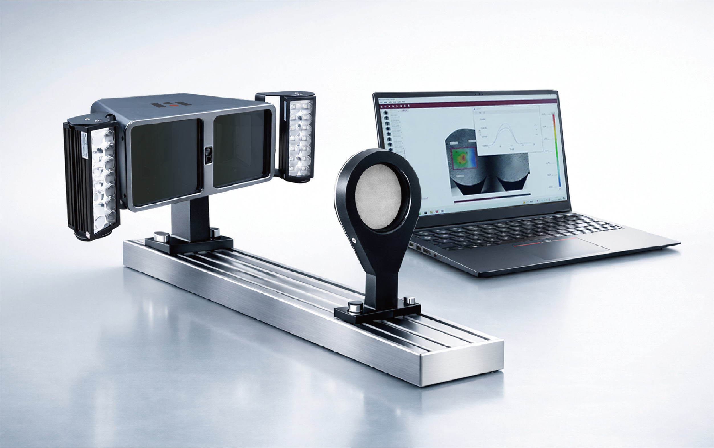

# **目录**

[**1. 注意事项 [2](#_Toc10590)**](\l)

[1.1. 使用安全 [2](#使用安全)](\l)

[1.2. 使用警告 [2](#使用警告)](\l)

[1.3. 法律声明 [3](#法律声明)](\l)

[**2. 系统介绍 [4](#_Toc26805)**](\l)

[测量原理 [5](#测量原理)](\l)

[**3. 软件安装 [5](#_Toc9030)**](\l)

[3.1. 相机驱动安装 [6](#相机驱动安装)](\l)

[3.2. 版软件安装 [6](#版软件安装)](\l)

[**4. 视频引伸计分析模块 [6](#_Toc5467)**](\l)

[4.1. 模块概述 [6](#模块概述)](\l)

[4.2. 硬件安装 [7](#硬件安装)](\l)

[4.3. 软件使用 [8](#软件使用)](\l)

[**5. 三维全场应变测量分析模块 [12](#_Toc23187)**](\l)

[5.1模块概述 [12](#模块概述-1)](\l)

[5.2硬件安装 [13](#硬件安装-1)](\l)

[5.3软件使用 [13](#软件使用-1)](\l)

[**6. 虚拟应变片测量分析模块 [20](#_Toc28195)**](\l)

[6.1模块概述 [20](#模块概述-2)](\l)

[6.2硬件安装 [20](#硬件安装-2)](\l)

[6.3软件使用 [22](#软件使用-2)](\l)

[**7. 设备保养维护以及注意事项 [24](#_Toc10244)**](\l)

[7.1 日常维护 [24](#日常维护)](\l)

[7.2 周期性维护 [24](#周期性维护)](\l)

[7.3 定期校准 [24](#定期校准)](\l)

[7.4 长期存放与应急处理 [25](#长期存放与应急处理)](\l)

1.  注意事项

    1.  ## 使用安全

<!-- -->

1)  本系统在部分需使用电源配件时，应使用符合标准三相220V电压，且应有接地装置。使用不正确的工作电压可能导致故障或火灾的危险，请严格遵守使用规范。

2)  使用设备前需检查设备是否完整，电缆是否破损或损坏，以防造成设备损坏或人员伤亡。

3)  请勿在高温、高压、高湿等环境下使用该设备。如确需使用，需做好整机防护。

4)  请勿在多尘、结霜、腐蚀等环境下使用该设备。

5)  在使用过程中必须遵守相关的使用流程及事故防治条例。

    1.  ## 使用警告

<!-- -->

1)  在使用过程中注意保持镜面清洁，请勿用手或尖锐物体触碰镜面，避免污染镜面影响成像质量。

2)  在使用设备过程中注意设备需远离振动源，减少环境对测量结果的影响。

3)  在使用设备时，请勿触碰或撞击设备及设备支架。

4)  在安装完设备后，需保证设备固定，防止摔落造成设备损坏或内部结构变化。

5)  请勿直视本设备补光灯，以免眼睛不适或视力受损。

6)  请勿在易滑动、倾斜、振动等地面使用该设备，避免晃动、摔落等风险。

7)  请勿自行拆装本系统主机及配件。如需更换零配件，请与本公司联系。

8)  如发现设备问题，请及时与本公司联系，请勿随意处理。

    1.  ## 法律声明

<!-- -->

1)  本说明书的文字、图片、操作指引、参数说明等所有内容，均为海塞姆的合法知识产权，受法律保护。您仅可将说明书用于指导本公司产品的使用，不得擅自抄袭、复制、传播、篡改说明书内容，或用于商业推广及其他产品配套非授权用途。

2)  本说明书的内容是基于产品当前版本、技术参数及行业规范编写，力求准确完整，但不保证内容完全无遗漏或绝对精准。若您发现内容与实际设备存在差异，或有疑问，可联系本公司电话核实。

3)  本公司保留根据产品技术升级、合规要求及功能优化等情况，对说明书内容（包括参数、操作步骤等）进行修改、补充或更新的权利。更新后的说明书以实际随箱设备附带的版本或官方发布的最新版本为准，无需另行通知。

4)  本说明书仅作为设备使用指引，其中的参数功能说明仅为参考，不构成对产品使用效果的绝对承诺。您在使用设备时，仍需结合自身测试场景、行业规范及实际需求操作，海塞姆不对因未按规范使用或场景不匹配导致的问题承担额外责任。

5)  任何单位或个人未经本公司许可，擅自使用、修改、传播本说明书内容，或侵犯相关知识产权的，本公司将依法追究其法律责任。

6)  本声明的最终解释权归深圳市海塞姆科技有限公司所有，若您对声明内容有疑问，可通过本公司电话咨询。

<!-- -->

2.  系统介绍

视觉应变仪教育版主要由以下部件组成：‌

-   设备主机

-   操作软件

-   电子密钥

-   光源及光源控制器

-   固定支架与云台

-   标定板

-   USB 3.0数据线

-   标记点、喷漆

    

## 测量原理

视觉应变仪教育版是一种光学非接触式变形应变测量设备，它通过一台相机捕捉试样表面的时序图像，利用数字图像相关技术(Digital
Image
Correlation，DIC)分析变形前后图像中特征点的位移、应变变化，从而得到试样的位移变化值。视觉应变仪教育版测量系统主要构成见图1，其中工业相机在光源和计算机的配合下完成对试样图像的采集，试样上布置的特征点作为视觉应变仪教育版需要匹配跟踪的特征。

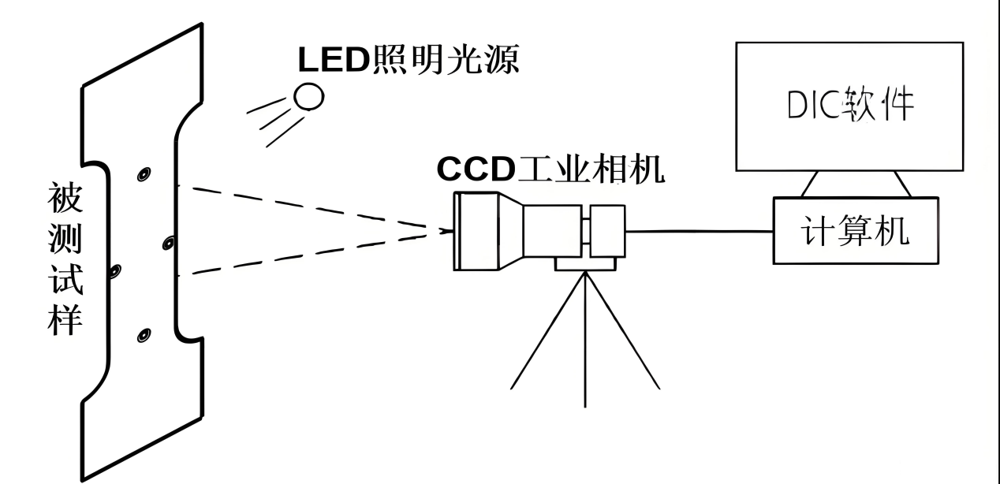

图1 测量原理示意图

3.  软件安装

安装软件的电脑基本配置要求：

-   i7或以上处理器。

-   16GB以上内存。

-   1TB以上固态硬盘。

-   USB3.0接口。

-   64位WIN10以上操作系统。

    1.  ## 相机驱动安装

将随箱U盘插入待安装电脑主机上，打开U盘-“相机驱动软件”文件夹，安装相机驱动软件。

安装完成后桌面上将生成2个快捷方式图标，一般只会用到Galaxy
Viewer软件。

## 版软件安装

将随箱U盘插入到待安装的电脑主机端口上，拷贝U盘根目录下的“视觉应变仪教育版软件”文件夹至电脑主机的D盘中双击“Visual
Extensometer”文件夹-点击“setup”应用程序进行变形测量软件安装，双击“VisualStrainGauge”应用程序进行全场应变软件安装。

安装完成后，桌面上会分别生成快捷方式图标和。

4.  视频引伸计分析模块

    1.  ## 模块概述

用于材料拉伸、压缩与弯曲等基础材料力学实验教学，可与视觉应变仪同步使用，实现材料加载过程与变形测量的联合教学

## 硬件安装

1）确保电脑具备USB
3.0接口，将视频引伸计的USB数据线连接到该接口，以保证数据传输的高速和稳定

2）将视频引伸计光源电源适配器连接到光源的电源接口，再将适配器插头插入电源插座

3）安装过程中，要注意避免强力拉扯数据线和电源线，防止接口松动或损坏

4）对于视频引伸计的安装位置，应选择在实验台的平稳区域，确保其在使用过程中不会晃动或位移。同时，要调整引伸计的角度，使其能够清晰捕捉实验材料的变形情况

5）可以通过微调引伸计的固定架，使其对准实验材料的关键部位，并保持合适的距离和角度

6）在完成硬件的初步安装后，重新检查一遍所有连接部位是否牢固，确保没有松动或接触不良的情况

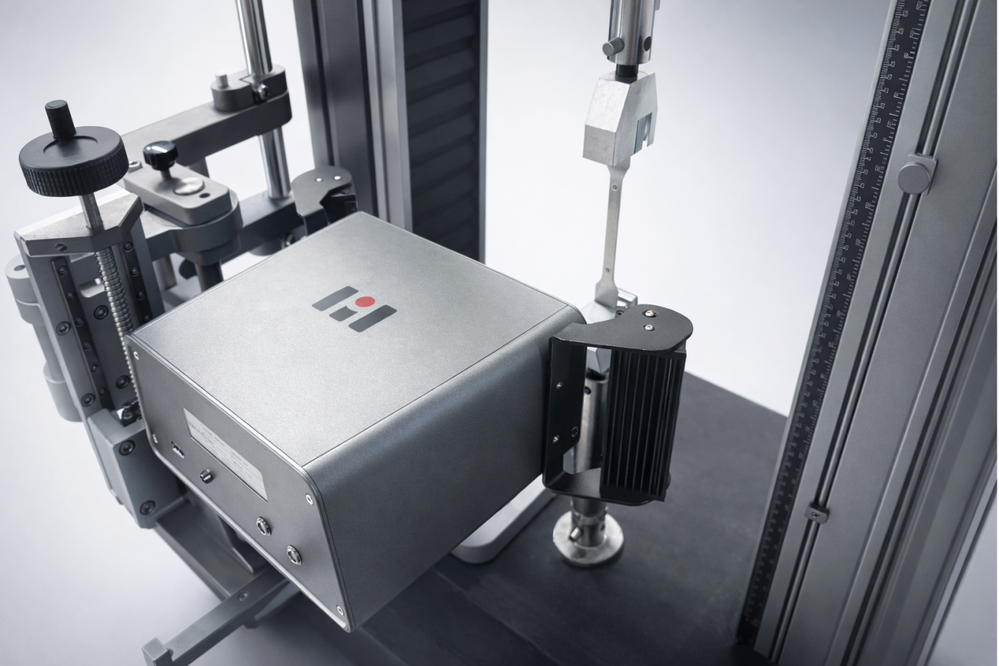

7.  标记点布置，将特定的标记点贴在标距范围内，软件可自动识别

    

    1.  ## 软件使用

<!-- -->

1)  将试样做好标记置于试验位置，标记通过粘贴标准圆形标记点或者手绘明显标记点方式完成，先在待测试样表面布置标记点/特征点，布置完成后将试样

2)  将设备按照标准物距架设，确保设备平行于试样表面，通过USB数据线将设备连接到电脑USB3.0接口上

3)  将加密狗插入到电脑主机USB接口中

4)  双击VisualExtensometer软件桌面快捷方式图标打开软件。打开软件界面如下：

> 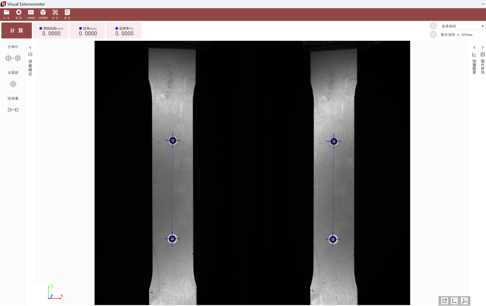 style="width:5.75208in;height:3.61597in" />

5)  软件标定，初次安装软件时需导入标定文件，点击软件菜单栏“标定”按钮，弹出创建标定界面，填写好标定参数，导入对应的标定文件，点击确定

    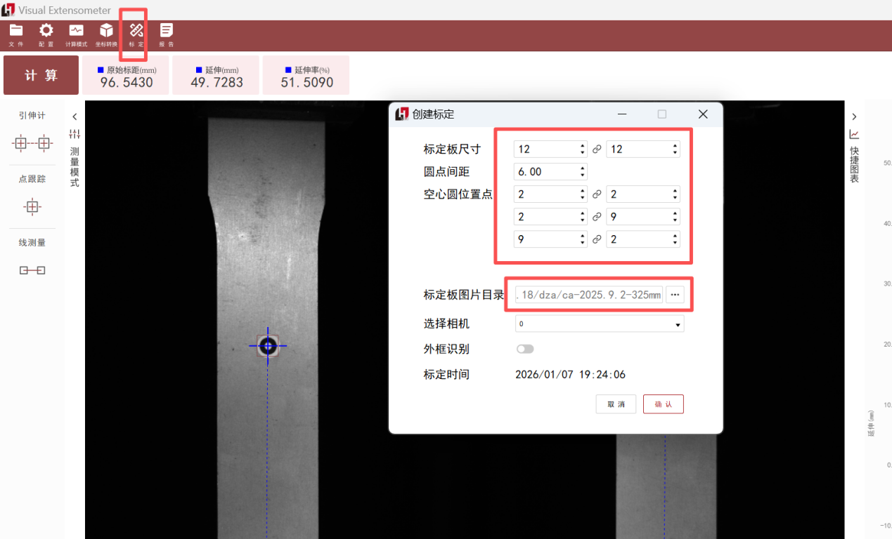

    弹出“标定矩阵创建成功”，即完成标定，后续使用时无需再次标定

    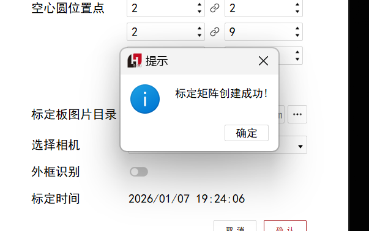

6)  标距识别，使用特定标记点时打开软件即可自动识别标记，测试时软件自动追踪特征点进行变形测量

>  style="width:5.43958in;height:3.57847in" />
>
> 多组标记点时也可手动添加标记点，可以根据实际测量需求添加多组标记点
>
>  style="width:4.21875in;height:2.4375in" />

7)  通讯设置，点击菜单栏“配置”按钮，弹出参数设置界面，选定通讯参数配置项选定通讯格式为“UDP_Json”即可实时把变形量传给试验机，生成应力应变曲线

    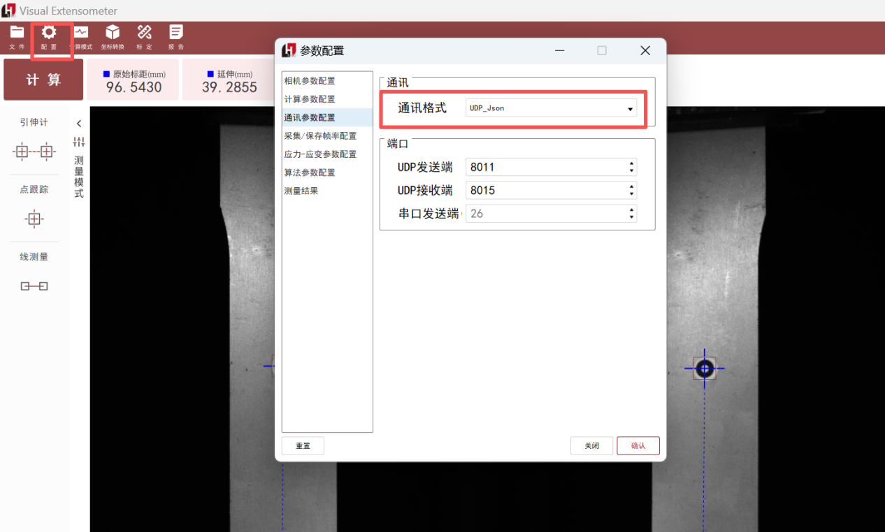

8)  点击计算，即可计算原始标距、延伸、延伸率数据，并实时显示变形曲线

    

9)  测试完成，点击左上角“取消”按钮即可结束本次测试

    

10) 结果输出，可以变形量传给试验机软件可以计算出模量，泊松比，N值R值，断裂伸长率等结果参数，也可把试验机力值导入视频引伸计软件生成对应的结果参数

    

<!-- -->

5.  三维全场应变测量分析模块

## 5.1模块概述

用于材料拉伸、压缩与弯曲等基础材料力学实验教学，可与视觉应变仪同步使用，实现材料加载过程与变形测量的联合教学

## 5.2硬件安装

通过固定块把视觉应变依和演示工装安装在演示工装调节好物距，按4.2操作连接光源及线缆

## 5.3软件使用

1)  标定文件导入，单目三维设备出厂前已完成标定，使用时无需拍摄标定图。初次安装软件需导入标定文件，启动应变仪软件并创建新项目，设置项目名称和路径

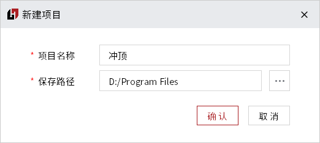

点击左侧菜单栏的标定按钮进入标定界面；点击左上方的导入图像按钮选择标定文件夹导入标定图像

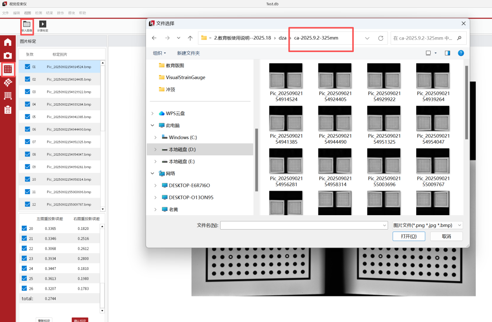

点击计算标定按钮，输入标定板参数，点击确定待显示完成即标定完成

2)  图片采集，点击左侧菜单栏进入图片采集界面，设置好采集帧率和采集时间等参数，点击开始采集试样加载完成结束采集。采集完标定图片后，点击应变仪软件右上角相机图标关闭相机

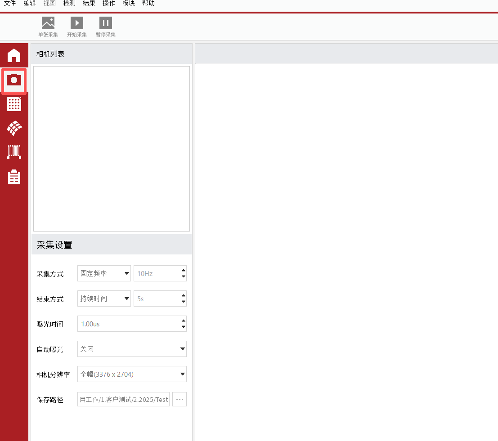

3)  位移计算，点击左侧分析计算按钮进入数据分析界面；点击左上角导入图像按钮进行图像导入，导入试验过程图片

在计算前需要先进行计算区域框选和计算参数设置

4)  应变计算，在计算参数设置完毕后，点击开始计算，进度条显示完成即可以查看计算结果，第一次计算完毕是指位移数据计算完毕，还需转应变，点击结果—应变—主应变，即可开始转应变

5)  结果查看，在位移和应变计算完毕后，点击构造点可查看结果

点击菜单栏结果按钮可查看需要的结果类型

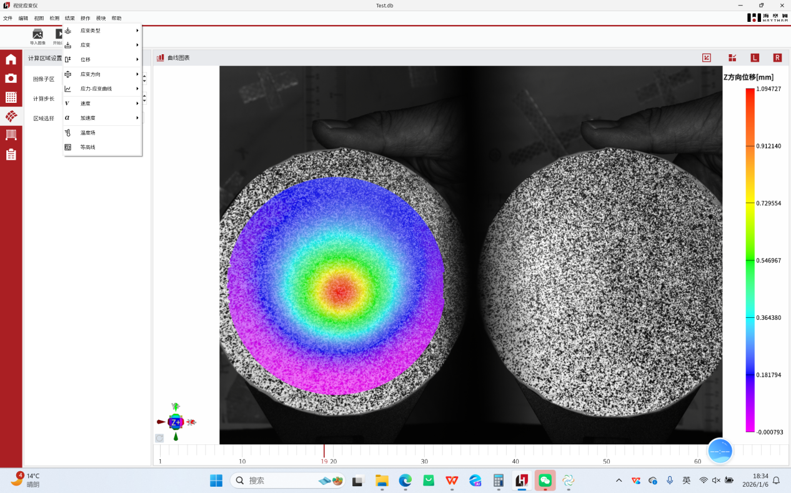

可查看不同类型的结果，如X向应变、Y向应变、主应变、次应变等

位移数据，位移可查看X向位移、Y向位移、Z向位移数据及云图

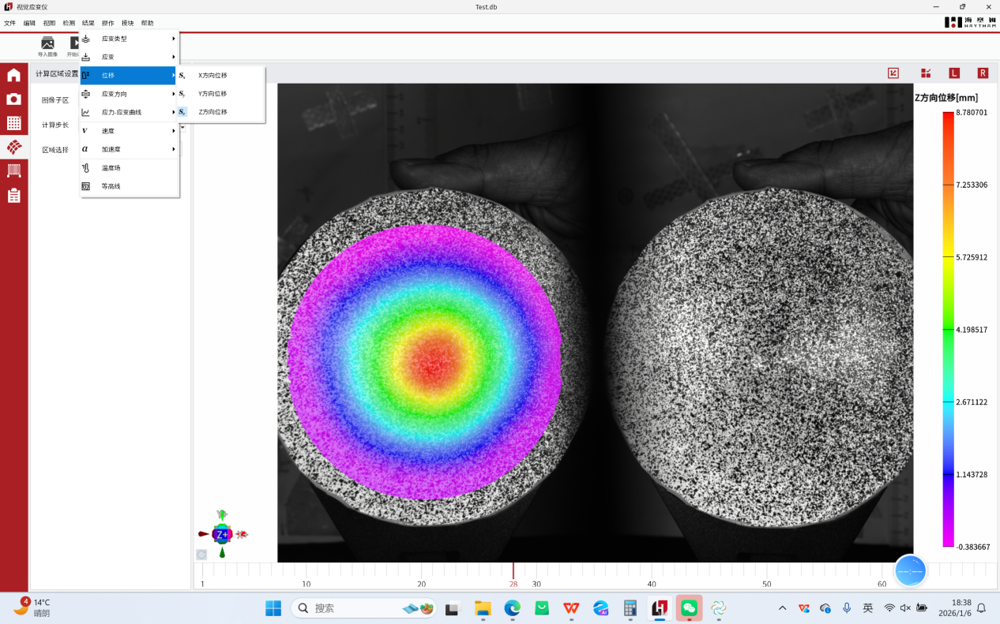

6)  导出点云数据，点击左上角“文件”，“输出”，“所有点数据”即可以excel形式导出计算区域所有点数据

点击曲线图表“导出数据”按钮可以导出构造点数据

7)  图片视频导出，点击软件右上角导出设置可以设置导出图片或者视频模板

点击生成动画和图片可以分别导出视频和动画

6.  虚拟应变片测量分析模块

## 6.1模块概述

用于结构力学中梁弯曲实验教学，结合电阻应变片与DIC测量方法进行对比教学。

## 6.2硬件安装

1)  散斑制备，如下图可以在被测部位贴水转印或者盖上散斑印章

    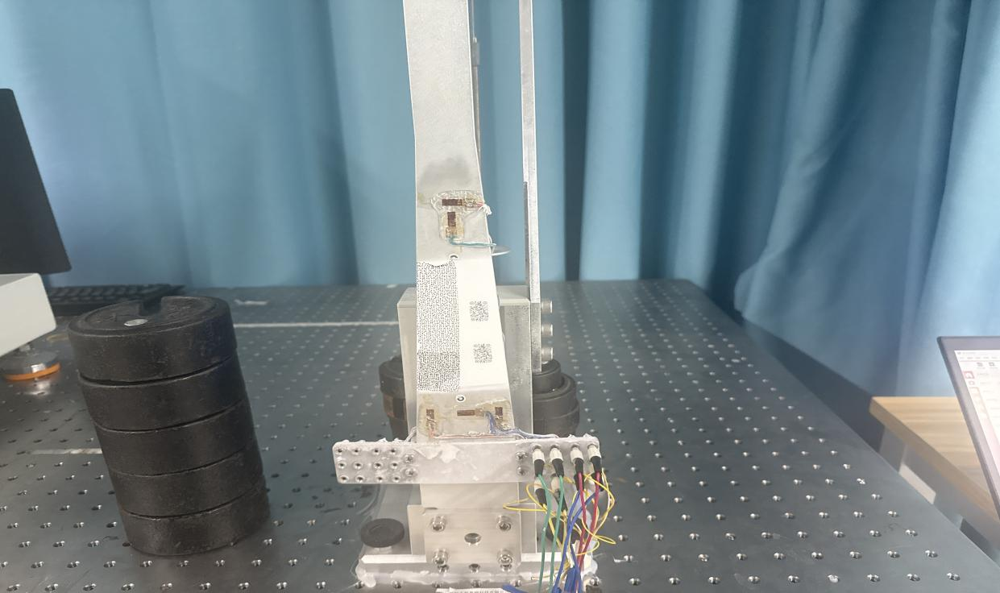

2)  如图架设好视觉应变仪，调整好物距

    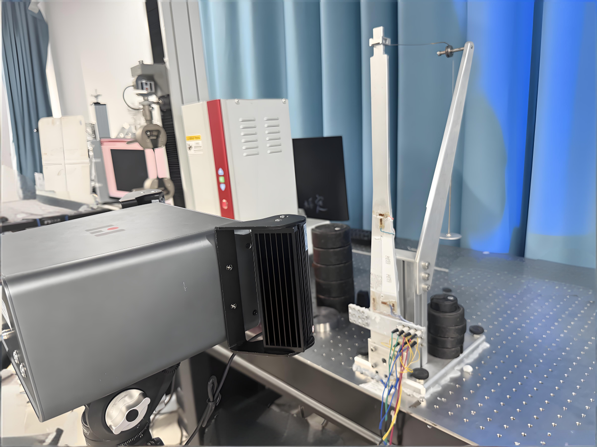

## 6.3软件使用

1)  打开应变仪软件，点击选定左侧菜单栏应变片功能，打开相机可以自动识别盖章应变片，散斑区域需手动设置应变

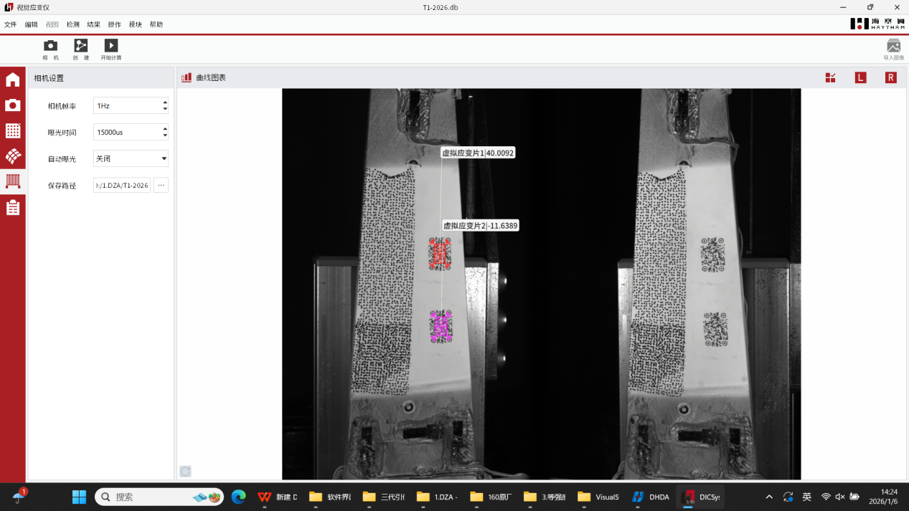

2)  参数设置，可设置曝光时间和采集帧率等参数

    

3)  参数设置好，点击左上角开始计算按钮即可实时或者导入计算虚拟应变片数据

    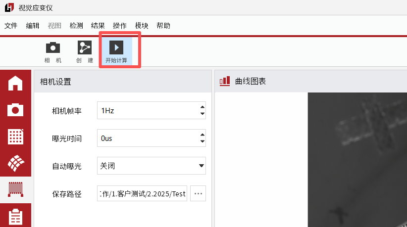

4)  计算应变片数据可以和物理应变片做对比，来验证数据的准确性

    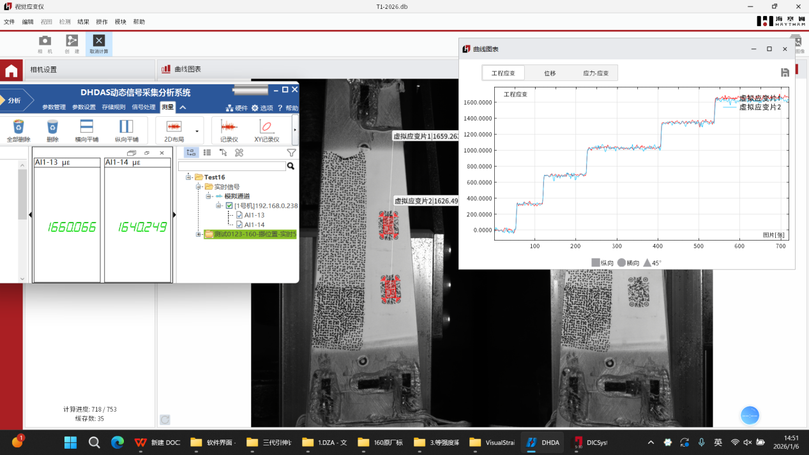

<!-- -->

7.  设备保养维护以及注意事项

## **7.1 日常维护**

**使用前检查**‌

外观：无变形、盖板完好、线缆无损

连接：主机与计算机连接稳固，电源正常

环境：温度5℃~40℃，湿度≤70%，无强光、震动

准备：取出设备，气吹清理前端盖板灰尘

**使用后清洁**‌

盖板：气吹去尘→镜头纸蘸清洁液轻擦（圆周运动）→检查无残留

表面：干布擦拭，禁用酒精

光源：关闭后清洁散热孔

注意：轻拿轻放防震

## **7.2 周期性维护**

全面清洁：刷缝隙灰尘，检线缆磨损，清工作台碎屑

校准：误差≤0.5%

光源：检查均匀性，如需要更换老化光源

## **7.3 定期校准**

周期：正常12月（最长18月），频繁使用或恶劣环境6月

方法：

安装校准装置

多级位移校准（3mm、5mm、10mm等）

误差在±0.5%或±1.5μm内

保存记录，维修或怀疑精度时立即校准

## **7.4 长期存放与应急处理**

**长期存放（\>4周）**‌

清洁干燥后装箱，内置干燥剂

环境：5℃~35℃，湿度≤60%，无腐蚀

每季检查防霉变

**应急处理**‌

镜头霉变：联系专业维修

进水/受潮：断电→风干→送修

精度异常：检查镜头、标记、环境→校准或联系技术支持

# 

# 

# 

# 

# 

感 谢 您 选 用 我 公 司 产 品！

**总部地址：**深圳市南山区桃源街道南山智园C3栋15层

**服务热线：**0755-86347753

**官方网址：**www.haytham.com.cn
