**2D 设备使用手册**

**目录**

[**一、设备介绍 [1](#一设备介绍)**](\l)

[1、设备主机 [1](#设备主机)](\l)

[2、光源 [1](#光源)](\l)

[3、固定支架 [1](#固定支架-根据实际测试环境搭配)](\l)

[4、标记点 [1](#标记点)](\l)

[**二、硬件安装 [2](#硬件安装)**](\l)

[**三、软件安装 [4](#软件安装)**](\l)

[**四、引伸计软件使用 [7](#引伸计软件使用)**](\l)

[**五、全场测量软件使用 [14](#全场测量软件使用)**](\l)

[**六、功能模块使用 [19](#功能模块使用)**](\l)

[1. 疲劳降频功能 [19](#疲劳降频功能)](\l)

[2. 裂纹扩展功能 [20](#裂纹扩展功能)](\l)

[3、模拟信号通讯模块 [25](#模拟信号通讯模块使用)](\l)

[**七、设备保养维护以及注意事项 [28](#七设备保养维护以及注意事项)**](\l)

1.  

# 一、设备介绍

**视频引伸计主要部件：设备主机、操作软件、电子密钥、光源及光源控制器、固定支架及云台、标定板、USB3.0 数据线、标记点或高温材料。**

## 1、设备主机

主要包括外观方形盒子和防尘盖两部分，通过底部不同的固定孔位可实现水平放置或者呈 90°竖直放置。

## 2、光源

## 常温标准视野配置环光，高温炉环境配置射灯，高低温箱环境配置条光。 

## 固定支架（根据实际测试环境搭配）

## 1）利用试验机安装孔固定的有旋转支架或 45 度支架。

2）可移动式固定支架有三角架或电动支架。

## 4、标记点

1）常温试验时，采用标准化标记点，可以实现软件自动识别。

2）高温试验时，采用酒精加高温材料或高温笔，制作高温标记点。

2.  # 硬件安装

    2.1 常温试验时，通过在待检测试样上粘贴标记点，可以实现软件自动识别。

    高温试验时，采用酒精和高温材料混合均匀点在被测试样表面即可或者用高温笔直接点在被测试样表面，制作高温标记点完成。

    2.2 根据不同试验机，选择合适夹具，将试样固定在拉伸试验机夹具上。

    2.3 检查试样安装是否到位，第一步首先确定设备已经摆放水平和物距是否正确，第二步打开电脑软件，开启相机，看视野中夹具上的试样是否居中在软件视野中间，图像呈现是否清晰，灯光亮度是否合适，一切调整完后，设备硬件准备完成。

    2.4 固定好三脚架、云台或则移动支架。

    2.5 将云台快装板固定在 2D 引伸计底板上。

    2.6 将引 2D 伸计安放在三脚架，调整好相对水平及相对高度。

    2.7 按照 2D 引伸计预设的距离参数，调整合适的摆放距离，

> 例：预设距离参数 210mm。

1）使用卷尺或长度尺等测量“设备前端边缘到试样”的间距，调整到约 210mm 为好。完成 2D 引伸计和待测试样中心的基本对齐。

2）可采用设备集成的激光测距模块，设备连接完成后打开软件，软件界面右上角点击激光测距。

如图：红色字体 210mm 为当前设备的激光测距照射到该试样表面的距离，完成引伸计窗口和待测试样中心的基本对齐。\[100mm\]是软件文件配置当激光测距为 100mm 时，达到±2mm 误差时红色字体会变为绿色。

2.8 光源连接：将电源线连接至光源控制器上，再通过黑色数据线将光源控制器与光源连接。

2.9 设备连接：将数据线将 2D 引伸计和电脑主机连接。

2.10 打开光源控制器开关，蓝色光源点亮，调整亮度。

2.11 打开电脑，进行软件操作，对 2D 引伸计、光源亮度等进行微调。

3.  # 软件安装

    3.1 初次使用时，必须在试验机电脑上先进行软件安装。

    3.2 电脑基本配置要求：i7 处理器 16GB 内存 1TB 固态硬盘 USB3.0 接口/
    64 位 WIN10 操作系统以上。

    3.3 相机驱动安装

找到随机 U 盘资料中的“相机软件”文件。

3.4 引伸计软件安装

1）找到随机 U 盘资料中的“引伸计软件”文件（版本号以实际为准）。

>  style="width:2.41667in;height:0.3in" alt="1718705667385" />
>
>  style="width:2.70833in;height:1.16667in" alt="1718705691539" />

2）安装完成后，电脑屏幕上显示下述图标。

3.5 软件安装验证

1）点击电脑屏幕上相机图标。

1.打开软件安装包，点击“Next”
2.勾选“accept”，然后点击“Next”
3.选择“Complete”，进行完整版安装
4.点击“Install”，进行安装

>  style="width:3.65556in;height:2.83611in" />
>
> 5.安装完成后，点击“Finish”，安装完成

2）进入相机/图像视图界面。用鼠标左键双击相机视图进入 IP 配置界面，按照下图所示 3 步进行操作：

3）配置完成后，点击“Close”按钮，关闭 IP 配置界面，进行相机连接

4）打开相机软件连接正常后，关闭驱动软件。

4.  # 引伸计软件使用

    4.0 标定图片采集，将设备固定在工作距离对焦好用相机驱动软件如下图姿态分两个路径存放标定图片，正对着采集 1 张图片用来尺寸标定，分不同姿态采集多张标定图片用来内参标定

尺度标定正视图

内参标定图

标定姿态示意图

4.1 相机类型选择，打开软件安装路径下“config”文件，将“cameraType”参数改为 1

4.2 打开软件

将加密狗 U 盘插入到电脑主机 USB 插口中，双击图标打开软件。打开软件界面如下：

4.3 图片保存操作

1）选择保存：依次点击软件界面左上角“文件”→
“保存图片”，再次打开时，“保存图片”前端处于勾选状态。

2）设置保存路径：点击“设置保存图片路径”。选择主机中剩余内存空间高于 30G 的硬盘建立文件夹存储图片。

3）不需要保存图片：依次重复上述步骤即可取消勾选状态。

4.4 相机参数设置

1）点击工具栏第二个按钮“参数设置按钮”，点击相机参数配置。

>  style="width:2.45833in;height:2.20278in" />

2）按照试验需求设置计算帧率和曝光间隔。

4.5 设备微调

1）点击“相机”按钮。

2）试样图片出现在屏幕上。

3）观察视窗，通过继续调整引伸计位置和角度，直至在视窗中看到清晰的待测试样全貌为止。

4.6 标记测试点（计算标距）

1）自动识别标距：再次点击“相机”按钮，软件可以自动识别相关的标记点。

2）手动调整标距：如果无法自动识别时，请选用手动调整，通过鼠标拖动“十字星”与试样上的标记点重合。根据需要可设置多组标记点，在视窗单击鼠标右键，即可添加。

4.7 创建标定

点击软件界面“标定”弹出窗口，即可修改标定参数，并选择标定文件目录，尺寸标定目录选择“1 张”图片的文件，内参标定目录选择“13 张”图片的文件，点击“确认”，标定矩阵创建成功，创建标定成功。

4.8 计算

1）点击“计算”按钮。

2）软件出现浮窗显示实时数据及位移 - 时间曲线。试验结束时，再次点击计算按钮，停止计算。

4.9 数据输出

1）点击“快捷图表”中工具栏最左侧“保存”图标。

2）即可输出实验数据的 EXCEL 格式文件：如下图

5.0 输出报告

点击报告，填入需要的文件名称，点击确认即可输出。

5.  # 全场测量软件使用

    5.1 打开软件，双击图标打开软件进入软件界面，选择新建项目模块，输入项目名称和保存目录，点击创建新项目进入
    计算模式；选择打开项目模块，选择已保存计算数据的文件并打开，可直接进行数据的重
    复计算；选择最近使用项目，可以快速打开上一次已关闭项目。

5.2
进入软件计算模式后，通过功能区和工具栏可选择需要进行的操作，功能区和工具栏按钮内容介绍如下：

1）文件：可以选择新建文件，打开文件，打开最近项目，保存试验数据，输入已有测量图片，参数设置及导出点云数据等功能
。

2）编辑：可以选择或者删除在计算区域内构造的点，线，面，应变片等。

3）视图：可以切换不同的显示模式。

4）构造：可以在计算区域内创建点，线，面，应变片，创造点间距等。

5）检测：可以选择需要测量的内容。

6）相机：点击相机按钮，切换是否打开图像采集功能。

7）参数设置：需要连接设备才可以使用参数设置按钮，用来设置采样频率和曝光间隔
。

8）标定：用来设置标定系数，参数设置和文件选择路径方式和引伸计一样。

9）采集：通过相机采集试验过程图像，用于应变分析

10）区域设置：可以通过拖动鼠标框选区域，选择需要分析的区域范围

11）计算：开始/中断对采集图像的应变分析

12）报告：可以输出 PDF 报告和视频报告

5.3 进入软件计算模式后，点击相机按钮实时采集图像进行应变分析，也可以通过点击文件——输入——图形序列，导入已保存的图像数据进行应变分析。

5.4 如果使用相机实时采集图像，先通过参数设置按钮，根据实验要求设置合适的采样频
率和曝光间隔，并点击采集按钮，开始记录并保存试验过程采集到的图像（如使用导入图形序列功能跳过此步骤，直接进行应变分析）。

5.5
点击区域设置按钮，根据实际需要检测的区域选择矩形和多边形按钮，拖动鼠标在图像中框选需要的计算区域，可以通过滚动鼠标滚轮调节图像大小，框选更合适的计算区
域，点击计算，可以通过构造按钮，预先在区域内创建一个点（也可以完成计算后再选择任一点，但是计算过程中没有曲线显示），点击计算按钮，开始进行计算区域的应变分析，可通过下方进度条查看计算进度。

5.6 计算完成后可根据实验需求通过构造和检测查看所需要的数据，并通过点击快捷图标中工具栏最左侧灰色图标，可输出实验数据的
EXCEL 格式文件，点击文件下方保存，可以将此次计算数据保存。

5.7 也可以通过报告按钮导出 PDF 版本报告和 MP4 格式的视频报告。

# 功能模块使用

## 疲劳降频功能

**功能介绍**

常见的 DIC 系统要在一个疲劳周期需采集 10 张以上图片，对于数以万次的疲劳测试，不仅要占用上百 G 的硬盘存储空间，而且会产生数据延迟、系统宕机等问题。针对此问题，海塞姆科技开发了跨周期采集的疲劳模块。如下图所示，该模块可以将接收到的疲劳加载 N 个小周期拟合成 1 个大周期，触发海塞姆视觉引伸计系统跨周期拍照采集。即可以实现全程跟踪计算，同时又减少了数据采集量。

**参数说明**

点击配置弹出疲劳降频参数

疲劳降频：设置为开，即开启该功能；

峰值计算：设置为开，即采集峰值数据；

降频倍数：小周期拟合大周期数；

周期点数：降频后每个周期采集数据点数；

加载频率：试验机疲劳加载频率；

保存峰值图像：打开即保存峰值图片；

保存路径：设置图片保存位置；

疲劳降频效果 峰值采集效果

## 裂纹扩展功能

**1 功能介绍**

背景意义：在材料力学性能测试中，获取裂纹扩展长度是测得材料层间断裂韧性的前提条件，在 GB/T
42903-2023 、ASTM
D5528 等测试标准中都需要先获得准确的裂纹长度等信息，然后转换得到相关力学性能参数。

**实现功能**：通过标记点获取位置信息、表面灰度变化自动识别加载位移和裂纹长度。

**应用场景**：主要应用于复合材料 (DCB)、金属材料 (CT) 试样的断裂韧性测试，这类测试为预制缺口加载，裂纹沿预制缺口向后扩展，测试目的为获得**材料基础力学性能（断裂韧性）**，一般不需要全场应变，但测试精度要求较高。

**基本原理**：对待测区域进行小区域划分，结合深度学习、边缘检测和灰度识别准确找到裂纹的尖端点位置，两标记点之间距离为加载位移，裂纹尖端距两标记点中心位置的距离为裂纹长度。

**2 前期准备**

**试样表面处理**：使用白色哑光油漆笔在试样表面均匀涂抹白漆。

**光源选取与位置**：使用投影射灯或平行光，与物体同一高度在夹具的另一侧与相机成 30°夹角打光（反光时可适当增大夹角至 60°或增加偏振片，光源角度可结合实际情况进行适当调整以达到最佳效果）。

**相机镜头选型**：

<table>
<colgroup>
<col style="width: 12%" />
<col style="width: 26%" />
<col style="width: 22%" />
<col style="width: 38%" />
</colgroup>
<tbody>
<tr class="odd">
<td>相机</td>
<td>镜头</td>
<td>视野</td>
<td>精度</td>
</tr>
<tr class="even">
<td>2621</td>
<td>大恒 75mm</td>
<td>50mm</td>
<td>裂纹宽度≥20um</td>
</tr>
<tr class="odd">
<td>1220</td>
<td>Kowa75mm</td>
<td>25mm</td>
<td>裂纹宽度≥20um</td>
</tr>
<tr class="even">
<td>2621</td>
<td>Kowa16mm</td>
<td>200mm</td>
<td>裂纹宽度≥80um</td>
</tr>
</tbody>
</table>

表 1.相机镜头选型

**3 操作过程描述**

引伸计裂纹扩展功能可进行实时监测，也可先采集后处理的方式。

注：对于裂纹与非裂纹的对比度较小，且试样表面处理效果不一致、设备未固定的测试，建议使用采集后处理的方式，由于不同工况的最优阈值存在差异，直接进行实时分析可能会出现识别精度较低的情况；如果裂纹与非裂纹的对比度较大，或者试样表面处理一致、设备固定的测试，最优阈值可提前预知，实时测量也可以达到较高精度。

实时分析：1.标定；
2.计算参数设置；3.打开软件下的检测→裂纹检测开关；3.开始计算。

先采集、后处理方式：1.标定；
2.导入采集的图片；3.计算参数设置；4.打开软件下的检测→裂纹检测开关；5.开始计算。

注：实时分析时，最大计算帧率与图像大小、电脑配置有关，可通过裁剪画幅和提升电脑配置的方式提高最大计算帧率。

裂纹扩展过程中，如果将导致当前裂纹扩展的力卸掉，可能会使试样裂纹张开区域出现闭合现象，导致相机捕捉不到细裂纹，在视觉上出现细裂纹“消失”的情况。所以，在加载过程中如果想准确地观察到裂纹尖端，应尽量在试验机加载状态下进行裂纹识别。

图 1.软件操作流程

先采集后计算的方式下，计算完成后提示计算完成即可查看结果，实时计算需在加载完成后手动结束计算。

图 2.裂纹预测参数设置界面

在进行裂纹识别前应根据当前试样表面、光源、曝光情况对裂纹识别参数进行设置。

**灰度阈值**：当识别模式为自动模式时，软件将根据当前图像自适应选取阈值，此时灰度阈值的设置不影响计算；当识别模式为手动模式时，灰度阈值将代入计算，识别区域的裂纹尖端灰度值低于灰度阈值时被当作裂纹（例：设置为 210，裂纹上灰度值低于 210 的被识别为裂纹，高于 210 的位置则不被识别为裂纹）。

**阈值选取**：通过相机软件观察试样表面灰度值、裂纹尖端位置灰度值确定，即取值应小于试样表面灰度值，大于所需检测裂纹尖端灰度值。

**识别模式**：分别为手动和自动模式，当选项为手动模式时，裂纹尖端位置依据灰度阈值进行识别；当选项为自动模式时，通过自适应阈值方法对裂纹尖端进行识别，此模式下不需设置灰度阈值（自适应阈值方法需要裂纹尖端与试样表面需有较明显的对比度，否则由于裂纹尖端无明显边缘，可能会导致裂纹尖端识别错误）。

**4 注意事项**

4.1）试样表面尽量保证平整，若试样表面较不平整，可使用砂纸进行打磨。

4.2）
标记点应在预制裂纹的左侧（即标记点的右侧应有可识别的裂纹），如果标记点右侧没有肉眼可见的裂纹，可使用黑色签字笔标出预制裂纹所在位置，或通过预加载使预制裂纹显现出来。

4.3）
测试前调整设备时，先使用相机软件观察表面灰度情况，曝光稍微调低来观察裂纹尖端位置，然后逐渐增加曝光，将曝光调整至裂纹尖端对比低曝光条件下长度一致，且非裂纹区域灰度值尽量接近 230 左右，即在不过曝的情况下尽量多的降低干扰。

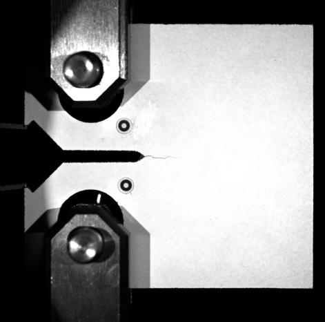

图 3.试样表面处理情况

4.4）对于颜色较浅、自身反光等材料，光源与试验表面应避免垂直照射，这样可以减小光线导致的裂纹对比度降低，以及光照反射对相机的干扰。

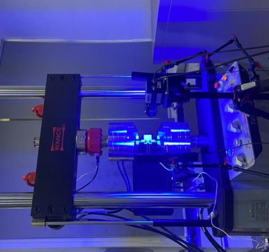

图 4.加载与测试设备

4.5）试样表面应为均匀白色，首选白色哑光油漆笔在待测区域涂画，若材料会发生大变形则不适用油漆笔直涂，需采用喷漆方式对试样表面进行处理。

4.6）试样加载端与预制裂纹尖端表面若经过处理，可以将两标记点粘贴在试样加载端处，若表面干扰较大或夹具遮挡严重，则将标记点贴在预制裂纹处。两标记点之间距离，DCB 试样可沿试样边缘，CT 试样应尽量与裂纹可能出现的上下范围位置一致。

## 3、模拟信号通讯模块使用

1.  **硬件构成**

主要由 NI-9171 单槽 USB
，NI-9269 电压输出模块，NI9215 电压输入模块和相关线缆构成

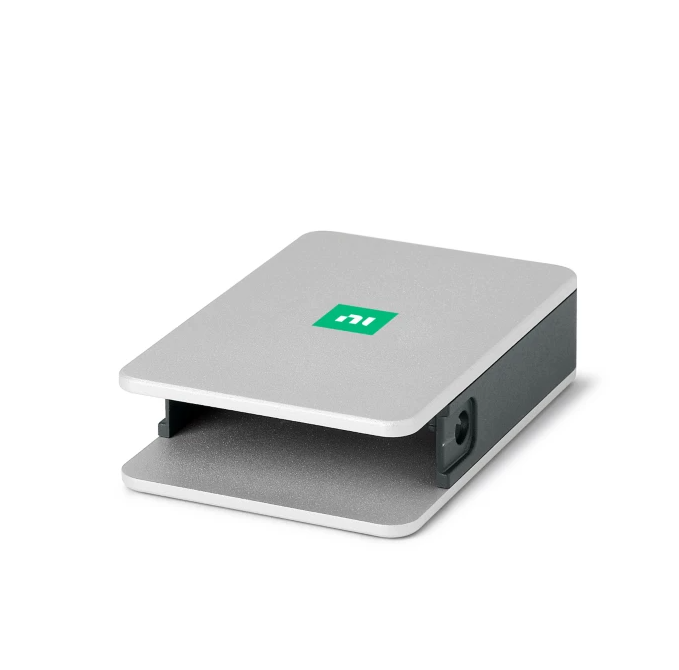
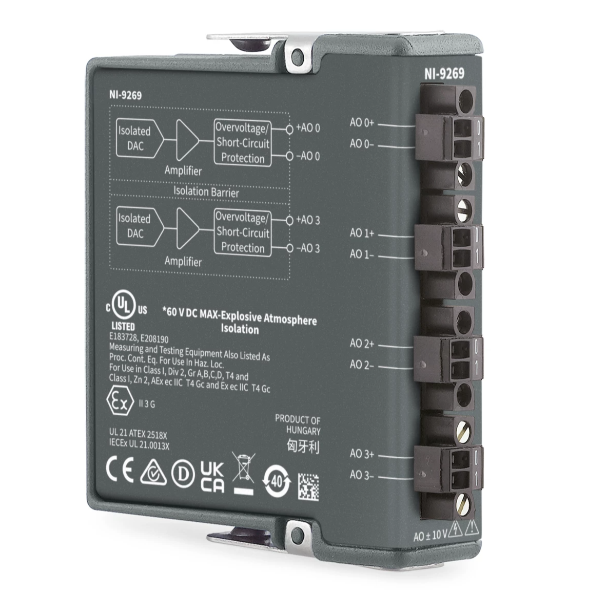
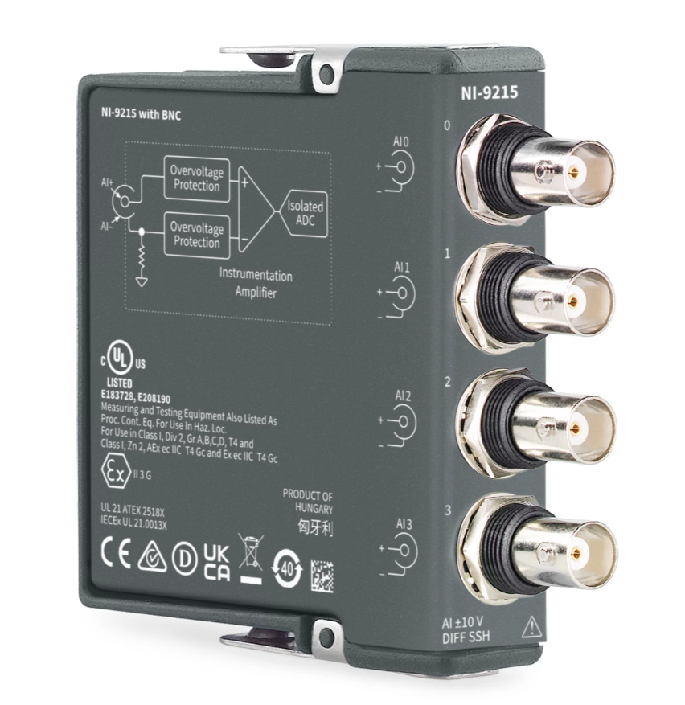

NI-9171 NI-9269 NI9215

NI-9171 单槽 USB：用于输出输出模块供电与数据传输；

NI-9269 电压输出模块：以模拟信号实时输出引伸计变形量给试验机；

NI9215 电压输入模块：实时采集试验机力值信号；

2.  硬件连接

    IO 部分连接试验机，USB 口连接电脑

三、软件设置

1.软件安装，电脑需安装 NI 驱动程序“ni-daqmx_23.8.0_offline”，安装完成打开控制程序“NIDAC_V2.1.2”设置端口号，端口号需与引伸计配置文件一致。

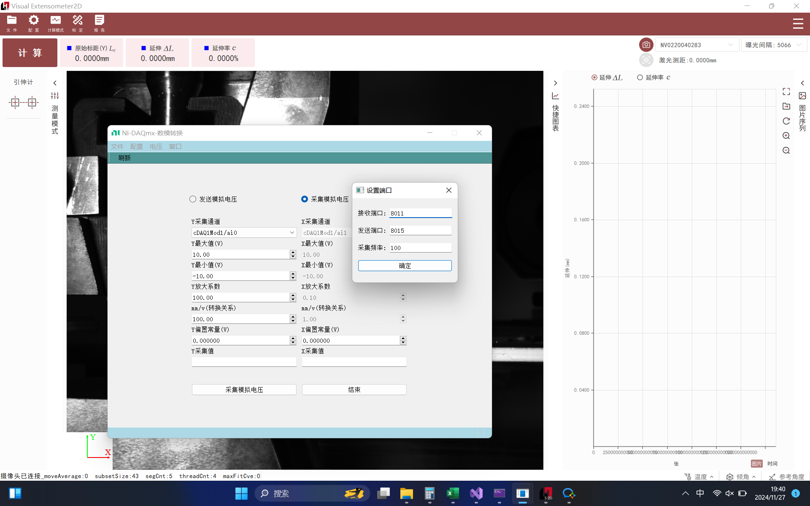
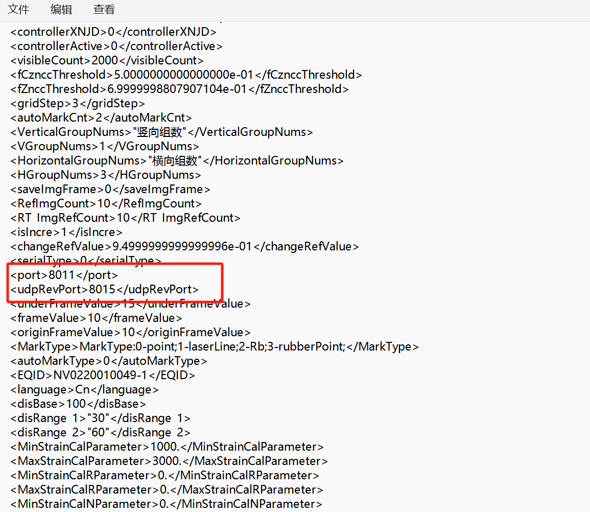

2.  NI 控制程序选择和硬件连接对应的端口号。

    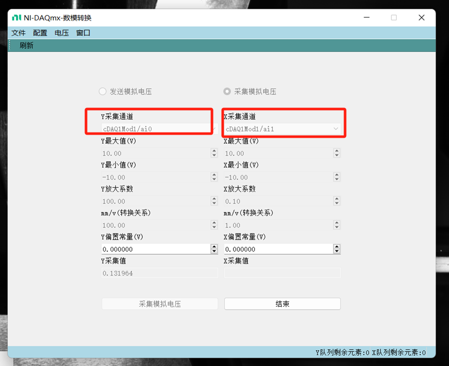

3.  引伸计软件设置好对应的比例系数，比如试验机 5000N 对应 10V，比例系数填写 500，就可以进行测试。

    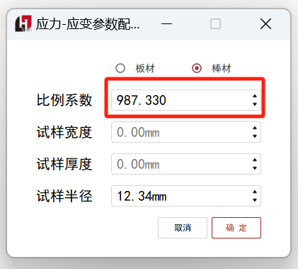

    4.采集到试验机采集到变形值，引伸计软件采集到力值就可以生成应力应变曲线，求相关力学性能参数。

    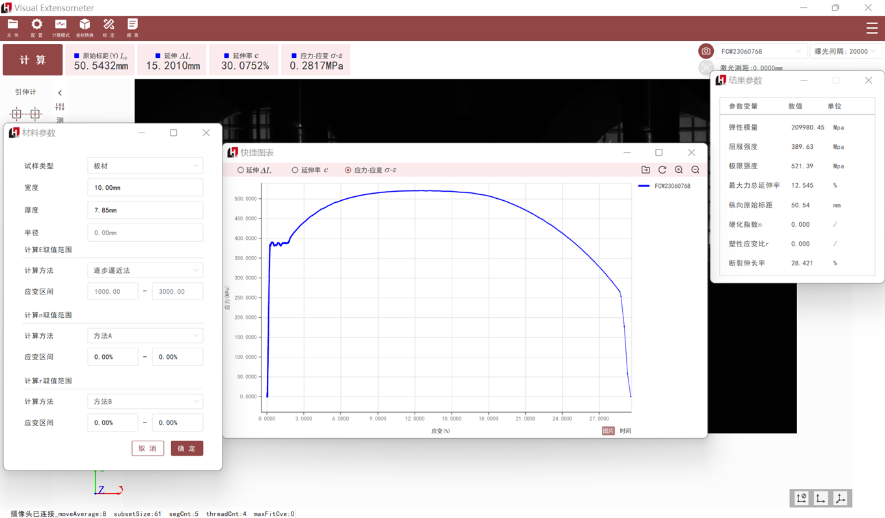

    引伸计软件生成应力应变曲线

    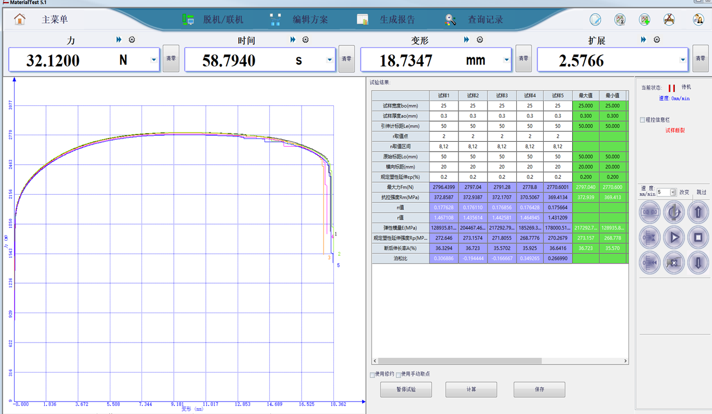

    试验机软件生成应力应变曲线

# 七、设备保养维护以及注意事项

6.1 未经专业培训，不得单独操作此仪器。

6.2 使用时尽量不要让光源直射人眼，避免可能造成操作人员眼部伤害。

6.3 高温环境下，尽量配戴高温手套，防止人员烫伤，制作高温散斑或者标记点时，注意不要沾到眼睛。

6.4 仪器不使用时，应将其装入箱内，置于干燥处，注意防震、防尘和防潮。

6.5 仪器运输应将仪器装于箱内进行，运输时应小心避免挤压、碰撞和剧烈震动，长途运输填充软件泡沫作为缓冲物。

6.6 仪器安装至三脚架或者拆卸时，要先托住仪器，以防仪器跌落。

6.7 不可用化学试剂擦试塑料部件及有机玻璃表面，可用浸水的软布擦试。

6.8 测量前应仔细全面检查仪器，确信仪器各项指标、功能、电源符合要求时再进行作业。

6.9 即使发现仪器功能异常，非专业维修人员不可擅自拆开仪器，以免发生不必要的损坏。

**感谢您选用我公司产品！**

**海塞姆，点亮机器的眼睛！**

**深圳市海塞姆科技有限公司**

地址：深圳市南山区桃源街道平山社区

留仙大道 4093 号南山云谷创新产业园山水楼 A 座 206

电话：0755-86347753

网址：www.haytham.com.cn

