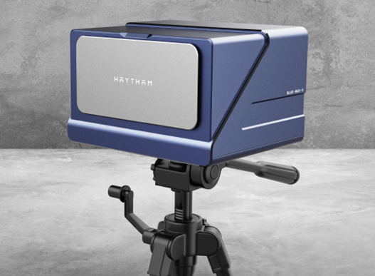

**BLUE BOX 视觉应变仪使用手册**

深圳市海塞姆科技有限公司

# 目录

[一、设备介绍 [1](#一设备介绍)](\l)

[1、设备主机 [1](#设备主机)](\l)

[2、光源 [1](#光源)](\l)

[3、固定支架 [2](#固定支架)](\l)

[4、散斑 [2](#散斑)](\l)

[二、硬件安装 [3](#二硬件安装)](\l)

[三、软件安装 [4](#三软件安装)](\l)

[1、相机驱动安装 [4](#相机驱动安装)](\l)

[2、应变仪软件安装 [4](#应变仪软件安装)](\l)

[3、软件安装验证 [4](#软件安装验证)](\l)

[四、软件使用 [6](#软件使用)](\l)

[1、软件打开 [6](#软件打开)](\l)

[2、创建新项目 [6](#创建新项目)](\l)

[3、相机采集设置 [7](#相机采集设置)](\l)

[4、分析计算 [8](#分析计算)](\l)

[5、应变片功能 [11](#应变片功能)](\l)

[6、报告生成 [12](#报告生成)](\l)

[五、安全操作及注意事项 [14](#五安全操作及注意事项)](\l)

# 

# 一、设备介绍

**应变仪主要部件：设备主机、操作软件、加密狗、光源及光源控制器、固定支架及云台、标定板、USB3.0 数据线、散斑喷漆或高温材料。**

# 1、设备主机

主要包括蓝色外观方形盒子和防尘盖两部分，通过底部不同的固定孔位可实现水平放置或者呈 90°竖直放置。

# 2、光源

常温标准视野配置环光，高温炉环境配置射灯，高低温箱环境配置射灯。

# 3、固定支架 

利用试验机安装孔固定的有旋转支架或 45 度支架，可移动式固定支架有三角架或电动支架。

# 4、散斑

1）常温试验时，采用标配的黑白颜色散斑喷漆。

2）高温试验时，采用酒精加高温材料，制作高温散斑。

# 二、硬件安装

1.  固定好旋转支架或三角架。

2.  将快装板固定在应变仪底座上。

3.  将应变仪安装在云台或支架上，调整好水平及高度。

4.  按照应变仪预设的距离参数，调整合适的摆放距离，

> 例：预设距离参数 210mm。
>
> 使用卷尺或长度尺等测量“设备前端边缘到试样”的间距，调整到约 210mm 为好。完成应变仪和待测试样中心的基本对齐。

5.  将光源固定在应变仪主机或者试验夹具周围。

6.  光源连接：将电源线连接至光源控制器上，再通过黑色数据线将光源控制器（CH 接口）与光源连接。

7.  应变仪连接：用 USB3.0 数据线将应变仪和电脑主机连接（电脑必须支持 USB3.0 接口）。

8.  取下应变仪防尘盖，按下光源控制器开关，蓝色光源点亮，调整亮度使视野亮度适中。

9.  按照试验要求，在待检测试样上检测区域喷涂散斑，并将喷好散斑试样固定在加载装置上。

10. 打开电脑，进行软件操作，对应变仪、灯光等进行微调。

# 三、软件安装

**初次使用时，必须在试验机电脑上先进行软件安装。**

**电脑基本配置要求：i7 处理器 16GB 内存 1TB 固态硬盘 USB3.0 接口/
64 位 WIN10 操作系统以上。**

# 相机驱动安装

找到随机 U 盘资料以下相机驱动文件，解压点击安装。

>  style="width:3.51806in;height:0.35764in" alt="1718705453768" />
>
>  style="width:3.04444in;height:0.35764in" alt="1718705636399" />

# 应变仪软件安装

找到随机 U 盘资料以下文件（版本号以实际为准），解压点击安装。

>  style="width:3.12431in;height:0.42431in" />

安装完成后，电脑屏幕上显示相机驱动软件和应变仪软件。

3.  # 软件安装验证

    1.  点击电脑屏幕上摄像头图标。

2.  在软件界面左侧，双击”MER-503-36U3M”打开摄像头，以相机型号为准。

3）在新窗口点击软件左上角“开始采集”图标，显示有图像即安装成功。

# 软件使用

# 1、软件打开

将加密狗 U 盘插入到电脑主机 USB 插口中，双击软件图标
，打开软件页面左侧从上往下图标依次为【主界面】、【图片采集】、【相机标定】、【分析计算】、【实时应变片】、【报告生成】

主界面如下：

# 2、创建新项目

点击软件“新建项目”弹出新建项目对话框，填写项目名称，选择保存项目路径。

# 3、相机采集设置

1）在“图片采集”界面点击相机按钮呈高亮状态，即可实时显示画面。

2）在“采集设置”设置板块，根据测试需求设置采集方式，结束方式，根据视野亮度适当调整曝光时间。

3）单次采集点击一次按钮采集一张图片，点击“开始采集”按钮则按采集设置的采集方式连续采集直到结束；点击“暂停采集”图片采集暂停，再次点击则“暂停”按钮则续接之前的采集直到结束采集图片。

# 4、分析计算

点击“分析计算”按钮，进入计算界面

1）在“区域选择”中下根据试样形状和检测位置，框选合适的测试区域类型和位置。

2）“图像子区”中设置计算子区大小；“计算步长”设置所需的步长大小。

3）点击“开始计算”按钮，即可进行计算，软件最下端会显示计算进度条，计算完成后软件弹出“计算完成”提示。

4）点击“检测”即可以在计算区域创建点、截面线或者两点距离，再点击“曲线图表”即可弹出数据窗口显示数据。

5）点击“结果”，可以查看所需的数据类型，并显示在主界面。

6）点击“曲线图标”中“导出数据保存”按钮可以导出计算数据。

7）点击“导入图像”按钮可以将已保存的图片，或者在其他单目三维引伸计上保存的图片，导入到本软件进行二次计算。

顺序为：点击“导入图像”按钮，在图片保存的路径下选择要导入的图片，也可按 Ctrl+A 全选图片，导入按之前步骤完成计算即可。

# 5、应变片功能

1）点击“应变片”，进入功能界面，点击“相机”按钮进行实时画面显示，在相机设置中设置相机帧率，根据图像明亮程度设置曝光时间，最后设置图片保存路径。

2）相机设置完成，点击“创建”按钮，自定义创建应变片大小、位置。

3）点击“开始计算”即可计算应变片数据。

# 6、报告生成

1）点击“报告信息”按钮，弹出填写报告信息窗口。填写信息将体现在报告中。

2）点击“生成报告”，弹出报告预览，可以选择保存或者打印。

3）点击“生成动画”，选择动画保存目录

# 五、安全操作及注意事项

1.  未经专业培训，不得单独操作此仪器。

2.  使用时尽量不要让光源直射人眼，避免可能造成操作人员眼部伤害。

3.  高温环境下，尽量配戴高温手套，防止人员烫伤，制作高温散斑或者标记点时，注意不要沾到眼睛。

4\. 仪器不使用时，应将其装入箱内，置于干燥处，注意防震、防尘和防潮。

5\.
仪器运输应将仪器装于箱内进行，运输时应小心避免挤压、碰撞和剧烈震动，长途运输最好在箱子周围使用软垫。

6\. 仪器安装至三脚架或者拆卸时，要先托住仪器，以防仪器跌落。

7\. 不可用化学试剂擦试塑料部件及有机玻璃表面，可用浸水的软布擦试。

8\. 测量前应仔细全面检查仪器，确信仪器各项指标、功能、电源符合要求时再

进行作业。

9.  即使发现仪器功能异常，非专业维修人员不可擅自拆开仪器，以免发生不必要的损坏。

**感谢您选用我公司产品！**

**海塞姆，点亮机器的眼睛！**

**深圳市海塞姆科技有限公司**

地址：深圳市南山区桃源街道平山社区

留仙大道 4093 号南山云谷创新产业园山水楼 A 座 206

电话：0755-86347753

网址：www.haytham.com.cn

微信公众号 B 站 今日头条
