**双目三维视觉应变仪使用手册**

深圳市海塞姆科技有限公司

# 目录

[一、设备介绍 1](#一设备介绍)

[1.1 设备主机 1](#设备主机)

[1.2 光源 1](#光源)

[1.3 固定支架 2](#固定支架)

[1.4 散斑 2](#散斑)

[二、硬件安装 3](#二硬件安装)

[三、软件安装 4](#三软件安装)

[3.1 相机驱动安装 4](#相机驱动安装)

[3.2 应变仪软件安装 4](#应变仪软件安装)

[3.3 软件安装验证 4](#软件安装验证)

[四：设备使用 6](#四设备使用)

[4.1 相机设置 6](#相机设置)

[4.2 标定 7](#标定)

[4.3 采集实验过程 14](#采集实验过程)

[4.4 数据处理 15](#数据处理)

[4.5 结果查看 16](#结果查看)

[4.6 实时应变片 20](#实时应变片)

[4.7 云图导出 20](#云图导出)

[五、安全操作及注意事项 22](#五安全操作及注意事项)

# 

# 一、设备介绍

**双目应变仪主要部件：设备主机、操作软件、加密狗、光源及光源控制器、固定支架及云台、标定板、USB3.0 数据线、散斑喷漆或高温材料。**

## 1.1 设备主机

主要包括固定支架和相机镜头两部分组成，通过底部不同的固定孔位可实现水平放置。

## 1.2 光源

常温标准视野配置环光，高温炉环境配置射灯，高低温箱环境配置条灯，大视野配摄影灯。

 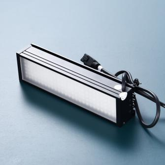 

## 1.3 固定支架 

使用三角架、双目横杠和三轴云台，将相机镜头固定好，调整双目设备整体位置，调整水平。

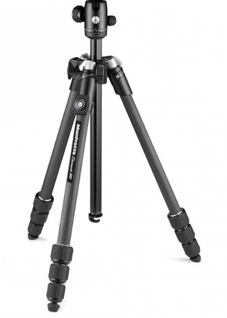

## 1.4 散斑

1)  常温试验时，采用标配的黑白颜色散斑喷漆。

2)  高温试验时，采用酒精加高温材料，制作高温散斑。

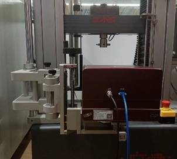

# 二、硬件安装

1.  固定好旋转支架或三角架。

2.  将快装板固定在双目横杠底座上。

3.  将双目应变仪安装在云台或支架上，调整好水平及高度。

4.  按照应变仪预设的距离参数，调整合适的摆放距离，

例：预设距离参数 210mm。

使用卷尺或长度尺等测量“设备前端边缘到试样”的间距，调整到约为 210mm。完成应变仪和待测试样中心的基本对齐。

5.  将光源固定在应变仪主机或者试验夹具周围。

6.  光源连接：将电源线连接至光源控制器上，再通过黑色数据线将光源控制器（CH 接口）与光源连接。

7.  应变仪连接：用 USB3.0 数据线将应变仪和电脑主机连接（电脑必须支持 USB3.0 接口）。

8.  取下设备镜头防尘盖，按下光源控制器开关，蓝色光源点亮，调整亮度使视野亮度适中。

9.  按照试验要求，在待检测试样上检测区域喷涂散斑，并将喷好散斑试样固定在加载装置上。

10. 打开电脑，进行软件操作，对应变仪、灯光等进行微调。

# 三、软件安装

**初次使用时，必须在试验机电脑上先进行软件安装。**

**电脑基本配置要求：i7 处理器 16GB 内存 1TB 固态硬盘 USB3.0 接口/
64 位 WIN10 操作系统以上。**

## 3.1 相机驱动安装

找到随机 U 盘资料以下相机驱动文件，解压点击安装。

>  src="./media/image9.png"
> style="width:3.51806in;height:0.35764in" alt="1718705453768" />
>
>  src="./media/image10.png"
> style="width:3.04444in;height:0.35764in" alt="1718705636399" />

## 3.2 应变仪软件安装

1)  找到随机 U 盘资料以下文件（版本号以实际为准），解压点击安装。

>  src="./media/image11.png"
> style="width:2.00021in;height:0.42435in" />

2)  安装完成后，电脑屏幕上显示相机驱动软件和应变仪软件。

## 3.3 软件安装验证

1)  点击电脑屏幕上相机驱动图标；

>  src="./media/image13.png"
> style="width:0.88333in;height:0.99097in" alt="1718705772522" />

1)  在软件界面左侧，双击”MER-503-36U3M”打开摄像头，以相机型号为准；

>  src="./media/image14.png"
> style="width:1.88403in;height:3.13681in" alt="1718705859542" />

2)  在新窗口点击软件左上角“开始采集”图标，显示有图像即安装成功。

# 四：设备使用

## 4.1 相机设置

打开相机驱动软件，并进入采集界面。

1)  确认软件可以正确读取到相机；

2)  批量连接相机和批量开启采集画面；

3)  调整合适的曝光时间以适应画面亮度；

4)  根据画面内被测区域相对于整个画面的占比调整物距，即设备与被测区域的距离；

5)  相机工装应水平放置，相机应保证水平；

6)  两相机应对称放置，被测物应保证在两相机中轴线上，两相机到被测区域距离应一致；

7)  相机与中轴线的夹角应在 15°～30°范围内；

8)  反复调整，使两相机采集画面对称显示，且显示范围一致；

9)  调整镜头焦距，使镜头对焦到被测区域，保证成像清晰；

10) 调整镜头光圈，与外部光源配合，使画面亮度、光源亮度（80% 亮度以下）、曝光时间（20000 内）、景深效果（光圈 8 左右）都在合适范围内；

## 4.2 标定

**在硬件调试完毕后，可进行标定步骤，根据视野大小选择合适的标定板，采集 13 张标定图片。**

打开应变仪软件，并创建一个新项目

1)  进入图片采集界面；

2)  打开相机；

3)  设置好保存图片的路径；

4)  使用单张采集功能进行标定图片采集；

5)  进行标定板姿势摆放并逐张采集，标定板摆放注意使三个空心圆成 L 状放置，即黑色角朝向画面的右上方，13 张姿势如下所示：

第一张，正视图，标定板按照对焦物距，正对设备摆放；

第二张，俯视图，在正视图的基础上，将标定板上边沿向前倾斜（15°左右）；

第三张，仰视图，在正视图的基础上，将标定板上边沿向后倾斜（15°左右）；

第四张，左向正视图，在正视图的基础上，将标定板向左旋转（15°左右）；

第五张，左俯视图，在左向正视图的基础上，将标定板上边沿向前倾斜（15°左右）；

第六张，左仰视图，在左向正视图的基础上，将标定板上边沿向后倾斜（15°左右）；

第七张，右正视图，在正视图的基础上，将标定板向右旋转（15°左右）；

第八张，右俯视图，在右向正视图的基础上，将标定板上边沿向前倾斜（15°左右）；

第九张，右仰视图，在右向正视图的基础上，将标定板上边沿向后倾斜（15°左右）；

第十张，正视图，将标定板回正到第一张正视图位置；

第十一张，向前视图，将标定板在正视图的基础上，向前 1 厘米左右正视放置；

第十二张，向后视图，将标定板在正视图的基础上，向后 1 厘米左右正视放置；

第十三张，正视图，将标定板回正到第一张正视图位置。

6)  采集完标定图片后，点击应变仪软件右上角相机图标关闭相机；

7)  点击左侧相机标定界面进行标定操作；

8)  点击左上角导入图像，根据采集标定前设置的图片保存路径找到标定图片，分左右相机导入标定图片；

9)  图片导入完成后，点击计算标定，输入标定参数（按照上图中左侧数据，HSM-Cal-250-6\*6-20
    1-1 1-4 4-1，6\*6 为标定板尺寸，20 为圆点间距，1-1 1-4
    4-1 为空心圆位置坐标）

10) 标定成功后左下角重投影误差，total 值应小于 0.2；在满足要求后，点击确认标定。

11) 在标定成功后，建议将标定图片另存，且按照日期 - 物距 - 实验场景命名。

## 4.3 采集实验过程

1)  标定步骤完成后，将被测区域挪到视野内，保证物距准确，点击左侧相机按钮进入图片采集界面，点击右上角相机图标打开相机；

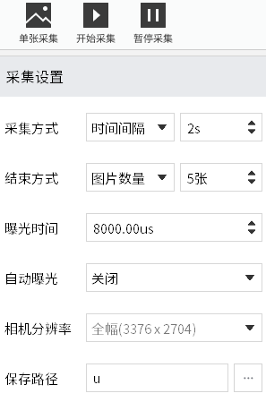

2)  实验开始前应进行采集设置，采集方式分为固定频率和时间间隔两种；

固定频率：即按照固定的采集频率进行图片采集，当达到设置的采集持续时间即停止采集，如需手动停止采集，建议将结束方式—持续时间改成最大值（9999s）；

时间间隔：即每间隔几秒采集一张图片，当达到设置的采集图片数量时即停止采集。

3)  建议将图片的保存路径设置为一个空间较大的固态硬盘，以防数据丢失。

## 4.4 数据处理

在实验过程图片采集完毕后，点击右上角相机图标关闭相机

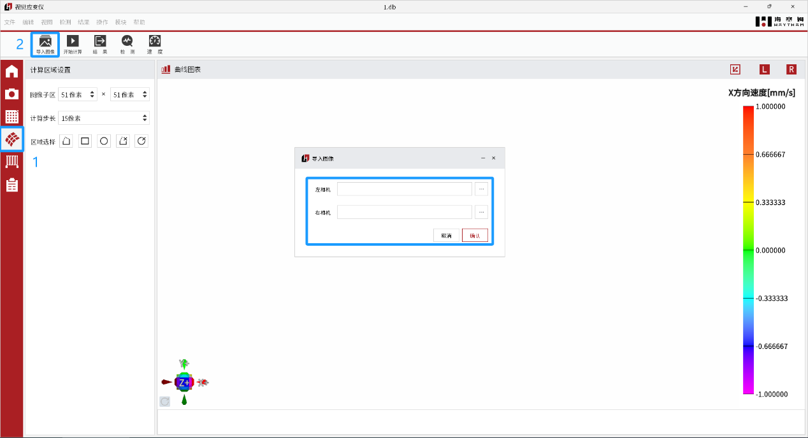

1)  点击左侧分析计算按钮进入数据分析界面；

2)  点击左上角导入图像按钮进行图像导入，分左右相机导入图片；

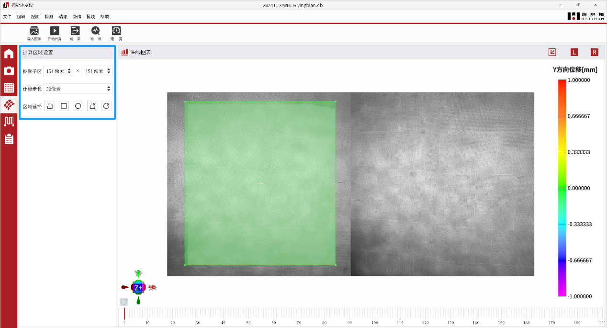

3)  在计算前需要先进行计算区域框选和计算参数设置；

子区：即 DIC 计算的最小区域，子区越大，特征越多，计算时间越长；

步长，子区与子区的间隔，步长越小，子区越密集，计算越慢；

区域选择：从左到右分别是，框选多边形，框选矩形，框选圆形，扣除多边形，扣除圆形；

4)  在计算参数设置完毕后，点击开始计算，即等待计算结果，计算结果分为位移和应变，第一次计算完毕是指位移数据计算完毕，还需转应变，点击结果—应变—主应变，即可开始转应变。

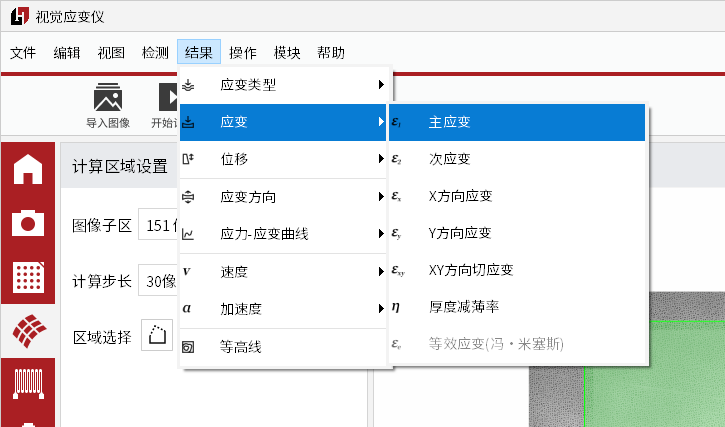

## 4.5 结果查看

在位移和应变计算完毕后，可查看结果

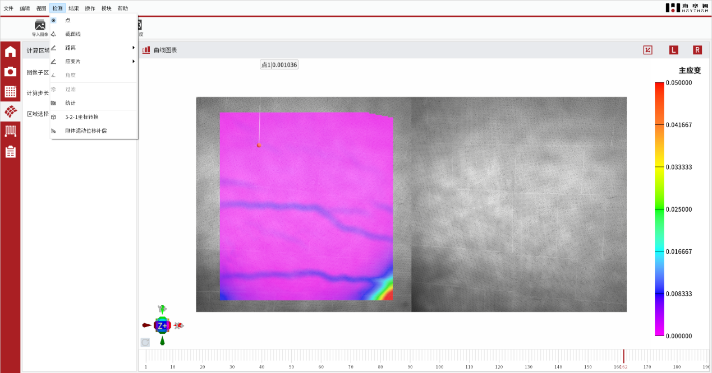

1.  点击检测，可创建点、线、片，选择对应的方式，在计算区域中点击创建，即可查看点、线、片的数据；

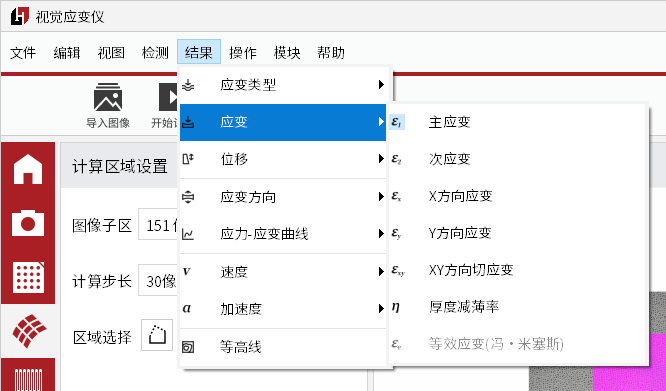

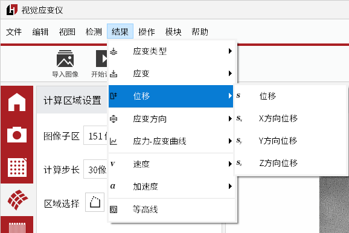

2.  点击结果，可查看不同类型的结果，如可查看格林应变、工程应变，应变可查看主应变、次应变、三向应变等，位移可查看三向位移等。

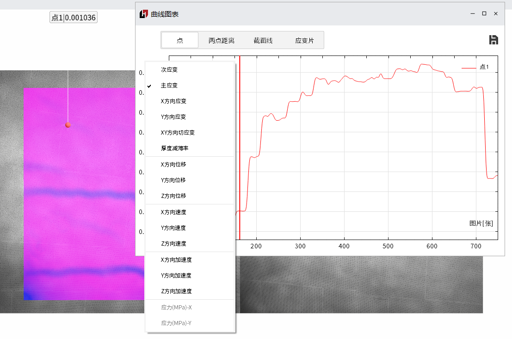

3.  在创建点、线、片后，可点击曲线图表以查看图片—应变等曲线，在横轴纵轴右键点击，可切换需查看显示的数据，点击曲线图表右上角保存图标，可导出所有创建数据；

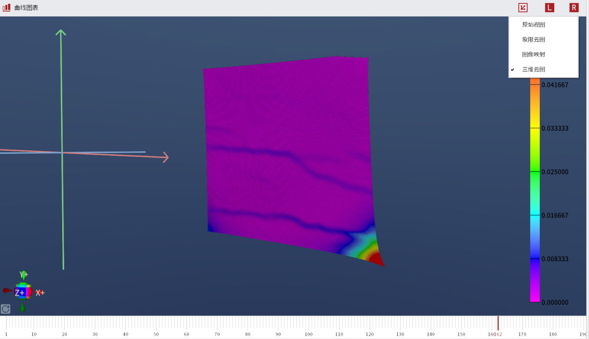

4.  点击界面右上角坐标轴图案，可切换不同视图，点击 L 或 R 图标，可显示/关闭一侧画面；

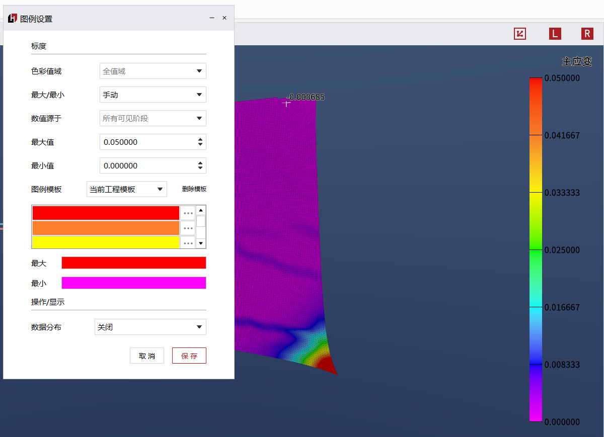

5.  右键单击色阶条，可进入图例设置，可自行编辑色阶条数量和颜色，以及设置显示阈值。

## 4.6 实时应变片

此外，软件还支持实时应变片功能，可模拟真实应变片效果；

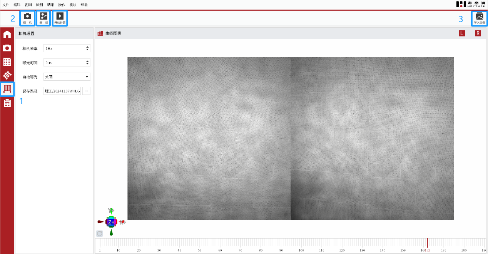

1.  点击左侧应变片按钮进入应变片功能界面；

2.  点击相机按钮打开相机，手动创建应变片区域（即框选矩形区域），进行采集界面设置，即可开始计算，但受性能影响，实时应变片功能目前只能以 1Hz 运行，建议将相机帧率设置为 1Hz；

3.  对于已经做过的实验，也可通过导入图像的方式来重复进行创建应变片计算。

## 4.7 云图导出

在数据处理完毕后，可进行云图或者视频的导出；

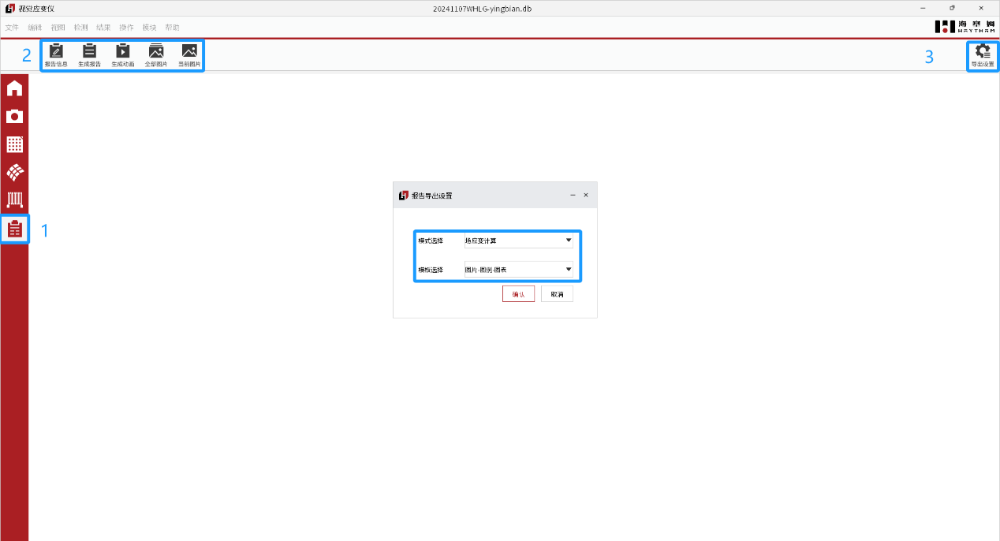

1.  点击左侧报告生成按钮进入报告导出功能界面；

2.  在此功能界面，可进行实验报告信息输入、实验报告导出、云图视频导出、全部云图导出、单张云图导出操作；

3.  在导出云图视频或者云图图片时，可进行模板设置，以选择纯云图导出，或者在创建点的情况下带曲线图表导出，或选择是否需要显示图例色阶条。

# 五、安全操作及注意事项

1.未经专业培训，不得单独操作此仪器。

2.使用时尽量不要让光源直射人眼，避免可能造成操作人员眼部伤害。

3.高温环境下，尽量配戴高温手套，防止人员烫伤，制作高温散斑或者标记点时，注意不要沾到眼睛。

4.仪器不使用时，应将其装入箱内，置于干燥处，注意防震、防尘和防潮。

5.仪器运输应将仪器装于箱内进行，运输时应小心避免挤压、碰撞和剧烈震动，长途运输最好在箱子周围使用软垫。

6.仪器安装至三脚架或者拆卸时，要先托住仪器，以防仪器跌落。

7.不可用化学试剂擦试塑料部件及有机玻璃表面，可用浸水的软布擦试。

8.测量前应仔细全面检查仪器，确认仪器各项指标、功能、电源符合要求时再进行作业。

9.即使发现仪器功能异常，非专业维修人员不可擅自拆开仪器，以免发生不必要的损坏。

**感谢您选用我公司产品！**

**海塞姆，点亮机器的眼睛！**

**深圳市海塞姆科技有限公司**

地址：深圳市南山区桃源街道平山社区

留仙大道 4093 号南山云谷创新产业园山水楼 A 座 206

电话：0755-86347753

网址：www.haytham.com.cn

  

微信公众号 B 站 今日头条
