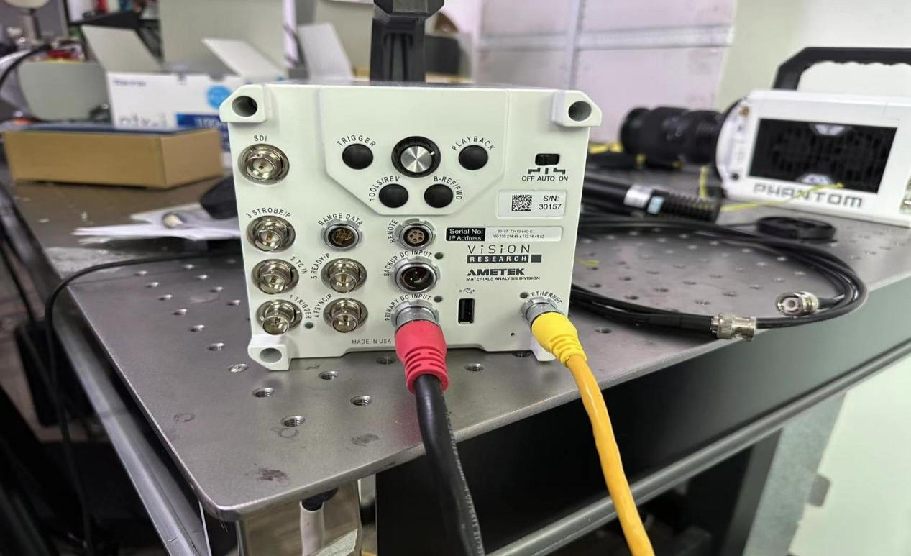

**BLUE BOX 高速视觉应变仪使用手册**

深圳市海塞姆科技有限公司

# 目录

[一、设备介绍 [3](#一设备介绍)](\l)

[1、设备主机 [3](#设备主机)](\l)

[2、光源 [3](#光源)](\l)

[3、固定支架 [4](#固定支架)](\l)

[4、散斑 [4](#散斑)](\l)

[二、硬件安装 [5](#二硬件安装)](\l)

[三、软件安装 [6](#三软件安装)](\l)

[1、相机驱动安装 [6](#相机驱动安装)](\l)

[2、应变仪软件安装 [6](#应变仪软件安装)](\l)

[3、高速相机软件使用 [7](#高速相机软件使用)](\l)

[四、应变仪软件使用 [10](#应变仪软件使用)](\l)

[1、软件打开 [10](#软件打开)](\l)

[2、创建新项目 [10](#_Toc12480)](\l)

[3、创建标定 [11](#创建标定)](\l)

[4、导入图片 [11](#导入图片)](\l)

[5、区域设置 [12](#_Toc17323)](\l)

[6、计算参数设置 [12](#计算参数设置)](\l)

[7、计算 [13](#计算)](\l)

[8、数据查看 [14](#数据查看)](\l)

[9、数据保存 [14](#数据保存)](\l)

[五、安全操作及注意事项 [15](#五安全操作及注意事项)](\l)

# 一、设备介绍

**高速应变仪主要部件：设备主机、操作软件、加密狗、光源、固定支架及云台、标定板、散斑喷漆或高温材料。**

# 1、设备主机

主要包括高速相机和光路设备两部分，通过底部不同的固定孔位可实现水平放置或者呈 90°竖直放置。

# 2、光源

> 常温标准视野配置环光，高温炉环境配置射灯，高低温箱环境配置射灯。

  

# 

# 3、固定支架 

可移动式固定支架有三角架或电动支架。

# 

# 

# 

# 

# 

# 4、散斑

常温试验时，采用标配的黑白颜色散斑喷漆。

高温试验时，采用酒精加高温材料，制作高温散斑。

# 二、硬件安装

1.  固定好旋转支架或三角架。

2.  将快装板固定在设备底座上。

3.  将高速应变仪安装在云台或支架上，调整好水平及高度。

4.  按照应变仪预设的距离参数，调整合适的摆放距离，

> 例：预设距离参数 210mm。
>
> 使用卷尺或长度尺等测量“设备前端边缘到试样”的间距，调整到约 210mm 为好。完成应变仪和待测试样中心的基本对齐。

5.  将光源固定在高速应变仪主机或者试验夹具周围。

6.  相机连线：按下图连接相机电源线，网线与电脑网络口相连。按照试验要求，在待检测试样上检测区域喷涂散斑，并将喷好散斑试样固定在加载装置上。

7.  打开电脑，进行软件操作，对应变仪、灯光等进行微调。

# 三、软件安装

初次使用时，必须在电脑上先进行软件安装。

> **电脑基本配置要求**：i7 处理器 16GB 内存 1TB 固态硬盘 USB3.0 接口/
> 64 位 WIN10 操作系统以上

# 相机驱动安装

找到随机 U 盘资料以下相机驱动文件，安装打开安装包（PCC_3.7.802.0_MainMenu），选择第一个 PCC
Installation 安装

>  src="./media/image10.png"
> style="width:4.45in;height:2.68403in" alt="1681191827385" />

# 应变仪软件安装

找到随机 U 盘资料以下文件（版本号以实际为准），解压点击安装。

>  src="./media/image11.png"
> style="width:3.72222in;height:0.68542in" />
>
>  src="./media/image12.png"
> style="width:3.72361in;height:0.90417in" />

安装完成后，电脑屏幕上显示相机驱动软件和应变仪软件。

 

# 高速相机软件使用

1）将电脑以太网 IP 地址改为 100.100.100.1；子网掩码 255.255.0.0

2）机开机待相机自检完成后，双击打开**PCC3.7**软件，在摄像机中可以看到对应相机编号，双击即可连接相机。在实时中关闭快门然后更换镜头。

3）然后在实时可以调节相机像素，帧率，曝光时间等参数。CSR 为黑平衡画面有条纹情况是都可以点击黑平衡调节，图像范围和图像触发位置中可以设置相机是否预录制，可根据实际场景调节相机录制触发时间。

4）在回放中保存其图片，其标记入点到标记出点间为保存图片

5）保存格式，其 cine 格式为原始格式，可以后期导入再修改其对应格式，也可以直接输出对应图片格式（要导入应变仪计算时，图片格式为 bmp 格式）

# 应变仪软件使用

# 1、软件打开

将加密狗 U 盘插入到电脑主机 USB 插口中，双击软件图标

开软件界面如下：

# 创建新项目

点击软件“新建项目”弹出新建项目对话匡，填写项目名称，选择保存项目路径。

3.  # 创建标定

    点击“标定”连接按钮呈高亮状态，即可创建标定，

    根据标定板尺寸及文件保存目录进行标定，创建成功后点击 OK，关闭对话框即可。

    

    

4.  # 导入图片

    在试验结束后，点击“文件”按钮，找到输入，点击“图形序列”，选择测试过程中保存的图片，点击打开。

     

5.  # 区域设置

    点击“区域设置”按钮，根据试样形状和检测位置，框选合适的测试区域类型和位置。

6.  # 计算参数设置

    点击“文件”弹出下拉框，点击“计算参数设置”，设置所需的子区大小。

 

点击“文件”弹出下拉框，点击“区域/步长设置”，设置所需的步长。

 

# 计算

点击“计算”按钮，即可进行计算，软件最下端会显示计算进度条，计算完成后软件弹出“计算完成”提示。

# 数据查看

点击“构造”，可以创建点或者应变片，并且显示数据在“曲线图表”上。

点击“检测”，可以查看所需的数据类型，并显示在主界面

# 数据保存

点击“报告”按钮弹出“创建报告”菜单可以导出报告，动画，或者图片数据。点击“曲线图表”上保存按钮，保存构造点数据。

# 

# 五、安全操作及注意事项

1.  未经专业培训，不得单独操作此仪器。

2.  使用时尽量不要让光源直射人眼，避免可能造成操作人员眼部伤害。

3.  高温环境下，尽量配戴高温手套，防止人员烫伤，制作高温散斑或者标记点时，注意不要沾到眼睛。

4\. 仪器不使用时，应将其装入箱内，置于干燥处，注意防震、防尘和防潮。

5\.
仪器运输应将仪器装于箱内进行，运输时应小心避免挤压、碰撞和剧烈震动，长途运输最好在箱子周围使用软垫。

6\. 仪器安装至三脚架或者拆卸时，要先托住仪器，以防仪器跌落。

7\. 不可用化学试剂擦试塑料部件及有机玻璃表面，可用浸水的软布擦试。

8\.
测量前应仔细全面检查仪器，确信仪器各项指标、功能、电源符合要求时再进行作业。

9.  即使发现仪器功能异常，非专业维修人员不可擅自拆开仪器，以免发生不必要的损坏。

**感谢您选用我公司产品！**

**海塞姆，点亮机器的眼睛！**

**深圳市海塞姆科技有限公司**

地址：深圳市南山区桃源街道平山社区

留仙大道 4093 号南山云谷创新产业园山水楼 B 座 206

电话：0755-86347753

网址：www.haytham.com.cn

  

微信公众号 B 站 今日头条
